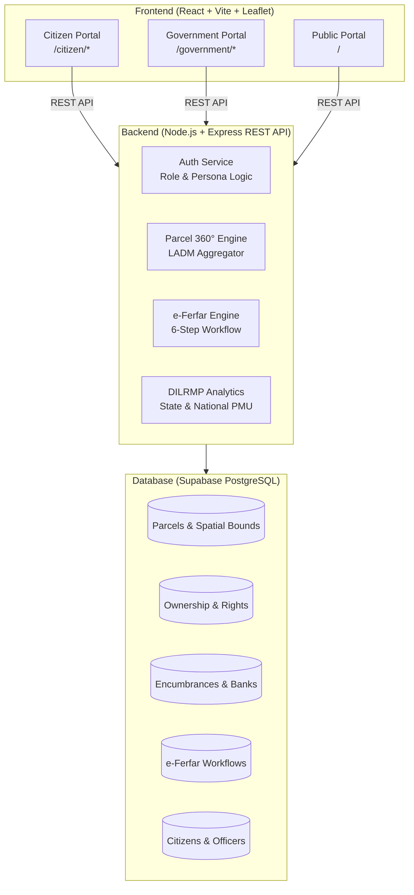

# 🏛️ Land Stack — Full-Stack Land Governance & Cadastral Platform

> **India's unified, parcel-centric land records and cadastral intelligence platform.**
> Built with **React (Vite), Node.js (Express), and Supabase PostgreSQL**, fully compliant with **LADM (ISO 19152)**, **ULPIN (14-digit Unique Land Parcel Identification Number)**, and **DILRMP** standards.

---

## 📋 Table of Contents
- [Overview & Vision](#-overview--vision)
- [System Architecture](#-system-architecture)
- [Repository Structure](#-repository-structure)
- [Key Features](#-key-features)
- [Getting Started](#-getting-started)
  - [1. Prerequisites](#1-prerequisites)
  - [2. Supabase Database Setup](#2-supabase-database-setup)
  - [3. Backend Setup](#3-backend-setup)
  - [4. Frontend Setup](#4-frontend-setup)
- [Test Credentials & Demo Personas](#-test-credentials--demo-personas)
- [REST API Reference](#-rest-api-reference)
- [Tech Stack & Standards](#-tech-stack--standards)

---

## 🌐 Overview & Vision

In traditional land administration, land records are fragmented across departments:
* **Revenue Department** maintains Rights (RoR / 7/12 / 8A).
* **Survey Department** maintains Cadastral Maps (e-Mojani).
* **Registration Department (IGR)** registers Title Deeds (Index II).
* **Financial Institutions** register Encumbrances & Mortgages (CERSAI).
* **Revenue Courts** maintain Litigations & Injunctions (RTS).

**Land Stack** unifies these disparate datasets into a single **360° Parcel Dossier**, keyed on the 14-digit **ULPIN** and provides seamless, role-separated portals for citizens and revenue officials.

---

## 🏗️ System Architecture



---

## 📁 Repository Structure

```text
Land-Stack/
├── frontend/                     # React 18 + Vite Frontend Application
│   ├── src/
│   │   ├── api/                  # Axios HTTP client & base configuration
│   │   ├── components/           # UI, layout, auth, maps, citizen & official components
│   │   ├── config/               # Roles, state presets, API endpoints
│   │   ├── context/              # Authentication & user state providers
│   │   ├── layouts/              # CitizenLayout, GovernmentLayout, PublicLayout
│   │   ├── pages/
│   │   │   ├── auth/             # Role-based login & OTP pages
│   │   │   ├── citizen/          # Citizen dashboard, parcels, mutations, due diligence
│   │   │   ├── government/       # 7 official role dashboards & work queues
│   │   │   └── public/           # Landing page, public search, info pages
│   │   └── services/             # Frontend API service layer
│   ├── package.json
│   └── vite.config.js
│
├── backend/                      # Express.js REST API Server
│   ├── src/
│   │   ├── config/               # Supabase client & environment configuration
│   │   ├── controllers/          # Route controller handlers
│   │   ├── middleware/           # CORS, logging, error handling
│   │   ├── routes/               # Modular Express API routes (/api/v1/*)
│   │   ├── services/             # Business logic & database queries
│   │   └── server.js             # Express app entry point (port 5000)
│   ├── database/
│   │   ├── schema.sql            # Normalized PostgreSQL DDL
│   │   └── seed.sql              # Prototype sample seed data
│   ├── package.json
│   └── README.md
│
└── docs/                         # Specifications, PRD, and architecture diagrams
```

---

## ⚡ Key Features

### 1. Citizen Portal
* **My Land Parcels (Form 8A / Khate Pustika)**: Instant view of all rural and urban holdings owned by the logged-in citizen.
* **Parcel 360° Title Dossier**: Composite view aggregating Ownership, Mortgages, Land-use Restrictions, Master Plan Zoning, Municipal Taxes, and Court Litigations.
* **e-Ferfar Mutation Tracking**: Live 6-step timeline for statutory mutations (Sale, Heirship, Gift Deed, Partition, Bank Charge).
* **Certified Digital Locker**: Download digitally signed 7/12 (Satbara), Form 8A, e-Mojani cadastral maps, and mutation notices.
* **Land Watchlist & Early Alerts**: Monitor parcels for unauthorized filings, survey notices, or boundary changes.

### 2. Government & Statutory Workspaces (7 Official Roles)
* **Talathi / Patwari**: Form 6 pencil entries, on-ground geotagged inspections, and statutory notices (Notice 135-D).
* **Tehsildar & Executive Magistrate**: Quasi-judicial dispute hearings, SLA tracking, and final e-Ferfar mutation orders.
* **Sub-Registrar Officer (SRO)**: Real-time deed registration audits and automated trigger to revenue mutation registries.
* **District Collector**: District-level revenue monitoring, Section 36A tribal protection audits, and revenue court appeal registers.
* **State PMU**: State-wide cadastral digitization metrics, SLA compliance, and cross-department API uptime.
* **National Cadastral Monitor (DoLR)**: Pan-India DILRMP benchmarks and national ULPIN adoption rates.
* **System Administrator**: User management, role provisioning, audit trails, and system health telemetry.

---

## 🚀 Getting Started

### 1. Prerequisites
* **Node.js**: v18.x or higher (v20+ recommended)
* **npm**: v9.x or higher
* **Supabase**: Free Supabase project for PostgreSQL hosting

---

### 2. Supabase Database Setup
1. Create a free project at [Supabase](https://supabase.com).
2. Open the **SQL Editor** in your Supabase dashboard.
3. Copy and run the contents of [`backend/database/schema.sql`](file:///c:/Users/LENOVO/OneDrive/Desktop/LAND-STACK/backend/database/schema.sql) to create all tables and indexes.
4. Copy and run the contents of [`backend/database/seed.sql`](file:///c:/Users/LENOVO/OneDrive/Desktop/LAND-STACK/backend/database/seed.sql) to populate sample parcels, citizens, officers, and mutations.

---

### 3. Backend Setup

```bash
# Navigate to backend directory
cd backend

# Install dependencies
npm install

# Setup environment variables
cp .env.example .env
```

Edit `backend/.env` with your Supabase project credentials:
```env
PORT=5000
NODE_ENV=development
FRONTEND_URL=http://localhost:5173

# Supabase PostgreSQL Credentials
SUPABASE_URL=https://your-project-id.supabase.co
SUPABASE_ANON_KEY=your-supabase-anon-key
SUPABASE_SERVICE_ROLE_KEY=your-supabase-service-role-key
```

Start the backend server:
```bash
# Development mode with auto-reload
npm run dev
```
* **Base API**: `http://localhost:5000/api/v1`
* **Health Check**: `http://localhost:5000/health`

---

### 4. Frontend Setup

In a new terminal:
```bash
# Navigate to frontend directory
cd frontend

# Install dependencies
npm install

# Setup environment variables
cp .env.example .env
```

Configure `frontend/.env`:
```env
VITE_API_BASE_URL=http://localhost:5000/api/v1
```

Start the frontend Vite dev server:
```bash
npm run dev
```
Open **`http://localhost:5173`** in your browser.

---

## 🔑 Test Credentials & Demo Personas

The application includes built-in role personas and test credentials for easy evaluation:

### 👤 Citizen Personas (`/login/citizen` or `/login?mode=citizen`)
> **Demo OTP**: `123456` | **Captcha**: `XbfL3`

| Citizen ID | Name | Registered Mobile | State | Holdings & Summary |
| :--- | :--- | :--- | :--- | :--- |
| **`CIT-001`** *(Default)* | **Aarav Patil** (आरव पाटील) | `+91 98230 45891` | Maharashtra | Gat 42 Wagholi, Pune (Agricultural / Bagayat) |
| **`CIT-002`** | **Sunita Kulkarni** (सुनिता कुलकर्णी) | `+91 98231 12345` | Maharashtra | Flat 402, Shivneri, Lohegaon (Residential NA) |
| **`CIT-003`** | **Rajesh Gaikwad** (राजेश गायकवाड) | `+91 98232 23456` | Maharashtra | Survey 118, Hinjawadi Phase 1 (Commercial) |
| **`CIT-004`** | **Priya Shinde** (प्रिया शिंदे) | `+91 98233 34567` | Maharashtra | Gat 88, Manjri Khurd, Haveli (Agricultural) |
| **`CIT-005`** | **Rameshwar Chaudhary** (रामेश्वर चौधरी) | `+91 98290 12345` | Rajasthan | Khasra 210, Jhotwara, Jaipur (Abadi Commercial) |

---

### 🛡️ Official Personas (`/login` or `/login/government`)
> **Password**: `GovPass@2026` | **Captcha**: `XbfL3`

| Role Code | Designation | Sample Officer | Email | Jurisdiction & Workspace |
| :--- | :--- | :--- | :--- | :--- |
| **`TALATHI`** | Village Revenue Officer / Patwari | **Prakash Shinde** | `prakash.shinde@maharashtra.gov.in` | Wagholi Circle, Pune (`/government/talathi`) |
| **`TEHSILDAR`** | Tehsildar & Executive Magistrate | **Sanjay Deshmukh** | `sanjay.deshmukh@maharashtra.gov.in` | Haveli Taluka, Pune (`/government/tehsildar`) |
| **`SRO`** | Sub-Registrar Officer (Class I) | **Rekha Joshi** | `rekha.joshi@igrmaharashtra.gov.in` | SRO Haveli No 5 (`/government/sro`) |
| **`COLLECTOR`** | District Collector & DM | **Dr. Suhas Diwase, IAS** | `collector.pune@maharashtra.gov.in` | Pune District (`/government/district`) |
| **`STATE_PMU`** | State PMU Head (DILRMP) | **Anil Verma** | `anil.verma@pmu.landrecords.gov.in` | State of Maharashtra (`/government/state`) |
| **`NATIONAL_MONITOR`** | National Cadastral Monitor (DoLR) | **Meera Sengupta** | `meera.sengupta@dolr.gov.in` | Pan-India (36 States) (`/government/national`) |
| **`ADMIN`** | System & Security Administrator | **Manoj Tiwari** | `admin.landstack@nic.in` | National Cloud (`/government/admin`) |

---

## 📡 REST API Reference

| Method | Endpoint | Description |
| :--- | :--- | :--- |
| `GET` | `/health` | System health & Supabase connection status |
| `GET` | `/api/v1/parcels` | List parcels with filters (`search`, `district`, `status`) |
| `GET` | `/api/v1/parcels/:ulpin/360` | Complete 360° Composite Title Dossier |
| `GET` | `/api/v1/parcels/owner/:citizenId` | Get parcels owned by specific citizen (Form 8A) |
| `GET` | `/api/v1/mutations` | List e-Ferfar mutation records |
| `POST` | `/api/v1/mutations` | Apply for new mutation application |
| `PATCH`| `/api/v1/mutations/:id/status` | Update mutation stage (verify / sanction / reject) |
| `POST` | `/api/v1/auth/login-citizen` | Authenticate citizen via mobile / ID |
| `POST` | `/api/v1/auth/login-officer` | Authenticate officer with role & jurisdiction |
| `GET` | `/api/v1/watchlist/citizen/:id` | Get citizen's pinned land watchlist |
| `GET` | `/api/v1/analytics/stats` | State and district DILRMP cadastral statistics |

---

## 🛠️ Tech Stack & Standards

* **Frontend**: React 18, Vite, React Router 6, Lucide React, Leaflet & React-Leaflet GIS
* **Backend**: Node.js, Express.js (ESM), Supabase JS Client, CORS, dotenv
* **Database**: Supabase PostgreSQL with relational indexing, foreign keys, and views
* **Design Guidelines**: UX4G Government of India Design System (Forest Green `#064e3b`, Saffron `#ea580c`, Slate surfaces)
* **Standards Compliance**: LADM (ISO 19152:2012), 14-digit ULPIN format, MLRC Sections 148–154 (e-Ferfar)

---

## 📄 License
This project is developed under the Government Open Code initiative for digital public infrastructure modernization.
