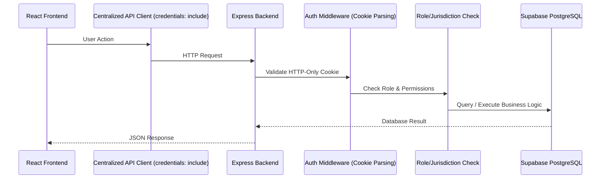

# Canonical Architecture & Database-Only Migration Plan

## 1. Purpose & Scope
This document defines the final, canonical architecture for the BHARATBHUMI (LAND-STACK) platform. It resolves contradictions between legacy documentation, current frontend mock state, and the newly refactored backend. It explicitly mandates a **Database-Only Architecture** and provides the migration steps to achieve it.

## 2. The Contradiction & Problem Found
- **Legacy Reality:** The frontend heavily utilized `localStorage` for session states, and `apiClient.js` stored massive arrays of JSON data to simulate the API locally.
- **Backend Reality:** The backend was written in a "Dual-Mode" (`DATA_PROVIDER_MODE=mock|supabase`) where it could either pull from massive `mockStore.js` data or query PostgreSQL.
- **The Problem:** Mock fallbacks mask integration issues. A production-grade platform cannot use silent failovers to mock data. If the database is unreachable, the system must show an explicit error.

## 3. Canonical Architecture Decision
The final system is designated **Database-Only**.

### Architecture Stack
- **Frontend:** React 18 / Vite
- **Backend API:** Node.js / Express
- **Database:** Supabase PostgreSQL + PostGIS + Supabase Storage
- **Authentication:** Supabase Auth via HTTP-only Cookies
- **Source of Truth:**
  - **Database:** The *only* source of truth for all application data.
  - **Backend:** The *only* source of truth for business rules, permissions, and workflow states.
  - **Frontend:** Only a presentation and client layer.

### Request Flow

## 4. Database-Only Data Policy
- **Allowed Data in Database:** Real production records. For development and demo environments, exactly 3–5 representative citizens, officers, parcels, and mutations are inserted via **SQL migrations** (`003_seed_data.sql`).
- **Not Allowed:** 
  - `DATA_PROVIDER_MODE` environment variable.
  - `backend/src/data/mockStore.js`.
  - Static fallback arrays in `frontend/src/api/client.js`.
  - Defaulting to a fake user login if the backend is unreachable.
- **Expected Behavior:** If no database records exist, the frontend must render an empty state (e.g., "No parcels found"). If the API is unreachable, the frontend must render a 500 error boundary.

## 5. Migration Strategy (Removing Dual-Mode)

### Phase 1: Backend Cleanup
1. Delete `backend/src/data/mockStore.js` and `backend/src/data/json/`.
2. Remove `config.dataProviderMode` from `backend/src/config/env.js`.
3. Update `backend/src/config/supabase.js` to crash (`process.exit(1)`) on startup if `SUPABASE_URL` is missing.
4. Remove all `if (isMockMode())` conditional logic in controllers, auth middleware, and services.

### Phase 2: Frontend Cleanup
1. Remove all static mock arrays (`parcelsData = []`, etc.) from `frontend/src/api/client.js`.
2. Update `apiClient.js` to strictly append `credentials: 'include'` to all `fetch` requests.
3. Update `AuthContext.jsx` to completely remove `localStorage.getItem('landstack_user')`.
4. Update `AuthContext.jsx` initialization to call `GET /api/v1/auth/me` on mount.

### Phase 3: SQL Seeding Only
1. Ensure the demo environment relies exclusively on `backend/database/migrations/003_seed_data.sql` to populate the Supabase DB.
