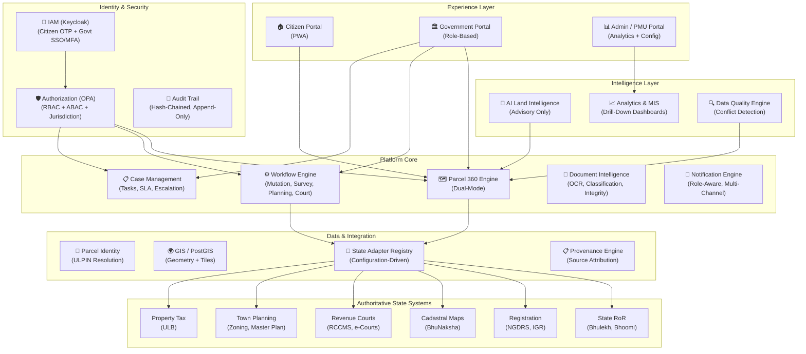

# Land Stack — Product Vision

**Version**: 2.0 | **Date**: September 2026
**Status**: Canonical
**Supersedes**: All prior product descriptions that define Land Stack as "citizen-facing only"

---

## 1. The One-Line Definition

> **Land Stack is a parcel-centric federated Digital Public Infrastructure and governance intelligence platform that provides role-specific experiences across 8 core roles: 1 Citizen role (Citizen Land Owner) and 7 Government roles (Talathi, Tehsildar, Sub-Registrar, District Collector, State PMU Head, DoLR / National Monitor, and System Administrator) — while integrating authoritative State systems through secure interoperability.**

---

## 2. Product Thesis

```
ONE PARCEL
  → ONE CANONICAL IDENTITY (ULPIN / Bhu-Aadhaar)
    → MANY AUTHORITATIVE DATA SOURCES (State RoR, Registration, Courts, GIS, Planning, Tax)
      → MANY GOVERNMENT WORKFLOWS (Mutation, Survey, Planning Approval, Court Proceedings)
        → ONE GOVERNANCE INTELLIGENCE LAYER (Analytics, AI Advisory, Data Quality)
          → ROLE-SPECIFIC EXPERIENCES (Citizen Portal + Government Operations Portal)
```

This thesis rejects the assumption that Land Stack is merely a citizen data viewer. It defines Land Stack as a **platform** that serves two experience planes sharing a common parcel-centric data and integration foundation.

---

## 3. The Two Experience Planes

### 3.1 Citizen / Public Experience Plane

The citizen-facing PWA provides:
- **Parcel 360° (Citizen Mode)**: Unified view of ownership, map, encumbrances, restrictions, zoning, tax, courts, documents, and data health — all with source attribution
- **Mutation Tracking**: Real-time status of pending ownership changes
- **Watchlist & Alerts**: Proactive notifications when anything changes on a watched parcel
- **Service Applications**: Apply for RoR extracts, NEC, data correction, grievances
- **Document Wallet**: Secure storage and retrieval of certified copies via DigiLocker
- **Multilingual, Low-Bandwidth, PWA**: Accessible on 2G networks in regional languages

### 3.2 Government / Institutional Operations Plane

The Government Operations Portal provides:
- **Role-Based Workspaces**: Each officer sees only the data, tasks, and actions authorized for their role + jurisdiction (Talathi, Tehsildar, Sub-Registrar, Collector, State PMU, National Monitor, Sys Admin)
- **Jurisdiction-Aware Login**: State → Department → District → Tehsil → Village → Role
- **Task-Oriented Work Queues**: Pending verifications, approvals, escalations, SLA alerts
- **Parcel 360° (Officer Mode)**: Extended view with provenance detail, audit trail, workflow history, case history, data conflicts, AI advisory
- **Case Management**: Mutation cases, grievances, survey projects, planning applications
- **Analytics & MIS**: Drill-down dashboards from National → State → District → Village → Parcel
- **AI Land Intelligence**: Advisory anomaly detection, SLA prediction, bottleneck analysis, executive summaries
- **Document Intelligence**: OCR, classification, metadata extraction, integrity verification
- **Integration Health**: Real-time visibility into State API availability and data freshness

---

## 4. What Land Stack IS

| Dimension | Description |
|---|---|
| **Interoperability Layer** | Connects fragmented State systems (RoR, Registration, Courts, GIS, Planning, Tax) via configuration-driven State Adapters |
| **Parcel-Centric Platform** | Every interaction anchors to a land parcel identified by ULPIN |
| **Workflow Orchestrator** | Routes and tracks government processes (mutation, service applications, surveys) with SLA monitoring |
| **Governance Intelligence** | Provides analytics, AI advisory, data quality detection, and executive dashboards for operational decision-making |
| **Role-Based Experience** | Delivers tailored interfaces for the 8 streamlined roles (1 Citizen + 7 Government) — from a rural citizen on 2G to a State PMU monitoring 40 crore parcels |
| **Digital Public Infrastructure** | Designed as a national-scale, open-standards, FOSS-first platform under DILRMP 3.0 |

## 5. What Land Stack is NOT

| Boundary | Explanation |
|---|---|
| **NOT a replacement for State systems** | Bhulekh, Bhoomi, BhuNaksha, NGDRS, RCCMS remain authoritative. Land Stack reads and projects. |
| **NOT a centralized national land database** | Land Stack stores projections with provenance, not original records |
| **NOT a statutory authority** | Mutations are approved by Tehsildars, deeds registered by Sub-Registrars, orders issued by Revenue Courts — not by software |
| **NOT an AI decision-maker** | All AI/ML outputs are labeled ADVISORY. Officers decide. |
| **NOT a blockchain** | PostgreSQL with hash-chained audit trail provides tamper evidence without the trade-offs |

---

## 6. Architectural Pillars



---

## 7. Key Design Decisions

| Decision | Rationale |
|---|---|
| **Dual Experience Planes** (Citizen + Government) | A land governance platform must serve the officers who process mutations, not just the citizens who check status. Both planes share the same parcel-centric backend. |
| **8-Role Architecture** | 1 Citizen role + 7 Government roles eliminate intermediate bureaucratic friction and provide crystal-clear statutory accountability. |
| **Role + Jurisdiction + Department authorization** | A Talathi in Pune district must only see parcels in their assigned circle. OPA policies enforce this at the API level. |
| **State Adapter Architecture** | India has 36 States/UTs with different terminology, hierarchies, and APIs. Configuration-driven adapters avoid `if(state === 'MH')` logic. |
| **AI is Advisory Only** | AI can detect anomalies, predict SLA risk, and summarize parcel intelligence — but it never approves a mutation or determines ownership. Every output is labeled ADVISORY. |
| **Modular Monolith → Services** | Start with a NestJS modular monolith. Extract services (GIS, Notifications, Analytics) only when scale demands. |
| **Projections, Not Originals** | Every record in Land Stack is a derived projection with provenance. State systems remain authoritative. |

---

## 8. Success Vision

In the target state, Land Stack enables:

1. **A Citizen** in a village opens the PWA, enters their Survey Number, and sees their complete Parcel 360° — ownership, map, encumbrances, restrictions, zoning, tax, court status — all on one page, in Marathi, with source attribution for every fact.

2. **A Talathi** logs in, sees 12 pending field verifications in their work queue, opens a mutation case, records verification notes, uploads field photos, and submits their recommendation directly to the Tehsildar — all without leaving Land Stack.

3. **A Tehsildar** reviews the Talathi's recommendation alongside the AI advisory summary, checks the parcel's complete history and data conflicts, and authoritatively sanctions the mutation — which automatically triggers the RoR update event and citizen notification.

4. **A Sub-Registrar (SRO)** performs instant parcel encumbrance and restriction checks prior to deed execution, ensuring clear title transfer.

5. **A District Collector** opens the district analytics dashboard, views tehsil-by-tehsil mutation SLA adherence rankings, drills down into bottleneck pockets, and issues administrative directions.

6. **A State PMU Head** opens the executive command center, tracks statewide DILRMP indicators and integration uptime, and reviews automated AI-generated governance performance briefs.

7. **A DoLR / National Monitor** reviews cross-state adoption benchmarks and national ULPIN rollout velocity.

8. **A System Administrator** verifies the cryptographic hash-chain integrity of the append-only audit log, updates state adapter configurations, and manages platform health.

---

## 9. Alignment

| Source | Alignment |
|---|---|
| **DILRMP 3.0 (2026-2031)** | GIS-based Land Stack with ULPIN, interoperable APIs, citizen service delivery |
| **Constitution of India** | Land is a State subject (List II, Entry 18/45). Land Stack respects State data sovereignty. |
| **GoRT** | Glossary of Revenue Terms provides canonical terminology mapping |
| **ISO 19152 (LADM)** | Data model based on Party → RRR → Spatial Unit |
| **DPDP Act, 2023** | Consent engine, purpose limitation, data minimization, no raw Aadhaar |
| **CERT-In Guidelines** | Session management, incident reporting, vulnerability management |

---

*This document is the canonical product vision. All other documentation derives from and must be consistent with this vision.*
