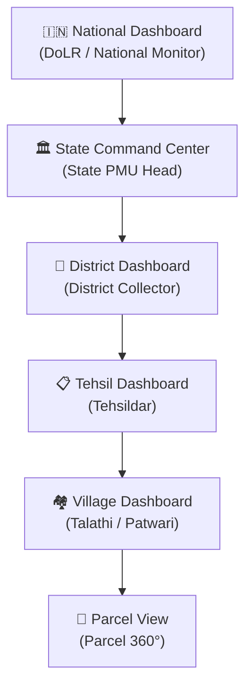
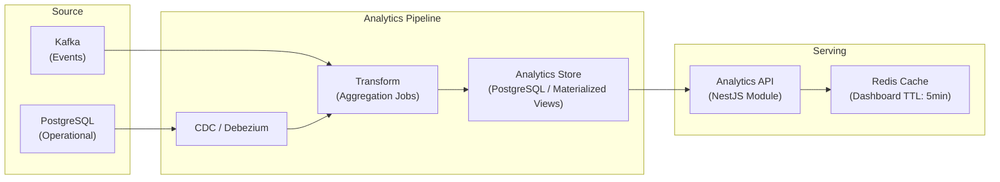

# Land Stack — Analytics & MIS Architecture

**Version**: 2.0 | **Date**: September 2026
**Purpose**: Analytics dashboards, KPIs, visualizations, and drill-down architecture

---

## 1. Analytics Hierarchy



Every dashboard at level N can drill down to level N+1. Click a district on the state choropleth → opens district dashboard (Collector scope). Click a tehsil → opens tehsil dashboard (Tehsildar scope). Click a village → opens village verification queue (Talathi scope). Click a parcel → opens Parcel 360°.

---

## 2. KPI Categories

### 2.1 Mutation Performance
| KPI | Description | Visualization |
|---|---|---|
| Mutation Pendency | Total pending mutations by stage | Stacked bar chart |
| Avg Processing Time | Average days from initiation to RoR update | KPI card + trend line |
| SLA Compliance % | % of mutations completed within SLA | Gauge + trend |
| Registration-to-Mutation Conversion | % of registrations that triggered mutations | KPI card |
| Mutation Ageing | Distribution of pending cases by age bucket | Histogram |
| Monthly Volume | Filed vs Completed vs Pending | Time-series area chart |

### 2.2 Data Quality
| KPI | Description | Visualization |
|---|---|---|
| Data Quality Index | Composite score (0-100) per jurisdiction | KPI card (A-E grade) |
| RoR-Map Mismatch % | % of parcels with >10% area discrepancy | KPI card + trend |
| Missing Geometry % | % of parcels without spatial_unit record | KPI card |
| Stale Data Count | Records not refreshed beyond threshold | Bar chart by source |
| Conflict Count | Active cross-source data conflicts | KPI card + trend |

### 2.3 Coverage & Digitization
| KPI | Description | Visualization |
|---|---|---|
| ULPIN Coverage % | % of parcels with assigned ULPIN | Choropleth map |
| RoR Integration % | % of parcels with active RoR projection | Progress bar |
| Cadastral Map Coverage % | % of parcels with geometry | Progress bar |
| Registration Integration % | % of SROs sending webhooks | Progress bar |
| Court Integration % | % of revenue courts linked | Progress bar |

### 2.4 Service Delivery
| KPI | Description | Visualization |
|---|---|---|
| Applications Pending | By type and jurisdiction | Stacked bar |
| Avg Resolution Time | Days to resolve service applications | KPI card + trend |
| Citizen Satisfaction (NPS) | Net Promoter Score from feedback | Gauge |
| Grievance Resolution Rate | % resolved within SLA | KPI card |

### 2.5 Integration Health
| KPI | Description | Visualization |
|---|---|---|
| Adapter Uptime % | Per-state, per-source system | Traffic light grid |
| API Response Time (P95) | Per-adapter latency | Bar chart |
| Event Lag | Delay between State event and Land Stack processing | KPI card |
| Failed Events | Events in dead-letter queue | KPI card + alert |
| Source Freshness | Time since last successful sync per source | Heatmap |

### 2.6 Platform Operations
| KPI | Description | Visualization |
|---|---|---|
| Active Government Users | By role and jurisdiction | KPI card + breakdown |
| Active Citizen Users | Daily/Monthly Active | Time-series |
| API Calls / Day | Total and per-endpoint | Time-series |
| Error Rate | 4xx + 5xx as % of total | KPI card + trend |
| Queue Depth | Kafka consumer lag | Real-time gauge |

---

## 3. Dashboard Specifications

### 3.1 State PMU Dashboard

```
┌─────────────────────────────────────────────────────────────┐
│  MAHARASHTRA — LAND GOVERNANCE MIS                          │
│                                                             │
│  ┌───────┐ ┌───────┐ ┌───────┐ ┌───────┐ ┌───────┐       │
│  │ULPIN  │ │Mutn   │ │DQ     │ │Integ  │ │Active │       │
│  │Covg   │ │Pend.  │ │Index  │ │Uptime │ │Users  │       │
│  │78.4%  │ │12,456 │ │B+(82) │ │99.2%  │ │1,234  │       │
│  │▲2.1%  │ │▼-340  │ │▲+3   │ │—      │ │▲+56   │       │
│  └───────┘ └───────┘ └───────┘ └───────┘ └───────┘       │
│                                                             │
│  ROW 1: CHOROPLETHS                                        │
│  ┌────────────────────┐  ┌────────────────────┐            │
│  │ District Mutation   │  │ District Data       │            │
│  │ SLA Choropleth     │  │ Quality Choropleth  │            │
│  │ [Click to drill]   │  │ [Click to drill]    │            │
│  └────────────────────┘  └────────────────────┘            │
│                                                             │
│  ROW 2: TRENDS                                             │
│  ┌────────────────────────────────────────────┐            │
│  │ Mutation Trend (6 months)                  │            │
│  │ [Area chart: Filed | Completed | Pending]  │            │
│  └────────────────────────────────────────────┘            │
│                                                             │
│  ROW 3: RANKINGS + AI SUMMARY                              │
│  ┌────────────────────┐  ┌────────────────────┐            │
│  │ District Ranking   │  │ 🧠 AI Executive     │            │
│  │ by SLA Compliance  │  │ Summary             │            │
│  │ 1. Pune (92%)      │  │ "Pendency decreased │            │
│  │ 2. Nashik (88%)    │  │  8% statewide..."   │            │
│  │ ...                │  │ ⚠️ ADVISORY          │            │
│  └────────────────────┘  └────────────────────┘            │
│                                                             │
│  FILTERS: [Date Range] [Department] [Workflow] [Status]    │
└─────────────────────────────────────────────────────────────┘
```

### 3.2 District Dashboard

Same structure as State but scoped to district:
- Choropleths show tehsils instead of districts
- Rankings compare tehsils
- KPIs scoped to district jurisdiction

### 3.3 Tehsil Dashboard (Tehsildar)

- KPI cards: pending, completed, SLA%, avg days
- Mutation ageing histogram
- Village-level heat map
- Work queue summary by stage
- AI bottleneck analysis

---

## 4. Visualization Types

| Type | Used For | Technology |
|---|---|---|
| KPI Cards | Headline metrics with trend arrows | Custom React components |
| Time-Series Charts | Trends over time (mutations, users, quality) | Apache ECharts |
| Bar Charts | Comparisons (districts, tehsils, departments) | Apache ECharts |
| Stacked Bar | Composition breakdown (by stage, type, status) | Apache ECharts |
| Choropleth Maps | Geographic performance visualization | MapLibre GL JS + GeoJSON |
| Heatmaps | Source freshness, data quality, anomaly density | Apache ECharts |
| Gauges | SLA compliance %, system health | Apache ECharts |
| Histograms | Case ageing distribution | Apache ECharts |
| Funnels | Workflow stage progression | Apache ECharts |
| Tables | Ranked lists, detailed data | TanStack Table |
| Pie/Donut | Status distribution | Apache ECharts |

---

## 5. Filter Dimensions

All dashboards are filterable by:

| Dimension | Values |
|---|---|
| State | Dropdown: all onboarded states |
| District | Cascading from state |
| Tehsil | Cascading from district |
| Village | Cascading from tehsil |
| Department | Revenue, Registration, Survey, Planning, Court |
| Date Range | Preset (7d, 30d, 90d, 1y, custom) |
| Workflow Type | Mutation, Service Application, Survey, Grievance |
| Status | Pending, In Progress, Completed, Overdue, Escalated |
| Role | Filter by officer role |

---

## 6. Data Pipeline



### Implementation Strategy

- **Phase 1**: PostgreSQL materialized views refreshed every 15 minutes
- **Phase 2**: Dedicated analytics database with pre-aggregated tables
- **Phase 3**: Real-time streaming analytics with Kafka + ClickHouse (if scale demands)

---

## 7. DILRMP MIS Alignment

| DILRMP KPI | Land Stack Metric | Classification |
|---|---|---|
| RoR Computerization % | RoR Integration Coverage | ✅ Guideline-Derived |
| Cadastral Map Digitization % | Geometry Coverage | ✅ Guideline-Derived |
| RoR-Map Integration % | Linked Parcels with both RoR + Geometry | ✅ Guideline-Derived |
| ULPIN Coverage | ULPIN Assignment % | ✅ Guideline-Derived |
| SRO Computerization % | Registration Integration Coverage | ✅ Guideline-Derived |
| Mutation Pendency | Platform-tracked pending mutations | 🟡 Platform Operational |
| SLA Compliance | Platform-calculated from workflow events | 🟡 Platform Operational |
| Data Quality Index | Composite score from DQ checks | 🔵 Proposed Innovation |
| AI Executive Summary | LLM-generated governance narrative | 🔵 Proposed Innovation |
| District Ranking | Composite governance performance score | 🔵 Proposed Innovation |

---

*This document defines the Analytics & MIS architecture. Access control is governed by [ROLE_PORTAL_MATRIX.md](./ROLE_PORTAL_MATRIX.md).*
