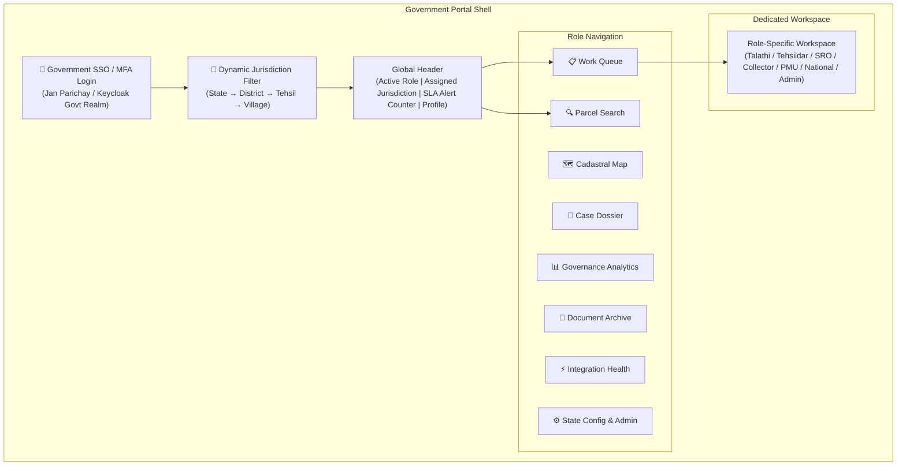
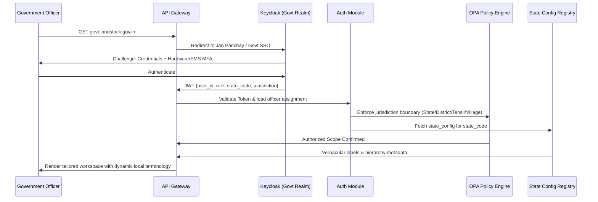
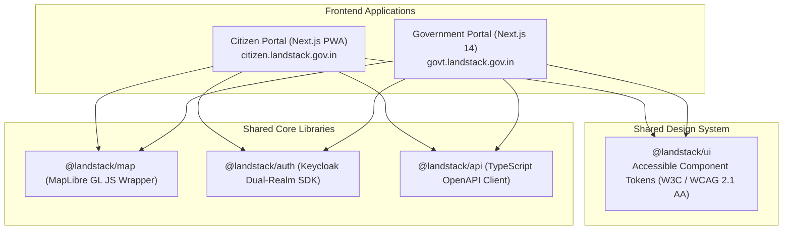

# Land Stack — Government Portal Architecture (7 Government Roles)

**Version**: 2.1 | **Date**: September 2026  
**Scope**: Architecture specification for the Government Operations Portal across the 7 streamlined government roles: Talathi, Tehsildar, Sub-Registrar, District Collector, State PMU Head, DoLR / National Monitor, and System Administrator.

---

## 1. Portal Overview

The Government Operations Portal is the **second experience plane** of Land Stack, operating alongside the Citizen Portal. It delivers dedicated, task-first workspaces for the 7 authorized government administrative roles.

### Core Architectural Principles
1. **Task-First Ergonomics**: Officers immediately see their prioritized work queue upon logging in rather than an unmanageable dashboard of all features.
2. **Strict Jurisdiction Isolation**: UI and backend endpoints strictly filter data to the officer's authorized geographic jurisdiction (State → District → Tehsil → Circle → Village).
3. **Absorbed Decision Authority**: The Tehsildar directly reviews Talathi verifications and issues statutory orders, eliminating intermediate delays.
4. **State-Configurable Vernacular**: Labels, administrative terms (e.g., Talathi vs. Lekhpal; 7/12 vs. Khatauni), and area units adapt dynamically per `state_config`.
5. **Mobile-Responsive Field Access**: The Talathi workspace is optimized for low-bandwidth field visits on tablets and smartphones with offline photo capture.

---

## 2. Portal Shell Architecture



---

## 3. State-Aware Authentication & Workspace Loading Flow



---

## 4. Role-Specific Workspaces (7 Government Roles)

### 4.1 Talathi / Patwari Workspace (Ground-Level Field Worker)

```
┌────────────────────────────────────────────────────────────────────────┐
│ 👤 TALATHI WORKSPACE — Haveli Taluka, Wadgaon Sheri (Gat/Survey)       │
├────────────────────────────────────────────────────────────────────────┤
│ 📋 MY PENDING FIELD QUEUE (12)                                         │
│ ┌────────────────────────────────────────────────────────────────────┐ │
│ │ 🔴 MUT-PU-HVL-2026-00456 │ Gat 45/2A │ Sale Mutation  │ SLA: 2d left│ │
│ │ 🔴 MUT-PU-HVL-2026-00459 │ Gat 78/1  │ Partition      │ SLA: 4d left│ │
│ │ 🟡 CIT-CORR-2026-0012    │ Gat 12/B  │ Area Mismatch  │ SLA: 6d left│ │
│ └────────────────────────────────────────────────────────────────────┘ │
│                                                                        │
│ ⚡ QUICK ACTIONS (Selected: MUT-PU-HVL-2026-00456)                     │
│ [📷 Upload Geotagged Site Photos] [📝 Enter Possession Notes]          │
│ [✅ Submit Recommendation to Tehsildar] [⚠️ Report Boundary Conflict] │
└────────────────────────────────────────────────────────────────────────┘
```

### 4.2 Tehsildar Decision Workspace (Primary Statutory Decision Maker)

```
┌────────────────────────────────────────────────────────────────────────┐
│ ⚖️ TEHSILDAR STATUTORY DECISION WORKSPACE — Haveli Taluka (Pune)       │
├────────────────────────────────────────────────────────────────────────┤
│ 📋 TEHSIL STATUTORY QUEUE                                              │
│ ┌───────────────┐ ┌───────────────┐ ┌───────────────┐ ┌──────────────┐ │
│ │ Awaiting Order│ │ Hearings Today│ │ SLA Breached  │ │ AI Risk Flag │ │
│ │      18       │ │       4       │ │       2       │ │       5      │ │
│ └───────────────┘ └───────────────┘ └───────────────┘ └──────────────┘ │
│                                                                        │
│ CASE REVIEW: MUT-PU-HVL-2026-00456 (Gat 45/2A — Wadgaon Sheri)        │
│ ┌─────────────────────────────────┐ ┌────────────────────────────────┐ │
│ │ EVIDENCE & VERIFICATION DOSSIER │ │ AI ADVISORY & STATUTORY ACTION │ │
│ │ • Registered Deed: PUN-2026-0456│ │ ⚠️ ADVISORY: 4.8% area variance│ │
│ │ • Talathi Report: Possession OK │ │   between RoR & GIS polygon.   │ │
│ │ • Geotagged Photos: 3 Verified  │ │   [View Anomaly] [Dismiss Flag]│ │
│ │ • Encumbrance: Clear (0 Liens)  │ │                                │ │
│ │ • Objections: 0 Received        │ │ [✅ STATUTORY SANCTION ORDER]  │ │
│ │ • 30-Day Notice Period: Elapsed │ │ [❌ REJECT WITH LEGAL GROUNDS] │ │
│ │                                 │ │ [🔄 RETURN TO TALATHI FOR CLAR]│ │
│ └─────────────────────────────────┘ └────────────────────────────────┘ │
└────────────────────────────────────────────────────────────────────────┘
```

### 4.3 Sub-Registrar (SRO) Workspace (Registration Authority)

```
┌────────────────────────────────────────────────────────────────────────┐
│ 🏛️ SUB-REGISTRAR OFFICE (SRO) — Haveli-01 Registry                     │
├────────────────────────────────────────────────────────────────────────┤
│ 🔍 INSTANT PRE-REGISTRATION PARCEL AUDIT                               │
│ [Enter ULPIN or Survey No: IN-MH-PU-0001-12345                 ] [Check]│
│                                                                        │
│ AUDIT RESULT FOR DEED EXECUTION:                                       │
│ • Canonical Owner: Ramesh Kumar (Matches Seller ID)                    │
│ • Mortgages: 0 Active (HDFC Satisfaction Deed Verified)                │
│ • Court Restrictions: 🟢 Clear (No Active Injunctions)                 │
│ • Government Land / Tribal Restriction: 🟢 Nil                         │
│                                                                        │
│ ⚡ NGDRS INTEGRATION MONITOR                                           │
│ Webhook Emitter: 🟢 Active │ Daily Transmitted: 48 │ Retries in DLQ: 0 │
└────────────────────────────────────────────────────────────────────────┘
```

### 4.4 District Collector Workspace (District-Level Oversight)

```
┌────────────────────────────────────────────────────────────────────────┐
│ 🏢 DISTRICT COLLECTOR COMMAND COCKPIT — Pune District (14 Tehsils)     │
├────────────────────────────────────────────────────────────────────────┤
│ 📊 DISTRICT HEADLINE METRICS                                           │
│ Total Parcels: 1.84M │ ULPIN Coverage: 84.2% │ Overall SLA: 89.4%      │
│                                                                        │
│ 🗺️ TEHSIL SLA CHOROPLETH & RANKINGS                                    │
│ 1. Pune City   (94.2% SLA Adherence - Green)                           │
│ 2. Haveli      (91.8% SLA Adherence - Green)                           │
│ ...                                                                    │
│ 14. Velhe      (68.4% SLA Adherence - Red) ⚠️ Escalation Triggered     │
│                                                                        │
│ [Drill down into Velhe Tehsil] [Reallocate Officers] [Export Review]   │
└────────────────────────────────────────────────────────────────────────┘
```

### 4.5 State PMU Head Workspace (State Nodal Officer)

```
┌────────────────────────────────────────────────────────────────────────┐
│ 🏛️ STATE PMU COMMAND CENTER — Maharashtra Land Governance (36 Dists)  │
├────────────────────────────────────────────────────────────────────────┤
│ 📈 STATE DILRMP PROGRESS                                               │
│ • Cadastral Digitization: 98.2% │ RoR-Map Integration: 89.4%           │
│ • Statewide Mutation Backlog: 12,450 (▼ 8.4% this month)               │
│ • State Adapter API Uptime: 99.4% (Mahabhulekh: 99.1%, NGDRS: 100%)    │
│                                                                        │
│ 🧠 AI STATE EXECUTIVE BRIEF                                            │
│ "Statewide pendency reduced by 8.4%. Gadchiroli and Velhe districts    │
│  exceed SLA thresholds due to administrative vacancies. Recommended:   │
│  deploy mobile revenue facilitation units."                            │
│  ⚠️ ADVISORY | Model: StateGov-v2.1 | Confidence: 0.88                 │
└────────────────────────────────────────────────────────────────────────┘
```

### 4.6 DoLR / National Monitor Cockpit (Central Ministry Oversight)

```
┌────────────────────────────────────────────────────────────────────────┐
│ 🇮🇳 NATIONAL LAND STACK COCKPIT — Department of Land Resources (DoLR)   │
├────────────────────────────────────────────────────────────────────────┤
│ 🌐 NATIONAL BENCHMARKS (36 States/UTs)                                 │
│ Total Assigned ULPINs (Bhu-Aadhaar): 36.4 Crore / 40+ Crore Target     │
│ National Avg Mutation SLA: 24.2 Days (Target: 21 Days)                 │
│ Inter-State Terminology Standard (GoRT) Adoption: 24 States            │
│                                                                        │
│ [State Comparison Matrix] [Export Ministry Brief] [DILRMP MIS Sync]    │
└────────────────────────────────────────────────────────────────────────┘
```

### 4.7 System Administrator Workspace (Platform & Security Operations)

```
┌────────────────────────────────────────────────────────────────────────┐
│ ⚙️ SYSTEM ADMINISTRATOR CONSOLE — Land Stack Platform Operations       │
├────────────────────────────────────────────────────────────────────────┤
│ 🛡️ SYSTEM & SECURITY STATUS                                            │
│ Pods: 48/48 Healthy │ DB Read-Replicas: 3 Active │ Cache Hit: 89.2%    │
│ Kafka Consumer Lag: 12ms │ Dead-Letter Queue (DLQ): 0                  │
│                                                                        │
│ 🔐 CRYPTOGRAPHIC AUDIT LOG HEALTH                                      │
│ Last Hash-Chain Verification: Today 04:00 AM UTC │ Result: 🟢 VALID    │
│ Partitions Scanned: 42.8M Events │ Tamper Evidence: ZERO ERRORS        │
│                                                                        │
│ [Deploy OPA Policy] [Update State Config] [Inspect Audit] [Replay DLQ] │
└────────────────────────────────────────────────────────────────────────┘
```

---

## 5. Navigation Access by Role (Strict 7 Government Roles)

| Navigation Module | Talathi | Tehsildar | Sub-Registrar | Collector | State PMU | National Monitor | Sys Admin |
|---|:---:|:---:|:---:|:---:|:---:|:---:|:---:|
| **Work Queue** | ✅★ | ✅★ | ✅ | ❌ | ❌ | ❌ | ❌ |
| **Parcel Search & 360°** | ✅ | ✅ | ✅★ | ✅ | ✅ | ✅ | ✅ |
| **Cadastral Map / GIS** | ✅ | ✅ | ✅ | ✅ | ✅ | ✅ | ❌ |
| **Case Decisions / Orders** | ❌ | ✅★ | ❌ | ✅ | ❌ | ❌ | ❌ |
| **Governance Analytics** | ❌ | ✅ | ❌ | ✅★ | ✅★ | ✅★ | ✅ |
| **Document Vault** | ✅ | ✅ | ✅ | ✅ | ❌ | ❌ | ❌ |
| **Integration Health** | ❌ | ❌ | ✅ | ❌ | ✅ | ❌ | ✅★ |
| **State Config & Policies** | ❌ | ❌ | ❌ | ❌ | ❌ | ❌ | ✅★ |

★ = Primary operational workspace for this role

---

## 6. Frontend Architecture & Technology Stack



| Dimension | Specification |
|---|---|
| **Framework** | Next.js 14 (App Router), TypeScript, Server Actions |
| **State Management** | TanStack React Query (Server State) + Zustand (Local UI State) |
| **Spatial Map Engine** | MapLibre GL JS with Martin Vector Tiles (`.pbf`) |
| **Chart Engine** | Apache ECharts for choropleths, histograms, and SLA gauges |
| **Data Tables** | TanStack Table with virtualized scrolling for large queues |
| **Forms & Validation** | React Hook Form with Zod schemas matching DTOs |

---

*This architecture document defines the exact workspace layouts, navigation trees, and functional scope for the 7 government roles in Land Stack.*
