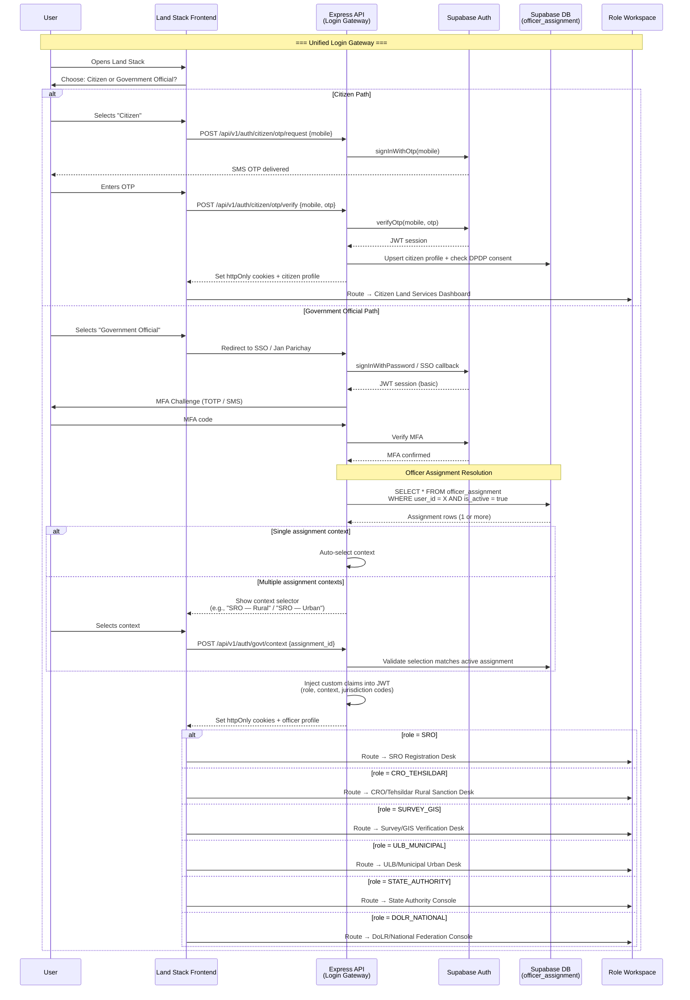

# Land Stack — Authentication & Roles (Final Prototype)

**Version**: 2.0 | **Date**: September 2026
**Prerequisite**: Read [01-architecture-overview.md](./01-architecture-overview.md) first
**Reference**: [ROLE_PORTAL_MATRIX.md](../../docs/ROLE_PORTAL_MATRIX.md), [Personas](../../docs/02-personas.md), [Workflows](../../docs/workflows.md)

---

## 1. Why Authentication Is Critical

In most apps, auth is a checkbox — "can this user log in?" In Land Stack, auth is the **foundation of the entire security model**. It's not just "who are you?" — it's "who are you, what role do you hold, in which department, in which state, in which district, in which tehsil or municipality, and which pilot context are you operating in?"

A bug in the parcel search UI is annoying. A bug in auth is catastrophic — it could let an SRO in Pune see mutation cases in Nagpur. Or let a citizen see another citizen's Aadhaar token hash. Or let an AI system approve a mutation without human oversight. Or let a ULB Officer approve a rural mutation they have no authority over.

This document describes the complete auth strategy for the Land Stack prototype: 1 citizen persona + 5 government personas, unified login gateway, pilot context model, jurisdiction enforcement, and security constraints.

---

## 2. Authentication Storage and Cookie Strategy

**This is a non-negotiable architectural decision.**

### The Decision

When a user authenticates (citizen or officer), the server issues a JWT. That JWT is stored in an **HTTP-only, Secure, SameSite=Strict cookie**. It is **never stored in localStorage or sessionStorage**.

### Why Not localStorage?

localStorage is accessible to **any JavaScript running on the page**. This means:

1. **XSS Vulnerability**: If an attacker injects malicious JavaScript into the page (via a stored XSS, reflected XSS, or compromised third-party script), that script can read `localStorage.getItem('access_token')`, steal the JWT, and send it to an attacker-controlled server. The attacker can then impersonate the user from anywhere in the world.

2. **No Expiry Enforcement**: localStorage persists until explicitly cleared. A token that should expire in 15 minutes might linger in localStorage for days if the cleanup logic has a bug.

3. **No Automatic Sending**: With localStorage, every API call needs explicit code to attach the Authorization header. If a developer forgets, the request goes unauthenticated. If they attach it incorrectly, the token leaks in logs.

### Why HTTP-Only Cookies?

1. **XSS-Proof**: An HTTP-only cookie is **invisible to JavaScript**. `document.cookie` cannot read it. Even if an attacker achieves full XSS on the page, they cannot exfiltrate the JWT. The cookie only travels between browser and server — never accessible to client-side code.

2. **Automatic Sending**: The browser automatically attaches the cookie to every request to the same domain. No developer has to remember to add an Authorization header. The auth context is always present.

3. **CSRF Protection with SameSite=Strict**: The `SameSite=Strict` attribute ensures the cookie is **only sent on requests originating from our own domain**. A malicious site cannot trigger a cross-site request that carries our cookie. Combined with `Secure` (HTTPS-only), this is the strongest cookie configuration available.

4. **Server-Controlled Expiry**: The server sets `maxAge` on the cookie. When it expires, it's gone. No client-side cleanup needed.

### The Trade-Off

HTTP-only cookies mean the frontend JavaScript **cannot read the JWT claims** (role, jurisdiction, etc.) to customize the UI. We solve this by:
- Providing a `/api/v1/auth/me` endpoint that returns the user's profile, role, active context, and jurisdiction — the frontend calls this on load
- Including non-sensitive user metadata in the `/me` response body that the frontend uses for UI rendering and workspace routing

This is a small inconvenience for a massive security gain.

> *Reference: Security best practices from [architecture.md](../../docs/architecture.md) Section 8. The cookie-based pattern was informed by Supabase documentation on SSR authentication with httpOnly cookies and Express.js middleware patterns.*

---

## 3. Citizen Authentication Flow

**Who**: Any citizen — farmer, landowner, flat buyer, NRI, legal representative
**Where**: PWA on mobile phone (possibly 2G network in rural India)
**Method**: Mobile number + OTP (6-digit, 5-minute expiry)

### The Flow

1. Citizen opens Land Stack → chooses **"Citizen"** from the unified login gateway
2. Citizen enters mobile number → Express calls Supabase Auth `signInWithOtp()`
3. Supabase sends OTP via configured SMS provider
4. Citizen enters OTP → Express calls Supabase Auth `verifyOtp()`
5. On success, Supabase returns session (access_token + refresh_token)
6. Express sets both tokens as HTTP-only cookies with `{ httpOnly: true, secure: true, sameSite: 'strict' }`
7. Express creates/updates the citizen profile in the `citizen` table
8. **First-time login**: DPDP Act consent modal is displayed → citizen accepts → consent recorded in `consent_log`
9. Frontend calls `/api/v1/auth/me` → receives profile for UI rendering
10. Frontend routes to **Citizen Land Services** dashboard

### Security Constraints

- Max 5 OTP attempts per 15 minutes
- Max 10 OTPs per day per mobile number
- Mobile stored as SHA-256 hash — never in plaintext
- Access token: 15-minute expiry
- Refresh token: 7-day expiry
- Idle timeout: 30 minutes
- Max session: 24 hours (CERT-In compliance)

Citizens access both rural and urban parcels through a unified search experience. There is no pilot context selector for citizens — they see whatever parcels match their search.

---

## 4. Government Official Authentication Flow

**Who**: SRO, CRO/Tehsildar, Survey/GIS Officer, ULB/Municipal Officer, State Authority, DoLR/National
**Where**: Desktop browser in government office (or tablet in field)
**Method**: SSO via Jan Parichay / State SSO / Official email + TOTP or SMS MFA

### The Flow

1. Officer opens Land Stack → chooses **"Government Official"** from the unified login gateway
2. Officer authenticates via Government SSO / Jan Parichay / State portal (or Supabase Auth with official email/password)
3. MFA challenge issued (TOTP via authenticator app or SMS)
4. Officer completes MFA → Supabase returns session
5. Express sets tokens as HTTP-only cookies
6. **Officer Assignment Resolution**: Express queries the `officer_assignment` table for this user:
   - Loads ALL active assignments (an officer may have multiple)
   - Resolves: role, department, pilot_context, jurisdiction_type, jurisdiction_id, state_code, district_code, tehsil_code, sro_code, ulb_code, assigned_projects, permissions
7. **Context Resolution**:
   - If the officer has **exactly one valid assignment context** → skip context selection, inject claims, go directly to workspace
   - If the officer has **multiple valid contexts** (e.g., an SRO assigned to both rural and urban jurisdictions) → present a context selector
8. **Context Validation**: The selected context is validated against `officer_assignment` on the backend. **The frontend context selector is never trusted.** Express verifies:
   - Is this officer assigned to this context?
   - Is this officer assigned to this jurisdiction?
   - Is this officer's assignment active (`is_active = true`)?
   - Does the officer have the permissions required for this workspace?
9. Express injects validated assignment as **custom claims** into the JWT
10. JWT (with enriched claims) stored in HTTP-only cookies
11. Express fetches `state_config` → returns vernacular labels
12. Frontend routes to the **role-specific workspace** for the active context

### Security Constraints

- MFA required for all government accounts — no exceptions
- 8-hour max session (government workday)
- MFA re-challenge for sensitive operations (APPROVE, REJECT, ISSUE_ORDER)
- Session bound to IP range (optional, configurable per deployment)
- Hardware token support for CRO/Tehsildar (statutory authority role)
- Context switching requires re-validation against `officer_assignment`

> *Reference: Auth flows from [architecture.md](../../docs/architecture.md) Section 8.1 and [GOVERNMENT_PORTAL_ARCHITECTURE.md](../../docs/GOVERNMENT_PORTAL_ARCHITECTURE.md) Section 3.*

---

## 5. Officer Assignment and Context Resolution

When a government officer logs in, the system must resolve their operational context. This is not a simple role lookup — an officer may operate across multiple pilot contexts.

### Why Context Resolution Exists

- An **SRO** may handle registrations for both rural parcels and urban properties within their registration sub-district boundary
- A **Survey/GIS Officer** may work on rural cadastral surveys one week and urban NAKSHA mapping the next
- A **State Authority** monitors both rural and urban pilots from a single dashboard

The system does not force officers to create separate accounts for each context. One identity, multiple validated contexts.

### Resolution Logic

1. Query `officer_assignment` WHERE `user_id = <authenticated_user>` AND `is_active = true`
2. Group results by `pilot_context`
3. If **one result** → auto-select, no UI prompt
4. If **multiple results** → show context selector listing the available contexts with human-readable labels (e.g., "SRO — Rural Pilot (Haveli Tehsil)" and "SRO — Urban Pilot (Pune Municipal)")
5. Officer selects a context → Express validates the selection against the database
6. **Never trust the frontend selection blindly** — the backend performs a fresh query to confirm the selection matches an active assignment row

### Context Switching

An officer who has multiple contexts can switch between them without logging out. The context switch triggers:
1. A new `officer_assignment` validation query
2. New JWT claims injection
3. New HTTP-only cookie set
4. Workspace re-render

Every context switch is recorded in the audit log.

---

## 6. Rural / Urban / Shared Context Model

Land Stack serves two distinct land governance pilots and a shared spatial layer. The pilot context determines which workspaces, workflows, and data an officer can access.

### The Five Contexts

| Context | Description | Who Operates Here |
|---|---|---|
| **RURAL** | Village/tehsil-level land governance — RoR, mutation, revenue workflow | SRO, CRO/Tehsildar, Survey/GIS Officer |
| **URBAN** | Municipal/ULB-level land governance — property cards, zoning, tax, NAKSHA | SRO, ULB/Municipal Officer, Survey/GIS Officer |
| **SHARED_GIS** | Cross-cutting spatial operations spanning both pilots | Survey/GIS Officer |
| **STATE** | State-wide monitoring, analytics, integration health | State Authority |
| **NATIONAL** | Cross-state federation monitoring, DILRMP indicators | DoLR / National Monitor |

### Context Does NOT Grant Permissions

Selecting a context is not an authorization action. It's a UI routing decision that determines which workspace a user sees. The actual authorization check happens at every data request:

- Is the officer **assigned** to this context in `officer_assignment`?
- Is the officer **assigned** to this jurisdiction (tehsil, SRO area, ULB boundary)?
- Is the officer's assignment **active**?
- Does the officer have the **specific permission** required for this operation?
- Is the **requested parcel** within the officer's authorized jurisdiction?

All five checks must pass for every sensitive data access.

---

## 7. Final Prototype Roles

The Land Stack prototype supports **6 personas**: 1 citizen + 5 government officials. These map to real people in India's land governance hierarchy.

### 1. Citizen

**Who**: Any individual — farmer, landowner, flat buyer, NRI, legal representative — accessing land records.

**Contexts**: Searches across both rural and urban parcels. No pilot context selector — citizens see a unified land services experience.

**What they can do**: Search any parcel (public summary). View full detail on their own/linked parcels. Apply for RoR extracts, Non-Encumbrance Certificates, data corrections, and grievances. Track mutation status. Set up watchlist alerts. Download certified copies.

**What they CANNOT do**: View other citizens' contact info, Aadhaar tokens, or officer notes. Approve or reject anything. Access government work queues. See internal data quality scores or officer deliberation notes.

**Jurisdiction**: Global search (public summary). Full access only on parcels they own or are linked to.

### 2. SRO (Sub-Registrar Officer)

**Who**: The officer at the registration office who handles deed registration and pre-registration parcel verification. The SRO is a **registration-side actor** — they work with the registration pipeline, not the revenue sanction pipeline.

**Contexts**: **Both RURAL and URBAN.** The Sub-Registrar Office handles property registration across all applicable land jurisdictions within its registration sub-district boundary — rural parcels, urban properties, and everything in between.

**What they can do**: Search parcels within their SRO jurisdiction. View ownership, encumbrances, and restrictions. Verify registered deed metadata. Check registration restrictions (court injunctions, encumbrance bars). Attach registration metadata to parcels. Trigger/forward mutation requests to the revenue workflow.

**What they CANNOT do**: Approve or reject mutations. Issue statutory orders. The SRO's role is verification and initiation — the sanction authority rests solely with the CRO/Tehsildar (rural) or the appropriate urban authority.

**Jurisdiction**: SRO office area (a registration sub-district boundary that may cover both rural and urban parcels).

**Why SRO is in both contexts**: Registration is jurisdiction-based, not pilot-based. A sub-registrar office in Pune handles deed registration for both village agricultural land (rural) and city apartments (urban) if they fall within the SRO's registration boundary.

### 3. CRO / Tehsildar (Rural Sanction Authority)

**Who**: The **sole statutory authority** for rural land mutation sanctions. The Tehsildar / CRO is the competent revenue authority for the tehsil/taluka — they review mutation cases, conduct hearings, issue statutory orders, and approve or reject mutations.

**Contexts**: **RURAL only** (unless explicitly assigned to an urban jurisdiction, which is uncommon in the prototype).

**What they can do**: Review mutation cases forwarded from the registration pipeline. View deed documents, RoR records, parcel geometry, GIS verification reports, objections, and case timeline. Schedule and record hearings. APPROVE mutations — digitally signed statutory order. REJECT mutations with recorded grounds. Send cases back for correction or additional verification. Request clarification from parties. Trigger revenue record update workflow upon approval.

**What they CANNOT do**: Operate in urban context without explicit assignment. Modify spatial data directly (that's the GIS Officer). Bypass MFA for statutory actions.

**Jurisdiction**: Assigned Tehsil / Taluka (all villages within their administrative boundary).

**Special constraint**: The `APPROVE` and `REJECT` mutation permissions are **exclusively** granted to this role. This is the only statutory mutation sanction action in Land Stack. Enforced at both Express middleware AND RLS policy level.

### 4. Survey / GIS Officer

**Who**: A technical officer managing spatial data — boundary surveys, geometry validation, overlap detection, area reconciliation. Shared across both rural and urban pilots.

**Contexts**: **RURAL, URBAN, and SHARED_GIS.** This is the only role that operates in the SHARED_GIS context, reflecting that GIS work crosses pilot boundaries.

**What they can do**: Geometry validation (ST_IsValid, topology checks). Survey/Gat/ULPIN mapping and identifier reconciliation. Area mismatch detection (RoR recorded vs PostGIS calculated). Boundary overlap detection between adjacent parcels. Parcel subdivision verification. Mark parcels as VERIFIED, CONFLICT, or RESURVEY_REQUIRED. Switch between rural and urban project contexts. Create and manage survey projects.

**What they CANNOT do**: Approve or reject mutations. Issue statutory orders. Modify ownership records. The GIS Officer verifies spatial data — they don't make legal determinations.

**Jurisdiction**: Assigned project areas (may span multiple tehsils or ULBs for a survey campaign).

**Prototype note**: If field verification is needed (e.g., Talathi-like site visits), this is represented as a GIS verification workflow step within the Survey/GIS Officer's workspace — not as a separate login persona.

### 5. ULB / Municipal Officer (Urban Pilot)

**Who**: An officer in an Urban Local Body (Municipal Corporation, Nagar Palika) handling urban land governance — property records, zoning, tax assessment, NAKSHA urban mapping workflows.

**Contexts**: **URBAN only.**

**What they can do**: View parcels within municipal limits. Municipal boundary validation. Property tax reference and assessment context. Zoning and land-use verification. Urban survey/RoR publication workflow. Coordinate with GIS and registration systems on urban land records.

**What they CANNOT do**: Approve rural mutations. Access parcels outside their municipal jurisdiction. Issue rural revenue orders.

**Jurisdiction**: Specific municipality / ULB boundary.

### 6. State Authority / DoLR (Monitoring & Federation)

This covers two sub-levels of the same monitoring persona:

#### State Authority

**Who**: State-level officers (State PMU head, Commissioner of Land Records, etc.) monitoring pilot implementation across the state.

**Contexts**: **STATE** — monitors both RURAL and URBAN pilots from a state-level dashboard.

**What they can do**: View state-wide analytics. District and pilot progress comparison. Integration health monitoring. Data freshness and ULPIN coverage metrics. Mutation pendency analysis. Urban/rural pilot progress tracking. Export governance reports.

**What they CANNOT do**: Approve/reject mutations. View individual citizen PII (masked by default). Modify parcel data. Process individual cases.

**Jurisdiction**: Entire state. Read-only. PII masked.

#### DoLR / National Monitor

**Who**: Officers at the Department of Land Resources (national level) monitoring cross-state federation and DILRMP compliance.

**Contexts**: **NATIONAL** — reads aggregate data from all states.

**What they can do**: Cross-state comparison and benchmarking. Federation health monitoring. State adapter status. DILRMP 3.0 indicators. ULPIN coverage and RoR-map linkage metrics at national aggregate level.

**What they CANNOT do**: Approve/reject anything. View individual citizen PII. Modify any state's land records. Process any mutation. Override any state-level decision.

**Jurisdiction**: National. Read-only federation data only. No direct access to any state's individual records.

> *Reference: Roles adapted from [ROLE_PORTAL_MATRIX.md](../../docs/ROLE_PORTAL_MATRIX.md) and [02-personas.md](../../docs/02-personas.md). Role consolidation decisions aligned with DILRMP 3.0 pilot scope and the registration-revenue integration framework.*

---

## 8. Role and Context Matrix

This matrix defines which roles can operate in which pilot contexts:

| Role | Rural | Urban | Shared GIS | State | National |
|---|---|---|---|---|---|
| **Citizen** | Yes (search & view) | Yes (search & view) | No | No | No |
| **SRO** | Yes (registration) | Yes (registration) | No | No | No |
| **CRO/Tehsildar** | Yes (sanction authority) | No, unless explicitly assigned | No | No | No |
| **Survey/GIS Officer** | Yes (rural surveys) | Yes (urban NAKSHA) | Yes (cross-cutting GIS) | No | No |
| **ULB/Municipal Officer** | No | Yes (urban operations) | No | No | No |
| **State Authority** | Monitoring | Monitoring | Monitoring | Yes (primary) | No |
| **DoLR/National** | Read-only federation | Read-only federation | Read-only federation | Read-only | Yes (primary) |

### Key Takeaways

- **SRO appears in both rural and urban** — registration is not pilot-specific, it's jurisdiction-specific
- **Survey/GIS Officer is the only SHARED_GIS role** — spatial work crosses pilot boundaries
- **CRO/Tehsildar is strictly the rural sanction authority** — the urban mutation authority (if any) is a separate concern not in this prototype
- **ULB is urban-only** — no rural operations
- **State/DoLR are monitoring roles** — they observe, measure, and report but never process individual cases

---

## 9. Detailed Role Permissions

| Permission | Citizen | SRO | CRO/Tehsildar | Survey/GIS | ULB/Municipal | State/DoLR |
|---|---|---|---|---|---|---|
| Search parcels (public) | ✅ | ✅ | ✅ | ✅ | ✅ | ✅ |
| View own parcels (full) | ✅ | — | — | — | — | — |
| View jurisdiction parcels | — | ✅ | ✅ | ✅ | ✅ | Aggregate only |
| View deed / registration | — | ✅ | ✅ | — | — | — |
| Verify registration context | — | ✅ | — | — | — | — |
| Trigger mutation request | — | ✅ | — | — | — | — |
| Review mutation case | — | — | ✅ | — | — | — |
| APPROVE mutation | — | — | ✅ | — | — | — |
| REJECT mutation | — | — | ✅ | — | — | — |
| Schedule hearing | — | — | ✅ | — | — | — |
| Issue statutory order | — | — | ✅ | — | — | — |
| Validate geometry | — | — | — | ✅ | — | — |
| Mark parcel GIS status | — | — | — | ✅ | — | — |
| Area reconciliation | — | — | — | ✅ | — | — |
| Boundary overlap check | — | — | — | ✅ | — | — |
| View property tax context | — | — | — | — | ✅ | — |
| Zoning verification | — | — | — | — | ✅ | — |
| Urban RoR publication | — | — | — | — | ✅ | — |
| View state analytics | — | — | — | — | — | ✅ |
| View federation metrics | — | — | — | — | — | ✅ |
| Apply for services | ✅ | — | — | — | — | — |
| Track mutation | ✅ | — | — | — | — | — |
| Watchlist alerts | ✅ | — | — | — | — | — |
| Download documents | ✅ | — | — | — | — | — |

---

## 10. Login-to-Workspace Routing

### Unified Login Gateway

Land Stack uses **one login page** — not separate portals per role. The user flow:

```
Land Stack Login Gateway
         │
    Choose User Type
    ┌────┴────┐
    │         │
 Citizen   Government
    │      Official
    │         │
 Mobile      Government SSO /
  OTP        Jan Parichay /
    │        State SSO
    │         │
    │       MFA Verification
    │         │
    │       Officer Assignment
    │       Resolution
    │         │
    │       ┌──────────────────┐
    │       │ Single context?  │
    │       │ Yes → Auto-route │
    │       │ No → Context     │
    │       │     selector     │
    │       └──────────────────┘
    │         │
    │       Backend Validates
    │       Context + Jurisdiction
    │         │
    ▼         ▼
Citizen    Role-Specific
Dashboard  Workspace
```

### Government Workspaces

Each role routes to a purpose-built workspace:

#### 1. SRO Registration Desk
*Available in: RURAL and URBAN contexts*

- Search parcel within SRO jurisdiction
- Verify registered deed metadata
- View ownership and encumbrance context
- Check registration restrictions (court injunctions, encumbrance bars)
- Attach registration metadata
- Trigger/forward mutation request to the revenue workflow
- Cannot approve or reject final mutation

#### 2. CRO/Tehsildar Rural Sanction Desk
*Available in: RURAL context only*

- Review mutation cases forwarded from SRO/registration pipeline
- View deed, RoR, parcel geometry, GIS verification, objections, timeline
- Approve mutation (statutory order, digitally signed)
- Reject mutation (with recorded legal grounds)
- Send back for correction or clarification
- Schedule and record hearings
- Issue sanction/order
- Trigger revenue record update workflow upon approval

#### 3. Survey/GIS Verification Desk
*Available in: RURAL, URBAN, and SHARED_GIS contexts*

- Geometry validation (topology, boundary integrity)
- Survey/Gat/CTS/ULPIN mapping and reconciliation
- Area mismatch detection (RoR vs calculated polygon)
- Boundary overlap detection across adjacent parcels
- Parcel subdivision verification
- Rural and urban project switching
- Mark parcels: VERIFIED / CONFLICT / RESURVEY_REQUIRED

#### 4. ULB/Municipal Urban Desk
*Available in: URBAN context only*

- View urban parcels within municipal limits
- Municipal boundary validation
- Property tax reference and assessment context
- Zoning and land-use verification
- Urban survey/RoR publication workflow
- Coordinate with GIS and registration systems
- Cannot approve rural mutations

#### 5. State Authority Console
*Available in: STATE context*

- State-wide monitoring dashboard
- District and pilot analytics comparison
- Integration health and adapter status
- Data freshness and ULPIN coverage metrics
- Mutation pendency analysis by district/tehsil
- Urban/rural pilot progress tracking

#### 6. DoLR/National Federation Console
*Available in: NATIONAL context*

- Cross-state monitoring and benchmarking
- Federation health — state adapter connectivity
- DILRMP 3.0 compliance indicators
- ULPIN and RoR-map linkage metrics (national aggregate)
- Read-only aggregate data — no individual mutation approval
- No direct editing of any state's land records

---

## 11. Officer Assignment Database Model

The `officer_assignment` record defines exactly what an officer is authorized to do and where.

### Assignment Structure

```
officer_assignment {
  id                   UUID (PK)
  user_id              UUID (FK → auth.users)
  role                 ENUM (SRO, CRO_TEHSILDAR, SURVEY_GIS, ULB_MUNICIPAL, STATE_AUTHORITY, DOLR_NATIONAL)
  department           VARCHAR (e.g., "REVENUE", "REGISTRATION", "SURVEY", "MUNICIPAL", "DOLR")
  pilot_context        ENUM (RURAL, URBAN, SHARED_GIS, STATE, NATIONAL)
  jurisdiction_type    ENUM (SRO_AREA, TEHSIL, ULB, SURVEY_PROJECT, DISTRICT, STATE, NATIONAL)
  jurisdiction_id      VARCHAR (identifier for the specific jurisdiction boundary)
  state_code           CHAR(2) (e.g., "MH", "KA", "TN")
  district_code        VARCHAR (e.g., "PU" for Pune)
  tehsil_code          VARCHAR (nullable — set for CRO/Tehsildar)
  sro_code             VARCHAR (nullable — set for SRO)
  ulb_code             VARCHAR (nullable — set for ULB/Municipal)
  assigned_projects    VARCHAR[] (nullable — GIS project IDs for Survey Officer)
  permissions          VARCHAR[] (validated permission list for this assignment)
  is_active            BOOLEAN (default true — deactivated when officer transfers out)
  assigned_at          TIMESTAMPTZ
  deactivated_at       TIMESTAMPTZ (nullable)
}
```

### How It Supports Multi-Context Officers

An SRO assigned to both rural and urban has **two rows**:

| user_id | role | pilot_context | sro_code | tehsil_code | ulb_code |
|---|---|---|---|---|---|
| uuid-sro-1 | SRO | RURAL | PU-HVL-01 | HVL | null |
| uuid-sro-1 | SRO | URBAN | PU-HVL-01 | null | PMC |

A Survey/GIS Officer working on both pilots has **multiple rows**:

| user_id | role | pilot_context | assigned_projects |
|---|---|---|---|
| uuid-gis-1 | SURVEY_GIS | RURAL | {PROJ-RUR-PU-001} |
| uuid-gis-1 | SURVEY_GIS | URBAN | {PROJ-URB-PMC-002} |
| uuid-gis-1 | SURVEY_GIS | SHARED_GIS | {PROJ-RUR-PU-001, PROJ-URB-PMC-002} |

A CRO/Tehsildar typically has **one row** (rural only):

| user_id | role | pilot_context | tehsil_code |
|---|---|---|---|
| uuid-cro-1 | CRO_TEHSILDAR | RURAL | HVL |

---

## 12. JWT Claims and Authorization

A standard Supabase JWT contains `{ sub, email, role, aud, exp }`. This isn't enough for Land Stack. We need the JWT to carry the active assignment context so that RLS policies can evaluate jurisdiction.

### What Goes in the JWT

After login and context resolution, Express enriches the JWT with the **active assignment** — not the full list of all assignments. The JWT represents "who this officer is right now, in this context."

**Important**: The JWT carries enough for RLS to do fast checks (role, jurisdiction codes, active context). It does NOT carry the full `permissions` array if permissions can become stale. Sensitive permissions (APPROVE, REJECT) are **always revalidated from the database** at the moment of the sensitive action, not trusted from the JWT alone.

### JWT Examples

**1. Citizen**
```json
{
  "sub": "uuid-citizen-001",
  "role": "CITIZEN",
  "party_id": "uuid-party-record",
  "state_code": "MH",
  "preferred_language": "mr",
  "exp": 1726063200
}
```

**2. SRO — Rural Context**
```json
{
  "sub": "uuid-sro-001",
  "role": "SRO",
  "department": "REGISTRATION",
  "pilot_context": "RURAL",
  "state_code": "MH",
  "district_code": "PU",
  "sro_code": "PU-HVL-01",
  "jurisdiction_type": "SRO_AREA",
  "assignment_id": "uuid-assignment-row",
  "exp": 1726063200
}
```

**3. SRO — Urban Context** (same officer, different context)
```json
{
  "sub": "uuid-sro-001",
  "role": "SRO",
  "department": "REGISTRATION",
  "pilot_context": "URBAN",
  "state_code": "MH",
  "district_code": "PU",
  "sro_code": "PU-HVL-01",
  "ulb_code": "PMC",
  "jurisdiction_type": "SRO_AREA",
  "assignment_id": "uuid-assignment-row-urban",
  "exp": 1726063200
}
```

**4. CRO/Tehsildar — Rural Context**
```json
{
  "sub": "uuid-cro-001",
  "role": "CRO_TEHSILDAR",
  "department": "REVENUE",
  "pilot_context": "RURAL",
  "state_code": "MH",
  "district_code": "PU",
  "tehsil_code": "HVL",
  "jurisdiction_type": "TEHSIL",
  "assignment_id": "uuid-assignment-row",
  "exp": 1726063200
}
```

**5. Survey/GIS Officer — Shared Context**
```json
{
  "sub": "uuid-gis-001",
  "role": "SURVEY_GIS",
  "department": "SURVEY",
  "pilot_context": "SHARED_GIS",
  "state_code": "MH",
  "district_code": "PU",
  "assigned_projects": ["PROJ-RUR-PU-001", "PROJ-URB-PMC-002"],
  "jurisdiction_type": "SURVEY_PROJECT",
  "assignment_id": "uuid-assignment-row",
  "exp": 1726063200
}
```

**6. ULB/Municipal Officer — Urban Context**
```json
{
  "sub": "uuid-ulb-001",
  "role": "ULB_MUNICIPAL",
  "department": "MUNICIPAL",
  "pilot_context": "URBAN",
  "state_code": "MH",
  "district_code": "PU",
  "ulb_code": "PMC",
  "jurisdiction_type": "ULB",
  "assignment_id": "uuid-assignment-row",
  "exp": 1726063200
}
```

**7. State Authority / DoLR**
```json
{
  "sub": "uuid-state-001",
  "role": "STATE_AUTHORITY",
  "department": "DOLR",
  "pilot_context": "STATE",
  "state_code": "MH",
  "jurisdiction_type": "STATE",
  "assignment_id": "uuid-assignment-row",
  "exp": 1726063200
}
```

### Why Not Put All Permissions in the JWT?

Permissions like `APPROVE` and `REJECT` are **safety-critical**. If an officer's assignment is revoked or modified (e.g., transferred, suspended, jurisdiction change), the change must take effect immediately — not wait for the JWT to expire in 15 minutes.

For this reason:
- The JWT carries **identity and jurisdiction context** (role, codes, context) — enough for RLS to filter data
- **Sensitive permissions** (APPROVE, REJECT, ISSUE_ORDER) are revalidated against the `officer_assignment` table at the moment of the action
- This means a revoked officer's `APPROVE` attempt will fail on the next action, even if they still have a valid JWT

---

## 13. Jurisdiction Enforcement

Authorization in Land Stack has two layers, both must pass:

### Layer 1: Express Middleware (Application Level)

Every request passes through auth middleware that:
1. Reads the JWT from the HTTP-only cookie
2. Validates the JWT signature and expiry
3. Extracts role, pilot_context, and jurisdiction codes
4. For sensitive operations, queries `officer_assignment` to revalidate
5. Rejects the request if the officer doesn't have access

### Layer 2: Supabase RLS (Database Level)

Even if Express middleware has a bug, the database itself enforces jurisdiction:

- **Citizen sees own parcels**: `right_record.party_id = auth.jwt() ->> 'party_id'`
- **SRO sees SRO jurisdiction**: `parcel.sro_code = auth.jwt() ->> 'sro_code'`
- **CRO/Tehsildar sees their tehsil**: `parcel.tehsil_code = auth.jwt() ->> 'tehsil_code'`
- **Survey/GIS Officer sees assigned projects**: Parcels within project area boundaries (spatial query)
- **ULB Officer sees municipal limits**: `parcel.ulb_code = auth.jwt() ->> 'ulb_code'`
- **State Authority sees state aggregates**: `auth.jwt() ->> 'role' = 'STATE_AUTHORITY'` with aggregation views only — no individual PII
- **DoLR/National sees national aggregates**: National-level materialized views only

This defense-in-depth means: even if an attacker somehow bypasses Express, the database engine itself will refuse to return unauthorized rows.

---

## 14. Session Management

| Parameter | Citizen | Government |
|---|---|---|
| Access token expiry | 15 minutes | 15 minutes |
| Refresh token expiry | 7 days | 8 hours |
| Idle timeout | 30 minutes | 30 minutes |
| Max session length | 24 hours | 8 hours |
| MFA required | No (OTP is the auth factor) | Yes — TOTP or SMS |
| Re-auth for sensitive ops | No | Yes — APPROVE, REJECT, ISSUE_ORDER |
| Cookie attributes | httpOnly, Secure, SameSite=Strict | httpOnly, Secure, SameSite=Strict |
| Token refresh | Auto via Express middleware | Auto via Express middleware |
| Context switch | N/A | Re-validates assignment, new JWT |

### Token Refresh Flow

When a request arrives with an expired access token but a valid refresh token (both in cookies), the Express auth middleware:

1. Reads the expired access_token cookie
2. Reads the valid refresh_token cookie
3. Calls Supabase Auth `refreshSession(refresh_token)`
4. Receives new access_token + refresh_token
5. Sets both as new HTTP-only cookies
6. Proceeds with the request using the new access_token

This happens transparently — the user never sees a login screen unless their refresh token has also expired.

---

## 15. Audit and Consent

### Audit Logging

Every official action is recorded in the `audit_event` table with SHA-256 hash-chaining:

- Login, logout, context switch
- Parcel view, search query
- Mutation state change (APPROVE, REJECT, etc.)
- Registration verification, deed attachment
- GIS verification status change
- Document upload/download
- Officer assignment change
- Context selector choice

No audit event can be modified or deleted — INSERT-only, enforced at the database level.

### DPDP Act Consent (Citizens Only)

The Digital Personal Data Protection Act, 2023 (India) requires explicit, informed consent before processing personal data. Land Stack handles this as follows:

1. **First login**: After successful OTP verification, a consent modal is displayed listing specific data processing purposes:
   - "View your land records and parcel information"
   - "Receive SMS/email notifications about your land"
   - "Store your name and mobile number for account access"

2. **Consent recording**: The citizen's acceptance is stored in a `consent_log` table with:
   - Citizen ID, consent version, purposes accepted, timestamp, IP address
   - This record is append-only — consent can be added or withdrawn, never deleted

3. **Purpose limitation**: The backend checks consent before processing. If a citizen hasn't consented to notifications, the notification module skips them.

4. **Withdrawal**: Citizens can withdraw consent at any time via profile settings. Withdrawal is recorded in the same append-only log.

> *Reference: DPDP Act compliance from [PRD](../../docs/01-prd.md) Section 8.4 and [architecture.md](../../docs/architecture.md) Section 8.3.*

---

## 16. Security Constraints

These rules are inviolable in the Land Stack prototype:

### Authentication Rules
- Frontend role selector is **never trusted** — backend validates against `officer_assignment`
- Context selector is **never trusted** — backend re-queries the database
- Backend validates `officer_assignment` for every government session
- Backend validates jurisdiction for every sensitive request

### Statutory Rules
- **SRO cannot approve or reject mutations** — SRO verifies and forwards only
- **Survey/GIS Officer cannot sanction mutations** — GIS verifies spatial data only
- **ULB Officer cannot approve rural mutations** — urban scope only
- **State/DoLR cannot modify individual parcel records** — monitoring only
- **No AI can approve or reject mutations** — AI is advisory, never decision
- **CRO/Tehsildar APPROVE is the only statutory mutation sanction action** — enforced at both Express middleware and RLS level

### Session Rules
- Sensitive actions (APPROVE, REJECT, ISSUE_ORDER) require **MFA re-authentication**
- Every official action is **audited** with hash-chained tamper-evident logging
- Context switches are audited
- JWT tokens are stored in **HTTP-only, Secure, SameSite=Strict cookies only**
- **No JWT in localStorage, ever**

### Platform Operations (Internal)

If technical administrator access is required for platform operations (state adapter configuration, user management, audit trail verification, RLS policy deployment), this is handled as an internal operations capability — not as a primary government persona in the prototype.

Platform ops tasks use the Supabase service_role key (which bypasses RLS) and are:
- Restricted to designated platform engineers
- Logged separately in the audit trail
- Never used from the public-facing frontend
- Never capable of statutory actions (approve/reject mutations)

---

## 17. Final Authentication Sequence Diagram



---

*Next: [03-database-design-philosophy.md](./03-database-design-philosophy.md) — How we model land records.*
