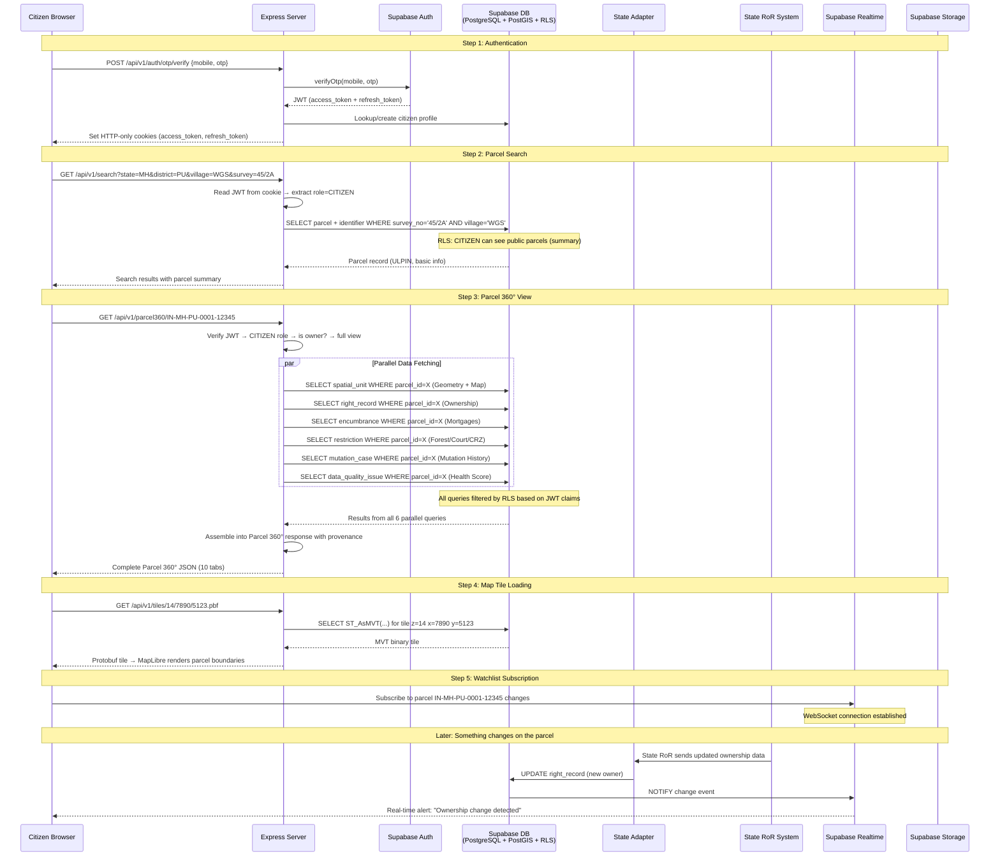
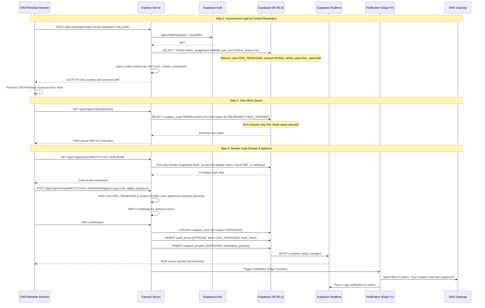

# Land Stack — Architecture Diagram

**Version**: 1.0 | **Date**: September 2026
**Purpose**: ONE unified architecture diagram representing the entire system, plus a request flow walkthrough.

---

## 1. Master Architecture Diagram

This is the complete, end-to-end architecture of Land Stack. Every layer, every service, every external system, and how they connect.

```mermaid
graph TB
    subgraph "Experience Layer (Frontend)"
        CIT["👤 Citizen PWA<br/>(Next.js / MapLibre GL JS)<br/>Mobile OTP Login<br/>Parcel 360° • Mutation Tracking<br/>Watchlist • Service Applications"]
        GOV["🏛️ Government Portal<br/>(Next.js / MapLibre GL JS)<br/>SSO + MFA Login<br/>Role Workspaces • Work Queues<br/>Case Management • Analytics"]
    end

    subgraph "API Layer (Express.js)"
        MW["🔒 Middleware Stack<br/>Cookie Parser • CORS • Helmet<br/>Rate Limiter • Request Logger<br/>Auth Middleware (JWT from Cookie)"]
        
        subgraph "Application Modules"
            AUTH_MOD["🔐 Auth Module<br/>OTP • SSO • MFA<br/>JWT Cookie Mgmt<br/>Custom Claims<br/>Consent Ledger"]
            PARCEL_MOD["📍 Parcel Module<br/>Identity Resolution<br/>ULPIN Mapping<br/>Multi-ID Search<br/>Parcel 360° Aggregator"]
            GIS_MOD["🌍 GIS Module<br/>Tile Serving (MVT)<br/>Spatial Queries<br/>Geometry Validation<br/>Map Click → Parcel"]
            WF_MOD["⚙️ Workflow Module<br/>12-State Mutation Engine<br/>SLA Timer & Escalation<br/>State Machine"]
            CASE_MOD["📋 Case Module<br/>Work Queues<br/>Task Assignment<br/>Case Dossier"]
            INTEG_MOD["🔌 Integration Module<br/>State Adapter Registry<br/>Webhook Handlers<br/>Circuit Breakers"]
            NOTIF_MOD["🔔 Notification Module<br/>SMS • Email • Push<br/>Real-time Alerts"]
            ANALYTICS_MOD["📊 Analytics Module<br/>Drill-down MIS<br/>DQI Scoring<br/>Anomaly Flags"]
            DOC_MOD["📄 Document Module<br/>Upload • Download<br/>Integrity Hashing"]
            AUDIT_MOD["📝 Audit Module<br/>Hash-Chained Events<br/>Tamper Detection"]
        end
    end

    subgraph "Supabase Platform"
        SB_AUTH["🔑 Supabase Auth<br/>JWT Lifecycle<br/>OTP Provider<br/>Token Refresh"]
        SB_DB["🗄️ Supabase Database<br/>(PostgreSQL 16 + PostGIS 3.4)<br/>───────────────<br/>Tables: parcel, spatial_unit,<br/>party, right_record, encumbrance,<br/>restriction, mutation_case,<br/>audit_event, state_config<br/>───────────────<br/>RLS Policies (Jurisdiction)<br/>Bi-temporal Versioning<br/>GIST Spatial Indexes"]
        SB_STORAGE["📦 Supabase Storage<br/>Deed PDFs<br/>Field Photos<br/>Court Orders<br/>SHA-256 Hashing"]
        SB_REALTIME["⚡ Supabase Realtime<br/>Mutation Status Push<br/>Watchlist Alerts<br/>Work Queue Updates"]
        SB_EDGE["⚡ Edge Functions<br/>Notification Dispatch<br/>Data Freshness Checks<br/>Webhook Ack"]
    end

    subgraph "State Adapter Layer"
        SA_REG["🏗️ State Adapter Registry<br/>(Configuration-Driven)"]
        SA_MH["MH Adapter<br/>Mahabhulekh • IGR<br/>BhuNaksha MH"]
        SA_KA["KA Adapter<br/>Bhoomi • Kaveri<br/>BhuNaksha KA"]
        SA_TN["TN Adapter<br/>Patta Chitta<br/>TNReginet"]
        SA_UP["UP Adapter<br/>Bhulekh UP<br/>IGRS UP"]
        SA_MOCK["🧪 Mock Adapter<br/>Scenario Fixtures<br/>Demo Data"]
    end

    subgraph "External Government Systems"
        EXT_ROR["📜 State RoR Systems<br/>(Mahabhulekh, Bhoomi,<br/>Patta Chitta, Bhulekh UP)"]
        EXT_NGDRS["📝 NGDRS / Registration<br/>(Deed Registration<br/>Webhooks)"]
        EXT_BN["🗺️ BhuNaksha<br/>(Cadastral Maps<br/>WMS/WFS)"]
        EXT_COURT["⚖️ Revenue Courts<br/>(RCCMS / e-Courts)"]
        EXT_ULB["🏙️ Municipal / ULB<br/>(Property Tax)"]
        EXT_FOREST["🌲 Restriction Layers<br/>(Forest • Tribal • CRZ)"]
        EXT_ULPIN["🔢 ULPIN Registry<br/>(Bhu-Aadhaar)"]
        EXT_SMS["📱 SMS Gateway<br/>(OTP + Notifications)"]
    end

    %% Frontend → API
    CIT --> MW
    GOV --> MW

    %% Middleware → Modules
    MW --> AUTH_MOD
    MW --> PARCEL_MOD
    MW --> GIS_MOD
    MW --> WF_MOD
    MW --> CASE_MOD
    MW --> INTEG_MOD
    MW --> NOTIF_MOD
    MW --> ANALYTICS_MOD
    MW --> DOC_MOD
    MW --> AUDIT_MOD

    %% Modules → Supabase
    AUTH_MOD --> SB_AUTH
    AUTH_MOD --> SB_DB
    PARCEL_MOD --> SB_DB
    GIS_MOD --> SB_DB
    WF_MOD --> SB_DB
    WF_MOD --> SB_REALTIME
    CASE_MOD --> SB_DB
    NOTIF_MOD --> SB_EDGE
    NOTIF_MOD --> SB_REALTIME
    ANALYTICS_MOD --> SB_DB
    DOC_MOD --> SB_STORAGE
    AUDIT_MOD --> SB_DB

    %% Modules → Integration
    PARCEL_MOD --> INTEG_MOD
    GIS_MOD --> INTEG_MOD
    WF_MOD --> INTEG_MOD

    %% Integration → Adapters
    INTEG_MOD --> SA_REG
    SA_REG --> SA_MH
    SA_REG --> SA_KA
    SA_REG --> SA_TN
    SA_REG --> SA_UP
    SA_REG --> SA_MOCK

    %% Adapters → External
    SA_MH --> EXT_ROR
    SA_MH --> EXT_BN
    SA_KA --> EXT_ROR
    SA_TN --> EXT_ROR
    SA_UP --> EXT_ROR

    %% Direct External
    INTEG_MOD --> EXT_NGDRS
    INTEG_MOD --> EXT_COURT
    INTEG_MOD --> EXT_ULB
    INTEG_MOD --> EXT_FOREST
    INTEG_MOD --> EXT_ULPIN
    NOTIF_MOD --> EXT_SMS

    %% Supabase internal
    SB_DB --> SB_REALTIME
    SB_AUTH --> SB_DB
```

---

## 2. Request Flow: Citizen Searches for a Parcel

This walkthrough shows exactly what happens when a citizen opens Land Stack, searches for their parcel by Survey Number, and views the Parcel 360° data.

---

## 3. Request Flow: CRO/Tehsildar Approves a Rural Mutation

---

## 4. How to Read This Diagram

| Symbol | Meaning |
|---|---|
| **Solid arrow (→)** | Synchronous request/response |
| **Dashed arrow (-→)** | Asynchronous event/notification |
| **par** block | Parallel concurrent operations |
| **Note** | Contextual information about what's happening |
| **RLS** | Row Level Security filtering happens inside the database |
| **JWT from Cookie** | Authentication token read from HTTP-only cookie, never localStorage |

---

## 5. Key Architectural Properties Visible in the Diagram

1. **Defense in Depth**: Auth happens at Express middleware AND at RLS inside the database. Two layers of security.

2. **Parcel-Centric**: Every module connects through the parcel entity. The ULPIN is the universal join key.

3. **Federated**: External systems are accessed ONLY through the State Adapter Layer. Core modules never call external APIs directly.

4. **Real-Time**: Supabase Realtime provides push notifications without polling. Status changes propagate in seconds.

5. **Separation of Concerns**: Auth module handles identity. Parcel module handles data. Workflow module handles process. GIS module handles space. They communicate through service calls, not database coupling.

6. **Graceful Degradation**: If a State system is down, the State Adapter serves cached data with a staleness warning. The rest of the system continues to work.

---

*Next: [15-references-and-sources.md](./15-references-and-sources.md) — All sources cited.*
