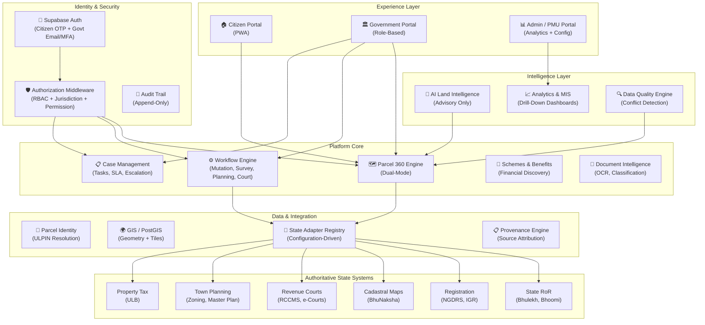

# Land Stack — Product Vision

**Version**: 3.0 | **Last Updated**: September 2026
**Status**: Canonical
**Audience**: Engineering, Architecture, Government Stakeholders, Product Planning
**Supersedes**: All prior product descriptions that define Land Stack as "citizen-facing only"

---

## 1. The One-Line Definition

> **Land Stack is a parcel-centric federated Digital Public Infrastructure and governance intelligence platform that provides tailored experiences for Citizens (Rural/Urban) and Government Officials (across 14 granular roles spanning Rural, Urban, Shared GIS, and Monitoring domains) — integrating authoritative State systems through secure interoperability while offering an explicit, transparent role-selection user experience.**

---

## 2. Product Thesis

```
ONE PARCEL
  → ONE CANONICAL IDENTITY (ULPIN / Bhu-Aadhaar)
    → MANY AUTHORITATIVE DATA SOURCES (State RoR, Registration, Courts, GIS, Planning, Tax)
      → MANY GOVERNMENT WORKFLOWS (Mutation, Survey, Planning Approval, Court Proceedings)
        → SCHEMES & FINANCIAL ASSISTANCE DISCOVERY
          → ONE GOVERNANCE INTELLIGENCE LAYER (Analytics, AI Advisory, Data Quality)
            → ROLE-SPECIFIC EXPERIENCES (Citizen Portal + Government Portal with Explicit Role Selection)
```

This thesis rejects the assumption that Land Stack is merely a citizen data viewer. It defines Land Stack as a **platform** that serves two experience planes sharing a common parcel-centric data and integration foundation.

---

## 3. The Two Experience Planes

### 3.1 Citizen / Public Experience Plane

The citizen-facing PWA provides:
- **Parcel 360° (Rural vs Urban Modes)**: Unified view of ownership, map, encumbrances. Rural (7/12, agriculture, cadastral boundaries) vs Urban (Property Card, zoning, municipal tax).
- **Service Applications**: Apply for RoR extracts, NEC, data correction, grievances.
- **Schemes & Benefits Engine**: Discovers potentially eligible government schemes based on parcel context. `[Planned]`
- **Financial Assistance Discovery**: Advisory-only discovery of institutional credit or financial assistance linked to land/property. `[Planned]`
- **Document Wallet**: Secure storage and retrieval of certified documents.
- **Multilingual, Low-Bandwidth, PWA**: Accessible on low-bandwidth networks in regional languages.

### 3.2 Government / Institutional Operations Plane

The Government Operations Portal provides a strict, granular authorization model combined with an explicit role-selection UX:
- **Explicit Role Selection**: Officers log in, explicitly select their operating domain (Rural, Urban, Shared GIS, Monitoring), and choose their specific role before entering their workspace.
- **Domain-Specific Workspaces**: Tailored UI for 13 distinct government roles (e.g., Talathi, ULB Officer, Survey/GIS, District Collector).
- **Jurisdiction-Aware Authorization**: Backend strictly enforces the user's assigned jurisdiction (State → District → Tehsil → Village → Role) regardless of the frontend selection.
- **Task-Oriented Work Queues**: Pending verifications, approvals, escalations, SLA alerts
- **Parcel 360° (Officer Mode)**: Extended view with provenance detail, audit trail, workflow history, case history, data conflicts, AI advisory
- **Case Management**: Mutation cases, grievances, survey projects, planning applications
- **Analytics & MIS**: Drill-down dashboards from National → State → District → Village → Parcel
- **AI Land Intelligence**: Advisory anomaly detection, SLA prediction, bottleneck analysis, executive summaries
- **Document Intelligence**: OCR, classification, metadata extraction, integrity verification `[Planned]`
- **Integration Health**: Real-time visibility into State API availability and data freshness `[Architecturally Defined]`

---

## 4. What Land Stack IS

| Dimension | Description |
|---|---|
| **Interoperability Layer** | Connects fragmented State systems (RoR, Registration, Courts, GIS, Planning, Tax) via configuration-driven State Adapters |
| **Parcel-Centric Platform** | Every interaction anchors to a land parcel identified by ULPIN |
| **Workflow Orchestrator** | Routes and tracks government processes (mutation, service applications, surveys) with SLA monitoring |
| **Schemes & Financial Discovery** | Matches citizen profiles and land contexts with potential government benefits and institutional credit |
| **Governance Intelligence** | Provides analytics, AI advisory, data quality detection, and executive dashboards for operational decision-making |
| **Role-Based Experience** | Delivers tailored interfaces for 14 granular roles organized into domains (Rural, Urban, Shared GIS, Monitoring) — from a rural citizen to a State PMU |
| **Digital Public Infrastructure** | Designed as a national-scale, open-standards, FOSS-first platform under DILRMP 3.0 |

## 5. What Land Stack is NOT

| Boundary | Explanation |
|---|---|
| **NOT a replacement for State systems** | Bhulekh, Bhoomi, BhuNaksha, NGDRS, RCCMS remain authoritative. Land Stack reads and projects. |
| **NOT a centralized national land database** | Land Stack stores projections with provenance, not original records |
| **NOT a statutory authority** | Mutations are approved by Tehsildars, deeds registered by Sub-Registrars, orders issued by Revenue Courts — not by software |
| **NOT an AI decision-maker** | All AI/ML outputs are labeled ADVISORY. Officers decide. |
| **NOT a blockchain** | PostgreSQL with hash-chained audit trail provides tamper evidence without the trade-offs |

---

## 6. Architectural Pillars



---

## 7. Key Design Decisions

| Decision | Rationale | Maturity |
|---|---|---|
| **Explicit Role Selection UX** | Users explicitly choose their Domain (Rural/Urban) and Role at login. The frontend adapts to their selection, while the backend strictly verifies authorization. This empowers users rather than hiding everything behind automatic resolution. | Architecturally Defined |
| **14-Role Permission Model** | 1 Citizen + 13 Government roles organized by domain (Rural, Urban, Shared GIS, Monitoring). Granular permission sets cover field verification through national monitoring. | Implemented |
| **Role + Jurisdiction + Permission authorization** | A Talathi in Pune district must only see parcels in their assigned circle. A 4-layer Express middleware chain (`requireAuth` → `requireRole` → `requirePermission` → `requireJurisdiction`) enforces this at the API level. | Implemented |
| **State Adapter Architecture** | India has 36 States/UTs with different terminology, hierarchies, and APIs. Configuration-driven adapters avoid `if(state === 'MH')` logic. | Architecturally Defined |
| **AI is Advisory Only** | AI can detect anomalies or match schemes — but it never approves a mutation or determines ownership. Every output is labeled ADVISORY. | Implemented (governance) |
| **Express.js Modular Monolith** | Start with an Express.js modular monolith organized as domain modules. | Implemented |
| **Projections, Not Originals** | Every record in Land Stack is a derived projection with provenance. State systems remain authoritative. | Implemented |

---

## 8. Success Vision

In the target state, Land Stack enables:

1. **A Citizen** in a village opens the PWA, enters their Survey Number, and sees their complete Parcel 360° — ownership, map, encumbrances, restrictions, zoning, tax, court status — all on one page, in Marathi, with source attribution for every fact.

2. **A Talathi** logs in, sees 12 pending field verifications in their work queue, opens a mutation case, records verification notes, uploads field photos, and submits their recommendation directly to the Tehsildar — all without leaving Land Stack.

3. **A Tehsildar** reviews the Talathi's recommendation alongside the AI advisory summary, checks the parcel's complete history and data conflicts, and authoritatively sanctions the mutation — which automatically triggers the RoR update event and citizen notification.

4. **A Sub-Registrar (SRO)** performs instant parcel encumbrance and restriction checks prior to deed execution, ensuring clear title transfer.

5. **A District Collector** opens the district analytics dashboard, views tehsil-by-tehsil mutation SLA adherence rankings, drills down into bottleneck pockets, and issues administrative directions.

6. **A State PMU Head** opens the executive command center, tracks statewide DILRMP indicators and integration uptime, and reviews automated AI-generated governance performance briefs.

7. **A DoLR / National Monitor** reviews cross-state adoption benchmarks and national ULPIN rollout velocity.

8. **A System Administrator** verifies the cryptographic hash-chain integrity of the append-only audit log, updates state adapter configurations, and manages platform health.

---

## 9. Alignment

| Source | Alignment |
|---|---|
| **DILRMP 3.0 (2026-2031)** | GIS-based Land Stack with ULPIN, interoperable APIs, citizen service delivery |
| **Constitution of India** | Land is a State subject (List II, Entry 18/45). Land Stack respects State data sovereignty. |
| **GoRT** | Glossary of Revenue Terms provides canonical terminology mapping |
| **ISO 19152 (LADM)** | Data model inspired by LADM concepts (parcels, ownership/rights, encumbrances, restrictions, spatial data). Current schema uses pragmatic table design aligned with Indian land governance terminology |
| **DPDP Act, 2023** | Purpose limitation, data minimization, no raw Aadhaar storage (hashed only). `[Planned: full consent engine]` |
| **CERT-In Guidelines** | Session management, rate limiting, structured error handling. `[Planned: incident reporting, vulnerability management]` |

---

## 10. Current Implementation Stack

| Layer | Technology | Status |
|---|---|---|
| **Frontend** | React 19 + Vite 8 + React Router 7 | Implemented |
| **Backend** | Express.js 4 + Node.js | Implemented |
| **Database** | Supabase PostgreSQL + PostGIS | Implemented |
| **Authentication** | Supabase Auth (JWT + HTTP-only cookies) | Implemented |
| **Authorization** | Express middleware (requireAuth → requireRole → requirePermission → requireJurisdiction) + Supabase RLS | Implemented |
| **GIS** | PostGIS extension, GeoJSON endpoints, bounding box queries | Partially Implemented |
| **File Storage** | Supabase Storage | Implemented |
| **Mapping** | Leaflet (dependency), placeholder map shell | Partially Implemented |
| **Vector Tiles / MVT** | PostGIS ST_AsMVT, Martin tile server | Planned |
| **State Adapters** | Configuration-driven adapter framework | Architecturally Defined |
| **AI/ML Intelligence** | Rule-based data health scoring | Partially Implemented |
| **ML Models** | XGBoost SLA predictor, LLM summarizer | Planned |
| **Observability** | Express logging, correlation IDs | Partially Implemented |
| **Full Observability** | OpenTelemetry, Prometheus, Grafana | Planned |

---

*This document is the canonical product vision. All other documentation derives from and must be consistent with this vision.*
