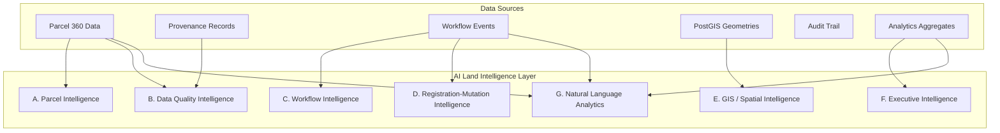
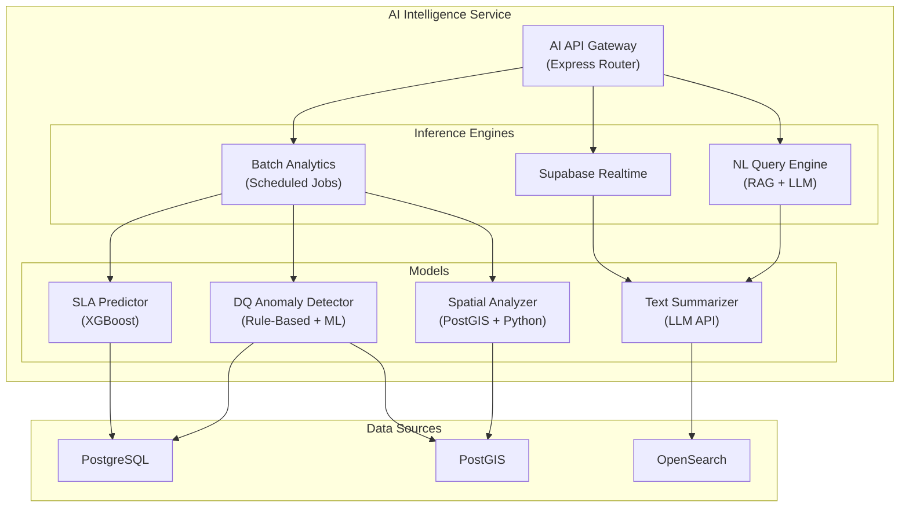

# Land Stack — AI & Land Intelligence Architecture

**Version**: 3.0 | **Last Updated**: September 2026
**Purpose**: Architecture specification for the AI/ML Intelligence Layer

> **Implementation Note**: The current backend implementation is built on **Express.js**, **Supabase Realtime**, and **Express Middleware** rather than NestJS, Kafka, and OPA. This document reflects the target architecture based on the current stack.

---

## 1. Core Principle

> **AI is advisory only. AI never makes statutory decisions.**

Every AI output MUST include:
- `ADVISORY` label (prominently displayed)
- Explanation of contributing factors
- Confidence score (0.0–1.0)
- Source data references
- Model name and version
- Timestamp
- Ability for authorized officer to dismiss/override

---

## 2. AI Intelligence Domains



---

## 3. Domain A: Parcel Intelligence

**Purpose**: Summarize a parcel's complete context for officers and citizens in plain language.

| Capability | Description | Consumer |
|---|---|---|
| Parcel Summary | Natural language summary of Parcel 360° | Officer, Citizen |
| Event Identification | Highlight significant events (recent registration, ownership change, new restriction) | Officer |
| Ownership History | Explain chain of title with timeline | Officer, Citizen |
| Registration History | Summarize deed transactions | Officer, SRO |
| Court Activity | Summarize pending/resolved cases | Officer, Court |
| Restriction Alert | Highlight conflicting or overlapping restrictions | Officer |
| Conflicting Records | Identify cross-source data mismatches | Officer |
| Stale Data Warning | Flag data that hasn't been refreshed beyond threshold | Officer |

**Example Output:**
```
⚠️ ADVISORY | Parcel Intelligence | Model: ParcelSummarizer v1.2

"ULPIN IN-MH-PU-0001-12345 is an agricultural parcel (2.5 acres) in Wadgaon
Sheri village, Haveli tehsil. Current owner: Ramesh Kumar (since 2019 via sale
deed PUN-2019-00789).

KEY FINDINGS:
• ⚠️ Pending mutation (MUT-PU-HVL-2026-00456) — awaiting Tehsildar sanction
• ⚠️ Area discrepancy: RoR states 2.5 acres; GIS boundary calculates 2.38 acres
• ✅ No active encumbrances
• ✅ No court cases
• 🟡 Forest boundary within 50m — recommend checking restriction layer"

Confidence: 0.89 | Sources: Mahabhulekh API, BhuNaksha, RCCMS
Timestamp: 2026-09-03T14:30:00Z
```

---

## 4. Domain B: Data Quality Intelligence

**Purpose**: Detect anomalies, inconsistencies, and conflicts across integrated data sources.

| Check | Logic | Severity |
|---|---|---|
| RoR vs Map Area Mismatch | `abs(ror_area - gis_area) / ror_area > 0.10` | HIGH |
| Duplicate Owner Detection | Fuzzy name match across parcels with same Aadhaar token | CRITICAL |
| Suspicious Identifier Mapping | Same ULPIN mapped to multiple state identifiers | CRITICAL |
| Conflicting Area Values | Multiple sources report different areas for same parcel | MEDIUM |
| Stale Source Detection | `NOW() - provenance.retrieval_time > threshold` | LOW |
| Missing Mandatory Fields | Parcel exists without geometry, or RoR without owner | MEDIUM |
| Topology Anomaly | `ST_Overlaps(a.boundary, b.boundary)` between neighboring parcels | HIGH |
| Unusual Mutation Pattern | >3 ownership changes in 12 months for same parcel | HIGH |

**Implementation**: Batch jobs running on scheduled intervals (every 6 hours) scanning PostgreSQL tables + PostGIS geometry comparisons. Results stored in `data_quality_issue` table and surfaced in officer dashboards.

---

## 5. Domain C: Workflow Intelligence

**Purpose**: Predict SLA risk, identify bottlenecks, and optimize case processing.

| Capability | Description |
|---|---|
| SLA Risk Prediction | Predict probability of SLA breach based on current case age, stage, and historical patterns |
| Bottleneck Identification | Identify stages/officers/tehsils where cases consistently stall |
| Workload Forecasting | Predict incoming case volume based on registration trends |
| Delayed Case Detection | Flag cases significantly older than average for their current stage |
| Escalation Recommendation | Suggest escalation when a case exceeds expected processing time |
| Workload Summary | Summarize pending/completed cases per officer/tehsil/district |

---

## 6. Domain D: Registration-Mutation Intelligence

**Purpose**: Cross-check registration and mutation records for consistency.

| Capability | Description |
|---|---|
| Registration-to-Mutation Tracking | Verify every registration triggers a mutation case |
| Consistency Cross-Check | Compare deed details with RoR records (names, areas) |
| Risk Factor Flagging | Identify registrations on parcels with active restrictions/court cases |
| Officer Review Summary | Generate pre-review summary of case for Tehsildar |

---

## 7. Domain E: GIS / Spatial Intelligence

**Purpose**: Detect spatial anomalies and provide geospatial insights.

| Capability | Description |
|---|---|
| Parcel Overlap Anomaly | Detect overlapping boundaries between parcels |
| Map vs RoR Mismatch | Compare GIS-calculated area with RoR-recorded area |
| Land-Use Inconsistency | Cross-check RoR land classification with observed spatial context |
| Restriction Overlap | Identify parcels falling in multiple restriction zones |
| Zoning Conflict | Detect parcels with land-use conflicting with zoning designation |
| Change Detection | Compare historical vs current geometry for unauthorized changes |

**Implementation**: PostGIS spatial queries + Python/FastAPI GIS sidecar service for computationally intensive operations (topology analysis, raster comparison).

---

## 8. Domain F: Executive Intelligence

**Purpose**: Generate governance summaries for PMU heads and administrators.

| Capability | Description | Consumer |
|---|---|---|
| State-Level Summary | Overall governance performance narrative | State PMU |
| District-Level Summary | District performance with comparison to peers | District PMU |
| Mutation Pendency Analysis | Trend analysis with root cause identification | PMU, Collector |
| Data Quality Trend | Improvement/degradation over time with contributing factors | PMU, GIS |
| Integration Health Report | Source system availability and data freshness trends | PMU, Admin |
| Digitization Progress | ULPIN, RoR, Map coverage progress tracking | PMU, DoLR |

**Example Output:**
```
⚠️ ADVISORY | Executive Intelligence | Model: GovSummary v1.1

"Maharashtra Governance Summary — September 2026

HEADLINE: Mutation pendency decreased 8% statewide this month.

POSITIVE: 28 of 36 districts improved SLA compliance.
CONCERN: Gadchiroli district SLA dropped from 72% to 54%.
ROOT CAUSE: 3 of 5 Tehsildar positions vacant since June 2026.
RECOMMENDATION: Prioritize Gadchiroli staffing.

Data Quality Index: B+ (82/100) — improved from B (78) last month.
Integration Uptime: 99.2% (NGDRS webhook: 100%, Mahabhulekh API: 98.1%)"

Confidence: 0.82 | Based on: 45,678 cases across 36 districts
Timestamp: 2026-09-03T06:00:00Z
```

---

## 9. Domain G: Natural Language Government Analytics

**Purpose**: Allow authorized officers to query platform data using natural language.

| Example Query | Response Type |
|---|---|
| "Show me villages with the highest mutation backlog" | Ranked table + map visualization |
| "Which tehsils have the worst RoR-map mismatch?" | Ranked table with DQ scores |
| "Which parcels have multiple active restrictions?" | Filtered parcel list |
| "Which districts have the most delayed mutation cases?" | Bar chart + ranking |
| "Summarize land governance for Pune district" | Narrative summary |
| "Why has mutation SLA deteriorated this month?" | Root cause analysis |

**Implementation**: LLM with RAG (Retrieval-Augmented Generation) against analytics database. Queries are translated to SQL/aggregation queries, results formatted as natural language with data citations.

**Guardrails:**
- Responses ALWAYS grounded in actual platform data
- No hallucinated statistics
- Source references included
- Confidence score on every response
- Only authorized roles can access (PMU, Collector, Admin)

---

## 10. Technical Architecture



### Technology Choices

| Component | Technology | Rationale |
|---|---|---|
| AI Module Host | Express Router (Node.js) | Consistent with main backend |
| Batch Analytics | Node.js scheduled jobs | Simple; runs SQL aggregations |
| ML Models (SLA, DQ) | Python sidecar (FastAPI) | scikit-learn, XGBoost ecosystem |
| Text Summarization | External LLM API (configurable) | OpenAI / Anthropic / self-hosted |
| Spatial Analysis | PostGIS queries + Python (Shapely, GeoPandas) | Best GIS ML ecosystem |
| NL Query (RAG) | LangChain + Vector Store | RAG pattern for grounded responses |

---

## 11. AI Governance Rules

| Rule | Enforcement |
|---|---|
| **AI never approves/rejects** statutory decisions | Express middleware: `if (req.user.actor_type === 'ai') return 403;` |
| **All outputs labeled ADVISORY** | Frontend component enforces advisory banner |
| **Confidence score required** | API schema validation; outputs without confidence are rejected |
| **Source references required** | API schema validation; outputs without sources are rejected |
| **Officer can dismiss** | Every advisory has a dismiss button; dismissal is audited |
| **Model version tracked** | Every output includes model name + version |
| **Audit every AI interaction** | Logged in audit_event with actor_type = "ai_system" |
| **No PII in prompts to external LLMs** | Data anonymization pipeline before LLM API calls |

---

*This document defines the AI Intelligence Layer. It is advisory-only and never makes statutory decisions. See [ROLE_PORTAL_MATRIX.md](./ROLE_PORTAL_MATRIX.md) for which roles can access AI features.*
