# Land Stack — Department Integration Matrix

**Version**: 3.0 | **Last Updated**: September 2026
**Purpose**: Canonical integration specification for every external system

> **Implementation Note**: This document outlines integrations applicable to the current Express.js backend architecture.

## 1. Integration Architecture Overview

```mermaid
graph TD
    subgraph "Land Stack Core"
        HUB["Integration Hub<br/>(State Adapter Registry)"]
    end

    subgraph "Revenue Department"
        ROR["State RoR Systems<br/>(Mahabhulekh, Bhoomi, Patta Chitta)"]
    end

    subgraph "Registration Department"
        NGDRS["NGDRS / State Registration<br/>(IGR, Kaveri, TNReginet)"]
    end

    subgraph "Survey & GIS"
        BN["BhuNaksha / State GIS"]
        ULPIN_R["ULPIN Registry"]
        SVAMITVA_R["SVAMITVA"]
    end

    subgraph "Revenue Courts"
        RCCMS_R["RCCMS / State Revenue Courts"]
        ECOURT["e-Courts (NIC)"]
    end

    subgraph "Planning & Municipal"
        TCP["Town & Country Planning"]
        ULB["Urban Local Bodies<br/>(Property Tax)"]
    end

    subgraph "Restriction Layers"
        FOREST["Forest Department"]
        TRIBAL["Tribal Welfare"]
        CRZ["CRZ / Environmental"]
    end

    subgraph "Identity & Documents"
        KC_EXT["Identity Services<br/>(Aadhaar eKYC, DigiLocker)"]
        SMS_GW["SMS / Email Gateway"]
    end

    HUB --> ROR
    HUB --> NGDRS
    HUB --> BN
    HUB --> ULPIN_R
    HUB --> RCCMS_R
    HUB --> ECOURT
    HUB --> TCP
    HUB --> ULB
    HUB --> FOREST
    HUB --> KC_EXT
    HUB --> SMS_GW
```

---

## 2. Integration Matrix

### 2.1 State RoR / Bhulekh Systems

| Attribute | Detail |
|---|---|
| **System Owner** | State Revenue Department |
| **Authority** | Statutory ownership record (Record of Rights) |
| **Data Domain** | Ownership, rights, area, classification, mutation history, encumbrances |
| **Direction** | Land Stack ← State RoR (READ ONLY) |
| **Mechanism** | REST API (JSON) / SOAP (XML) per state |
| **Authentication** | API Key / OAuth 2.0 (state-specific) |
| **Schema Transformation** | State-specific fields → Canonical `RoR Projection` via `state_config.schema_mapping` |
| **State Adapter** | Per-state adapter implementing `IStateAdapter.fetchRoR()` |
| **Retry Strategy** | Exponential backoff: 1s, 2s, 4s, 8s, max 3 retries |
| **Timeout** | 10s per request |
| **Failure Mode** | Circuit breaker opens after 5 consecutive failures; serve cached projection |
| **Reconciliation** | Daily batch comparison of projected data vs fresh API response |
| **Event Model** | Poll-based refresh (configurable interval per state) |
| **Provenance** | `authority: "Revenue Dept, Govt of {State}"`, `source_system: "{system_name}"` |
| **Freshness Target** | < 24 hours for active parcels |
| **Monitoring** | Adapter health dashboard; latency P95; error rate; cache hit ratio |
| **Fallback** | Serve last cached projection with staleness warning in UI |

**State Implementations:**

| State | System | API Type | Identifier | RoR Document |
|---|---|---|---|---|
| Maharashtra | Mahabhulekh | REST (JSON) | Survey/Gat No | 7/12 Extract |
| Karnataka | Bhoomi | SOAP (XML) | Survey/Hissa No | RTC (Pahani) |
| Tamil Nadu | Patta Chitta | REST (JSON) | Survey/Subdivision | Patta + Chitta |
| Uttar Pradesh | Bhulekh UP | REST (JSON) | Khasra/Gata No | Khatauni |
| Rajasthan | Apna Khata | REST (JSON) | Khasra No | Jamabandi |

### 2.2 NGDRS / State Registration

| Attribute | Detail |
|---|---|
| **System Owner** | State Registration Department / DoLR |
| **Authority** | Statutory deed registration |
| **Data Domain** | Registered deeds, parties, consideration, stamp duty, SRO details |
| **Direction** | Land Stack ← NGDRS (EVENT / WEBHOOK) |
| **Mechanism** | Webhook: `POST /webhooks/ngdrs/registration` |
| **Authentication** | Webhook signature verification (HMAC-SHA256) |
| **Schema Transformation** | NGDRS payload → `RegistrationTransaction` canonical model |
| **Idempotency** | Idempotency key on `deed_number + sro_code` |
| **Retry Strategy** | NGDRS retries up to 3 times; Land Stack returns 200 on success, 500 on failure |
| **Failure Mode** | Failed webhooks stored in dead-letter queue; manual retry |
| **Event Produced** | `registration.completed` → triggers Mutation Case creation |
| **Provenance** | `authority: "Registration Dept, Govt of {State}"` |
| **Monitoring** | Webhook receipt rate, processing latency, DLQ depth |

### 2.3 BhuNaksha / State GIS

| Attribute | Detail |
|---|---|
| **System Owner** | State Survey/Revenue + NIC |
| **Authority** | Official cadastral map |
| **Data Domain** | Parcel boundaries, survey numbers, area calculations |
| **Direction** | Land Stack ← BhuNaksha (READ ONLY) |
| **Mechanism** | WMS/WFS for visual tiles; GeoJSON/Shapefile for vector data |
| **Authentication** | API Key or public (varies by state) |
| **Schema Transformation** | State GIS format → PostGIS `spatial_unit` (SRID 4326) |
| **Validation** | `ST_IsValid()`, `ST_MakeValid()`, area threshold > 1 sq.m |
| **Freshness Target** | < 7 days for cadastral tiles |
| **Fallback** | Serve cached tiles; display "Map data may be outdated" warning |

### 2.4 ULPIN / Bhu-Aadhaar Registry

| Attribute | Detail |
|---|---|
| **System Owner** | DoLR, Government of India |
| **Authority** | National parcel identifier assignment |
| **Data Domain** | ULPIN ↔ State parcel identifier mapping |
| **Direction** | Bidirectional: Lookup ULPIN by state ID; Lookup state ID by ULPIN |
| **Mechanism** | REST API |
| **Failure Mode** | Fallback to state identifier; mark ULPIN as "pending" |

### 2.5 Revenue Courts / RCCMS / e-Courts

| Attribute | Detail |
|---|---|
| **System Owner** | Revenue Courts / NIC |
| **Authority** | Revenue and civil court proceedings |
| **Data Domain** | Case number, parties, parcel link, hearing dates, orders, status |
| **Direction** | Land Stack ← RCCMS/e-Courts (READ ONLY) |
| **Mechanism** | REST API (JSON) |
| **Event Produced** | `court_case.linked`, `court_order.issued` → Parcel 360° restriction |
| **Provenance** | `authority: "Revenue Court, {jurisdiction}"` |

### 2.6 Town & Country Planning

| Attribute | Detail |
|---|---|
| **System Owner** | State TCP Department / ULB |
| **Data Domain** | Zoning, master plan, land-use classification, FSI/FAR, building permissions |
| **Direction** | Land Stack ← TCP (READ ONLY) |
| **Mechanism** | REST API or WMS for spatial zoning data |
| **Schema Transformation** | Planning zone boundaries → PostGIS `planning_zone` table |
| **Spatial Query** | `ST_Intersects(parcel.boundary, zone.boundary)` for zoning check |

### 2.7 Urban Local Bodies (Property Tax)

| Attribute | Detail |
|---|---|
| **System Owner** | Municipal Corporation / ULB |
| **Data Domain** | Property tax assessment, dues, payment status |
| **Direction** | Land Stack ← ULB (READ ONLY) |
| **Mechanism** | REST API |
| **Provenance** | `authority: "Municipal Corporation, {city}"` |

### 2.8 Forest / Restriction Layers

| Attribute | Detail |
|---|---|
| **System Owner** | Forest Department, Tribal Welfare, Environment |
| **Data Domain** | Forest land boundaries, tribal land, CRZ zones, environmental restrictions |
| **Direction** | Land Stack ← Dept (READ ONLY) |
| **Mechanism** | WMS/WFS for spatial layers; REST API for attribute data |
| **Spatial Query** | `ST_Intersects(parcel.boundary, restriction.boundary)` |

### 2.9 Identity & Document Services

| System | Direction | Mechanism | Purpose |
|---|---|---|---|
| Aadhaar eKYC (UIDAI) | Land Stack → UIDAI | UIDAI ASA/AUA API | Identity verification (consent-based) |
| DigiLocker | Land Stack ↔ DigiLocker | OAuth + API | Document retrieval and verified storage |
| SMS Gateway | Land Stack → SMS Provider | REST API | OTP delivery, notification SMS |
| Email Service | Land Stack → Email Provider | SMTP / API | Notification emails |

---

## 3. Integration Health Dashboard

| Metric | Visualization | Alert Threshold |
|---|---|---|
| Adapter Uptime % | Traffic light grid (per state, per source) | < 95% |
| API Response Time P95 | Bar chart by adapter | > 5s |
| Webhook Receipt Rate | Time-series (events/hour) | < expected baseline |
| Dead Letter Queue Depth | KPI card with trend | > 50 events |
| Cache Hit Ratio | Gauge per adapter | < 60% |
| Source Freshness | Heatmap (state × source × hours since last sync) | > 48h |
| Circuit Breaker Status | Traffic light per adapter | OPEN |
| Reconciliation Discrepancy | KPI card (% of records with mismatch) | > 5% |

---

## 4. State Onboarding Checklist

| Step | Description | Owner |
|---|---|---|
| 1 | Create `state_config` entry with terminology, hierarchy, units | Platform Admin |
| 2 | Map State API response fields to canonical schema | Integration Engineer |
| 3 | Configure authentication credentials in Vault | Security Officer |
| 4 | Implement/configure State Adapter | Integration Engineer |
| 5 | Run adapter contract tests with sample State data | QA |
| 6 | Configure NGDRS webhook endpoint (if available) | State IT + Platform |
| 7 | Ingest BhuNaksha geometry for state | GIS Team |
| 8 | Verify ULPIN mapping for pilot district | Platform Admin |
| 9 | Test end-to-end: Search → Parcel 360° → Mutation | QA |
| 10 | Enable for production traffic | Platform Admin |

---

*For each integration, the State Adapter pattern ensures that core Land Stack code remains generic. State-specific logic is encapsulated in configuration. See [architecture.md](./architecture.md) for the adapter architecture diagram.*
