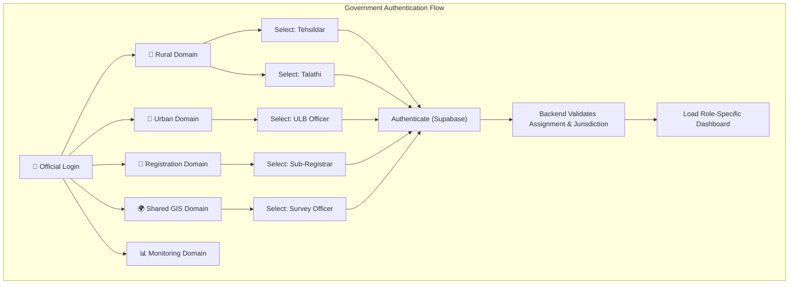
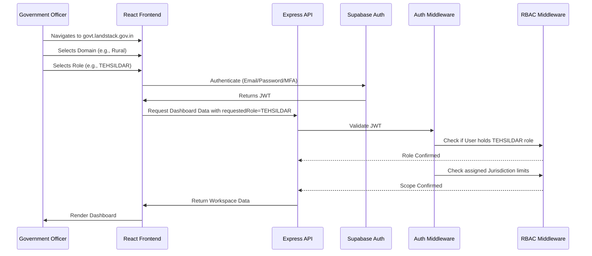

# Land Stack — Government Portal Architecture (Explicit Role Selection)

**Version**: 3.0 | **Last Updated**: September 2026  
**Scope**: Architecture specification for the Government Operations Portal across 13 government/institutional roles.

> **Implementation Note**: The current implementation uses **Supabase Auth**, **Express Middleware**, and **React 19 / Vite 8**. It strictly enforces backend authorization while offering an explicit Domain → Role frontend selection flow.

---

## 1. Portal Overview

The Government Operations Portal is the **second experience plane** of Land Stack, delivering dedicated, task-first workspaces for 13 authorized government/institutional roles.

### Core Architectural Principles
1. **Explicit Role Selection**: The user explicitly chooses their operating domain and role. They are not silently routed.
2. **Task-First Ergonomics**: Officers immediately see their prioritized work queue upon logging in.
3. **Strict Jurisdiction Isolation**: UI and backend endpoints strictly filter data to the officer's authorized geographic jurisdiction (State → District → Tehsil → Circle → Village).
4. **State-Configurable Vernacular**: Labels, administrative terms, and area units adapt dynamically per `state_config`.

---

## 2. Portal Shell Architecture & The Selection Flow

The frontend allows the user to explicitly define the context in which they are logging in.



---

## 3. State-Aware Authentication & Workspace Loading Flow



> **Security Note**: The explicit role selection on the frontend is an ENTRY PREFERENCE. It does not grant trust. The backend completely ignores the frontend request if the user is not legally assigned to the requested role and jurisdiction in the `government_users` table.

---

## 4. Role-Specific Workspaces (Examples)

### 4.1 Rural Domain: Talathi Workspace

```
┌────────────────────────────────────────────────────────────────────────┐
│ 🌾 RURAL DOMAIN | 👤 TALATHI — Haveli Taluka, Wadgaon Sheri             │
├────────────────────────────────────────────────────────────────────────┤
│ 📋 MY PENDING FIELD QUEUE (12)                                         │
│ ┌────────────────────────────────────────────────────────────────────┐ │
│ │ 🔴 MUT-PU-HVL-2026-00456 │ Gat 45/2A │ Sale Mutation  │ SLA: 2d left│ │
│ └────────────────────────────────────────────────────────────────────┘ │
│                                                                        │
│ ⚡ QUICK ACTIONS (Selected: MUT-PU-HVL-2026-00456)                     │
│ [📷 Upload Geotagged Site Photos] [📝 Enter Possession Notes]          │
│ [✅ Submit Recommendation to Tehsildar] [⚠️ Report Boundary Conflict] │
└────────────────────────────────────────────────────────────────────────┘
```

### 4.2 Rural Domain: Tehsildar Workspace

```
┌────────────────────────────────────────────────────────────────────────┐
│ 🌾 RURAL DOMAIN | ⚖️ TEHSILDAR — Haveli Taluka (Pune)                  │
├────────────────────────────────────────────────────────────────────────┤
│ 📋 TEHSIL STATUTORY QUEUE                                              │
│ ┌───────────────┐ ┌───────────────┐ ┌───────────────┐ ┌──────────────┐ │
│ │ Awaiting Order│ │ Hearings Today│ │ SLA Breached  │ │ AI Risk Flag │ │
│ │      18       │ │       4       │ │       2       │ │       5      │ │
│ └───────────────┘ └───────────────┘ └───────────────┘ └──────────────┘ │
│                                                                        │
│ [✅ STATUTORY SANCTION ORDER] [❌ REJECT WITH LEGAL GROUNDS]           │
└────────────────────────────────────────────────────────────────────────┘
```

### 4.3 Urban Domain: ULB Officer

```
┌────────────────────────────────────────────────────────────────────────┐
│ 🏢 URBAN DOMAIN | 🏛️ ULB OFFICER — Pune Municipal Corporation          │
├────────────────────────────────────────────────────────────────────────┤
│ 📋 URBAN PROPERTY QUEUE                                                │
│ ┌────────────────────────────────────────────────────────────────────┐ │
│ │ 🟡 URB-MUT-2026-1234 │ CTS 405 │ Title Transfer │ SLA: 4d left      │ │
│ └────────────────────────────────────────────────────────────────────┘ │
│ [✅ Verify Zoning] [❌ Reject Title Transfer]                          │
└────────────────────────────────────────────────────────────────────────┘
```

### 4.4 Registration Domain: Sub-Registrar (SRO)

```
┌────────────────────────────────────────────────────────────────────────┐
│ 📄 REGISTRATION DOMAIN | 🖋️ SUB-REGISTRAR — Haveli SRO-1               │
├────────────────────────────────────────────────────────────────────────┤
│ 📋 PRE-REGISTRATION VERIFICATION                                       │
│ ┌────────────────────────────────────────────────────────────────────┐ │
│ │ 🟢 ULPIN: IN-MH-PU-0001 │ Encumbrance: Clear │ Court Stays: None   │ │
│ └────────────────────────────────────────────────────────────────────┘ │
│ [🔗 Trigger NGDRS Webhook] [⚠️ Flag Fraudulent Transaction]            │
└────────────────────────────────────────────────────────────────────────┘
```

### 4.5 Monitoring Domain: District Collector

```
┌────────────────────────────────────────────────────────────────────────┐
│ 📊 MONITORING DOMAIN | 🏢 DISTRICT COLLECTOR — Pune District           │
├────────────────────────────────────────────────────────────────────────┤
│ 🗺️ TEHSIL SLA CHOROPLETH & RANKINGS                                    │
│ 1. Pune City   (94.2% SLA Adherence - Green)                           │
│ 14. Velhe      (68.4% SLA Adherence - Red) ⚠️ Escalation Triggered     │
│                                                                        │
│ [Drill down into Velhe Tehsil] [Reallocate Officers] [Export Review]   │
└────────────────────────────────────────────────────────────────────────┘
```

---

## 5. Navigation Access by Domain

| Navigation Module | Rural (Talathi/Tehsildar) | Urban (ULB) | Registration (SRO) | Shared GIS | Monitoring (Collector/PMU/Admin) |
|---|:---:|:---:|:---:|:---:|:---:|
| **Work Queue** | ✅ | ✅ | ✅ | ✅ | ❌ |
| **Parcel Search & 360°** | ✅ (Rural Data) | ✅ (Urban Data) | ✅ | ✅ | ✅ |
| **Cadastral Map / GIS** | ✅ | ✅ | ✅ (Read-only) | ✅ | ✅ (Read-only) |
| **Case Decisions / Orders** | ✅ | ✅ | ❌ | ❌ | ❌ |
| **Governance Analytics** | ❌ | ❌ | ❌ | ❌ | ✅ |
| **State Config & Policies** | ❌ | ❌ | ❌ | ❌ | ✅ (Admin only) |

---

## 6. Frontend Architecture & Technology Stack

| Dimension | Specification |
|---|---|
| **Framework** | React 19, Vite 8, React Router 7 |
| **State Management** | React Query (Server State) + Zustand (Local UI State) |
| **Design System** | `@landstack/ui` (Vanilla CSS, custom design tokens, accessible components) |
| **Spatial Map Engine** | Leaflet JS / React-Leaflet |
| **Data Tables** | TanStack Table with virtualized scrolling for large queues |

---

*This architecture document defines the exact workspace layouts, explicit selection flow, and functional scope for the government roles in Land Stack.*
