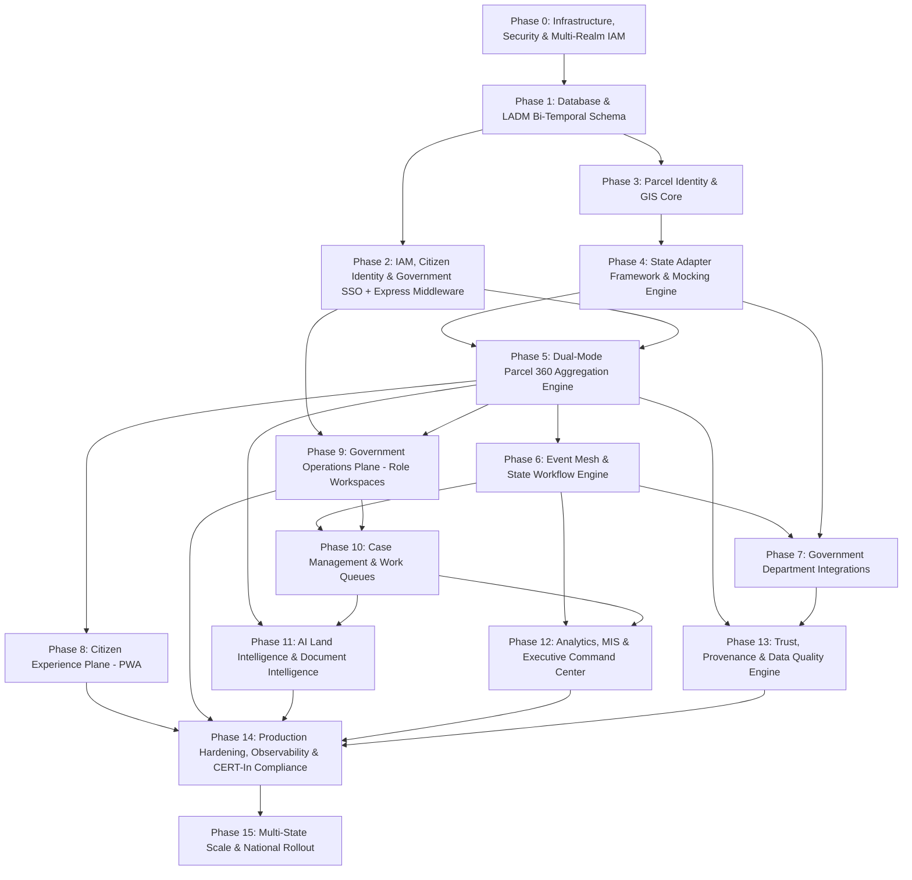
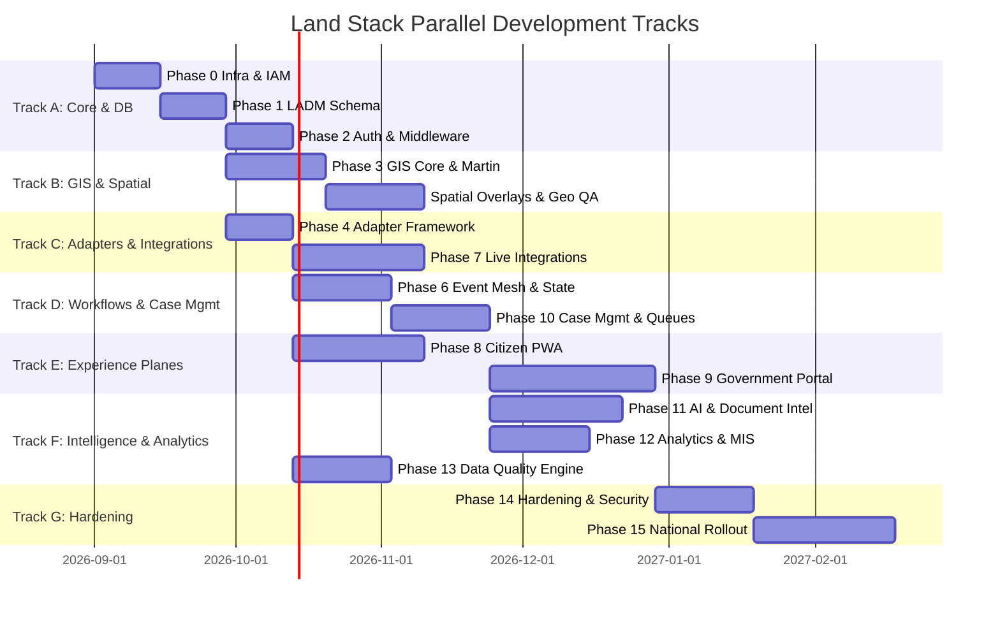

# Land Stack — Implementation Phases & Build Roadmap

**Version**: 3.0 | **Last Updated**: September 2026  
**Scope**: End-to-End Implementation Roadmap for Dual-Plane Land Stack (Citizen Experience + Government Operations)  
**Aligned With**: DILRMP 3.0 (2026–2031), ISO 19152 LADM, [01-prd.md](./01-prd.md), [GOVERNMENT_PORTAL_ARCHITECTURE.md](./GOVERNMENT_PORTAL_ARCHITECTURE.md)

> **Implementation Note**: Phases are labeled with their current maturity: `[Implemented]`, `[Partially Implemented]`, `[Architecturally Defined]`, `[Planned]`. The current implementation uses Express.js + Supabase rather than the infrastructure originally envisioned (Keycloak, OPA, Kafka, K8s). See `docs/backend-docs/01-architecture-overview.md` for details.

---

## 1. Architectural Foundation & Dependency Strategy

This roadmap is built on the foundational thesis:
**ONE PARCEL → ONE CANONICAL IDENTITY → MANY AUTHORITATIVE DATA SOURCES → MANY GOVERNMENT WORKFLOWS → ONE GOVERNANCE INTELLIGENCE LAYER → ROLE-SPECIFIC EXPERIENCES.**

Land Stack builds outward from data and identity foundations to integration adapters, event-driven workflows, role-based governance portals, AI intelligence, and citizen accessibility.

### 1.1 Master Phase Dependency Graph

---

## 2. Phase-by-Phase Implementation Plan

### Phase 0 — Infrastructure & Security Foundation `[Implemented]`
**Objective**: Establish cloud platform foundation, CI/CD, and identity infrastructure.
- **Infrastructure**: Supabase project provisioned (PostgreSQL + Auth + Storage + Realtime). Express.js API server with Node.js.
- **Security**: Helmet middleware (HTTP security headers), CORS configuration, express-rate-limit for API rate limiting, TLS via hosting provider.
- **IAM Foundation**: Supabase Auth with two authentication flows:
  1. **Citizen**: Mobile OTP authentication via Supabase Auth.
  2. **Government**: Email/password login with MFA step-up for sensitive operations (mutation approve/reject).
- **Session Management**: HTTP-only secure cookies wrapping Supabase JWTs. No localStorage token storage.
- **CI/CD**: Standard development workflow. `[Planned: GitHub Actions for automated linting, testing, container scanning]`

### Phase 1 — Database Schema `[Implemented]`
**Objective**: Implement PostgreSQL schema with PostGIS spatial support.
- **Tables**: 30+ tables including `parcels`, `ownership_records`, `encumbrances`, `restrictions`, `mutations`, `mutation_timeline`, `court_cases`, `zoning`, `tax_records`, `audit_events`, `citizens`, `government_users`, `government_roles`, `applications`, `documents`, `notifications`, `watchlist`, and jurisdiction hierarchy (`states`, `districts`, `tehsils`, `villages`).
- **Temporal Modeling**: Simple `created_at`/`updated_at` timestamps. `[Planned: bi-temporal valid_from/valid_to + system_from/system_to]`
- **Audit Foundation**: Append-only `audit_events` table with `event_hash` and `previous_hash` columns. `[Partially Implemented: columns exist, hash-chain computation not yet active]`
- **Indexing**: B-tree indexes on ULPIN (`survey_number`, `gat_number`, `khasra_number`), jurisdiction codes, mutation status. `[Planned: GIST spatial indexes on geometry columns]`

### Phase 2 — Authentication, Authorization & Jurisdiction `[Implemented]`
**Objective**: Secure, policy-driven authorization engine enforcing RBAC + Jurisdiction.
- **Citizen Auth**: Mobile OTP via Supabase Auth, session hydration via HTTP-only cookies.
- **Government Auth**: Email/password via Supabase Auth, MFA step-up for approve/reject actions (`requireMfaStepUp` middleware).
- **Authorization Engine**: 4-layer Express middleware chain:
  - `requireAuth`: Validates JWT from cookie, attaches user to request.
  - `requireRole(roles)`: Checks user's role against allowed roles.
  - `requirePermission(permission)`: Checks user's role-specific permissions from `ROLE_PERMISSIONS` map.
  - `requireJurisdiction`: Verifies user's assigned jurisdiction covers the requested resource.
- **14 System Roles**: Defined in `core/permissions.js` with 60+ granular permissions.
- **5 Contexts**: RURAL, URBAN, SHARED_GIS, STATE, NATIONAL — scoping which roles operate in which environments.
- **Supabase RLS**: Database-level Row Level Security policies as defense-in-depth `[Partially Implemented]`.

### Phase 3 — Parcel Identity & GIS Core `[Partially Implemented]`
**Objective**: Parcel identity resolution and spatial query capability.
- **Identity Resolution**: Multi-identifier search (ULPIN, Survey No, Gat No, Khasra No, CTS No) via `ParcelService` with fuzzy matching.
- **GIS**: PostGIS extension enabled. GeoJSON generation from database. Bounding box search. Village cadastral map endpoint.
- **Spatial Functions**: `[Planned: ST_Contains, ST_DWithin, ST_Intersects, ST_AsMVT via Supabase RPC]`
- **Geometry QA**: `[Planned: ST_IsValid, ST_MakeValid, area threshold checks]`
- **Vector Tile Serving**: `[Planned: Martin tile server or PostGIS ST_AsMVT via Express endpoint]`
- **Frontend Map**: Leaflet dependency installed, placeholder `MapContainer.jsx` component. `[Planned: MapLibre GL JS with full interactivity]`

### Phase 4 — State Adapter Framework & Mocking Engine
**Objective**: Build the configuration-driven abstraction layer isolating State-specific variations from platform core.
- **Registry**: `StateAdapterRegistry` dynamically instantiating adapters from `state_config` metadata tables.
- **Interface Contract**: Strict `IStateAdapter` contract (`fetchRoR`, `fetchGeometry`, `fetchEncumbrance`, `resolveIdentity`).
- **Adapter Implementations**:
  - `MaharashtraAdapter` (Mahabhulekh 7/12, BhuNaksha, IGR).
  - `KarnatakaAdapter` (Bhoomi RTC, Kaveri).
  - `TamilNaduAdapter` (Patta Chitta, TNReginet).
  - `UttarPradeshAdapter` (Bhulekh UP, IGRS UP).
- **Scenario Mock Adapter**: Mock engine returning deterministic scenario fixtures (`ULPIN-CLEAN`, `ULPIN-DISPUTED`, `ULPIN-ENCUMBERED`, `ULPIN-AREA-MISMATCH`, `ULPIN-TIMEOUT`).

### Phase 5 — Dual-Mode Parcel 360 Aggregation Engine
**Objective**: Assemble complete 10-layer parcel data for both Citizen Mode and Officer Mode.
- **Aggregation Engine**: `Parcel360Module` concurrently pulling from RoR, Spatial, Encumbrance, Restriction, Tax, Planning, and Court projections.
- **Caching Layer**: Redis Cluster caching with 1-hour TTL, stale-while-revalidate pattern, and event-based cache invalidation.
- **Dual-Mode Response Transformation**:
  - **Citizen View**: Public records, ownership names, map boundaries, encumbrance highlights, non-dismissible legal disclaimer.
  - **Officer View**: Full raw provenance, officer audit logs, workflow history, active cross-source discrepancies, AI risk advisory badge.
- **Resilience**: Circuit breaker (Opossum) tripping after 5 consecutive external failures, serving cached projection with freshness warning.

### Phase 6 — Event Mesh & State Workflow Engine
**Objective**: Asynchronous, distributed event routing across departments and durable workflow orchestration.
- **Event Bus**: Kafka / Redis Streams with ULPIN-based partitioning ensuring strict per-parcel event ordering.
- **Event Envelope**: CloudEvents-compliant JSON payload containing `event_id`, `correlation_id`, `causation_id`, `provenance`, and payload.
- **Core Topics**: `registration.completed`, `mutation.initiated`, `mutation.status_changed`, `ror.updated`, `court_order.issued`, `data_conflict.detected`.
- **Workflow State Machine**: 12-state mutation engine (`INITIATED` → `VERIFICATION_ASSIGNED` → `FIELD_VERIFIED` → `REVIEWED` → `NOTICE_PERIOD` → `HEARING` → `APPROVED` → `ROR_UPDATED`).

### Phase 7 — Government Department Integrations
**Objective**: Connect State Adapters to actual state staging/sandbox APIs.
- **RoR Integration**: REST/SOAP consumers for Mahabhulekh, Bhoomi, Bhulekh UP.
- **Registration Webhooks**: `POST /webhooks/ngdrs/registration` endpoint with HMAC-SHA256 signature verification and idempotency keys.
- **BhuNaksha**: WMS/WFS raster & vector tile ingestion pipelines.
- **Revenue Courts**: REST sync with RCCMS and e-Courts case feeds.
- **Planning & ULB**: Spatial layer overlays for master plan zoning and property tax status.

### Phase 8 — Citizen Experience Plane `[Implemented]`
**Objective**: Mobile-responsive web application for citizens.
- **Tech Stack**: React 19, Vite 8, React Router 7, vanilla CSS, Leaflet (maps).
- **Features**:
  - Parcel search (ULPIN, Survey No, owner name).
  - Parcel 360° view with 9-tab data aggregation.
  - Mutation tracking page.
  - Parcel Watchlist with notifications.
  - Service application submissions.
  - Documents and grievances pages.
  - Due diligence page.
- **Auth**: OTP login via Supabase Auth, session persistence via HTTP-only cookies.
- **Routes**: `/citizen/dashboard`, `/citizen/search`, `/citizen/parcels`, `/citizen/parcels/:id`, `/citizen/mutations`, `/citizen/applications`, `/citizen/documents`, `/citizen/watchlist`, `/citizen/notifications`, `/citizen/grievances`, `/citizen/due-diligence`, `/citizen/profile`.
- **Accessibility & i18n**: `[Planned: WCAG 2.1 AA, PWA manifest, multilingual toggle, low-bandwidth optimization]`

### Phase 9 — Government Operations Plane (Role Workspaces)
**Objective**: Dedicated, jurisdiction-scoped operational portal for government officers.
- **Portal Shell**: Dynamic header displaying current Officer Role, Department, Jurisdiction path, pending task counter, and notification feed.
- **State-Aware UI**: Dynamic label resolution from `state_config` (e.g., rendering "Talathi" in MH vs "Lekhpal" in UP).
- **Dedicated Workspaces (13 Government Roles)**:
  1. **Rural Domain**:
     - **Talathi / Patwari**: Task-first verification queue, GPS photo upload, field observation entry, recommendation submission.
     - **CRO**: Supervision and escalation management.
     - **Tehsildar**: Decision workspace, objection tracking, hearing recorder, statutory sanction/rejection execution.
     - **Collector**: District command cockpit, tehsil SLA choropleth rankings, inter-tehsil dispute escalations.
  2. **Urban Domain**:
     - **ULB Officer**: Verify municipal tax status, master plan zoning, and property mutations.
  3. **Registration (Rural & Urban)**:
     - **Sub-Registrar (SRO)**: Pre-registration parcel encumbrance check, restriction alerts, NGDRS integration transaction monitor.
  4. **Shared GIS Domain**:
     - **Survey & GIS Officer**: Process surveyor GPS data, run topology checks, update canonical geometries.
  5. **Monitoring Domain**:
     - **State PMU / Authority**: Statewide DILRMP indicator monitor, State Adapter API health, automated AI executive brief.
     - **National Monitor / DoLR**: Cross-state benchmark cockpit, national ULPIN rollout metrics.
     - **System Administrator**: Platform configuration, state adapter schemas, Supabase/Permissions administration, cryptographic audit verification.

### Phase 10 — Case Management & Work Queues
**Objective**: High-throughput task processing, SLA calculation, and automated escalation chains.
- **Task Allocator**: Automatic assignment of incoming mutation events to the village officer based on jurisdiction mapping.
- **SLA Engine**: Dynamic SLA timer calculation based on State citizen charter rules (e.g., 15 days for field report, 30 days for sanction).
- **Escalation Triggers**: Auto-escalation of overdue cases from Talathi to Tehsildar, and from Tehsildar to District Collector with audit log entry.
- **Case Dossier**: Unified case view containing attached citizen applications, registered deed extracts, field photos, and officer notes.

### Phase 11 — AI Land Intelligence & Document Intelligence
**Objective**: Deploy advisory ML models and document processing pipelines.
- **Document Intelligence**:
  - Secure upload to S3/MinIO with virus scanning (ClamAV) and SHA-256 integrity hashing.
  - OCR pipeline (Tesseract/PaddleOCR) extracting deed numbers, party names, and survey numbers.
  - Automated classification of deeds, mutation notices, court orders, and tax receipts.
- **AI Land Intelligence (Strictly Advisory)**:
  - **Parcel Summarizer**: Plain-language synthesis of 360° records with highlighted risk flags.
  - **SLA Risk Predictor**: XGBoost model predicting SLA breach probabilities based on officer queue depth.
  - **Spatial Anomaly Detector**: Geometry overlap detection, RoR area vs PostGIS calculated area discrepancy flagging (>10%).
  - **Natural Language Governance Analytics**: RAG-powered query interface for authorized administrators with cited data sources.
- **Governance Enforcement**: Mandatory `ADVISORY` tag, explanation metadata, and manual officer dismissal logging.

### Phase 12 — Analytics, MIS & Executive Command Center
**Objective**: Multi-tier governance analytics from National overview to village-level drill-down.
- **Hierarchy Drill-Down**: National (DoLR) → State PMU → District Collector → SDM → Tehsildar → Village Talathi.
- **Visualizations**:
  - Choropleth maps of mutation pendency and SLA adherence.
  - Data Quality Index (DQI) grade heatmaps (A to E).
  - Backlog funnels, ageing histograms, and registration-to-mutation conversion trends.
- **Integration Observability**: Live status of state adapters, API response percentiles (P95/P99), webhook receipt latency, DLQ counts.
- **Executive Summaries**: Automated AI-generated governance performance briefs for PMU leadership.

### Phase 13 — Trust, Provenance & Data Quality Engine
**Objective**: Continuous background data validation, conflict alerting, and provenance transparency.
- **Data Quality Engine**: Scheduled batch comparison engine scanning for:
  - Area mismatch (RoR recorded vs cadastral polygon).
  - Duplicate owner names across disparate identifiers.
  - Stale projections (>48 hours without sync).
  - Unmapped parcels (ULPIN missing).
- **Provenance Visualization**: Clickable lineage badge on every field showing authoritative system, retrieval timestamp, and confidence score.
- **Cryptographic Audit Log**: Scheduled batch validator recalculating the SHA-256 hash-chain of `audit_event` to verify tamper-proof history.

### Phase 14 — Production Hardening, Observability & CERT-In Compliance
**Objective**: Resilience verification, penetration testing, and enterprise monitoring.
- **Observability**: OpenTelemetry distributed tracing across all modules, Prometheus metrics collection, Grafana dashboards, Loki log aggregation.
- **Performance Tuning**: PostGIS spatial indexing benchmarks, PgBouncer connection pooling, Redis cluster caching optimization.
- **Load Testing**: 10,000 concurrent citizen users + 2,000 concurrent government officers using k6.
- **Security Audit**: Penetration testing against OWASP Top 10, CERT-In compliance signoff, DPDP Act consent audit review.

### Phase 15 — Multi-State Scale & National Rollout
**Objective**: Expansion to 5+ major States and full national scaling readiness.
- **Multi-State Onboarding**: Rapid configuration onboarding of Uttar Pradesh, Rajasthan, Gujarat, and Madhya Pradesh via metadata injection.
- **Database Partitioning**: PostgreSQL table partitioning by `state_code` and date ranges.
- **National Monitoring**: Central DoLR dashboard aggregating state-level performance indicators.

---

## 3. Parallel Development Tracks

---

## 4. MVP vs Production vs Future DPI

| Dimension | Current MVP | Production Pilot (2 States) | National DPI Scale (All States) |
|---|---|---|---|
| **Experience Planes** | Citizen React App + 13 Govt Workspaces (all roles) | Citizen PWA + All 13 Government Workspaces | Full National DPI Deployment across all roles + Mobile Native Apps |
| **Authentication** | Supabase Auth (OTP + email/password + MFA step-up) | Supabase Auth + Jan Parichay SSO federation | Full UIDAI eKYC + National Single Sign-On |
| **Integrations** | Seeded database (no live external APIs) | Live APIs for MH & KA + NGDRS Webhook Listener | All 36 States/UTs integrated via State Adapters |
| **GIS Capability** | PostGIS extension + GeoJSON + Leaflet placeholder | PostGIS spatial queries + MapLibre + Satellite Overlays | Drone-based SVAMITVA integration + 3D Cadastre |
| **Workflows** | End-to-end 12-state mutation lifecycle | Multi-department workflows (Mutation, Survey, Planning) | Cross-border dispute & inter-state consolidation |
| **AI Intelligence** | Rule-based data health scoring in Parcel 360° | Rule-based anomalies + LLM Summarizer | Multi-modal Satellite Change Detection + Automated Legal Extraction |
| **Analytics & MIS** | National/State/District analytics from PostgreSQL | Full State PMU Command Center + Choropleths | Real-time DoLR National Land Governance Cockpit |
| **Audit & Trust** | Append-only audit_events table | Automated nightly integrity verification | Distributed verifiable credential audit proof |

---

*This roadmap aligns with [00-product-vision.md](./00-product-vision.md), [01-prd.md](./01-prd.md), [GOVERNMENT_PORTAL_ARCHITECTURE.md](./GOVERNMENT_PORTAL_ARCHITECTURE.md), and [AI_INTELLIGENCE_ARCHITECTURE.md](./AI_INTELLIGENCE_ARCHITECTURE.md). See `docs/backend-docs/` for current implementation details.*
