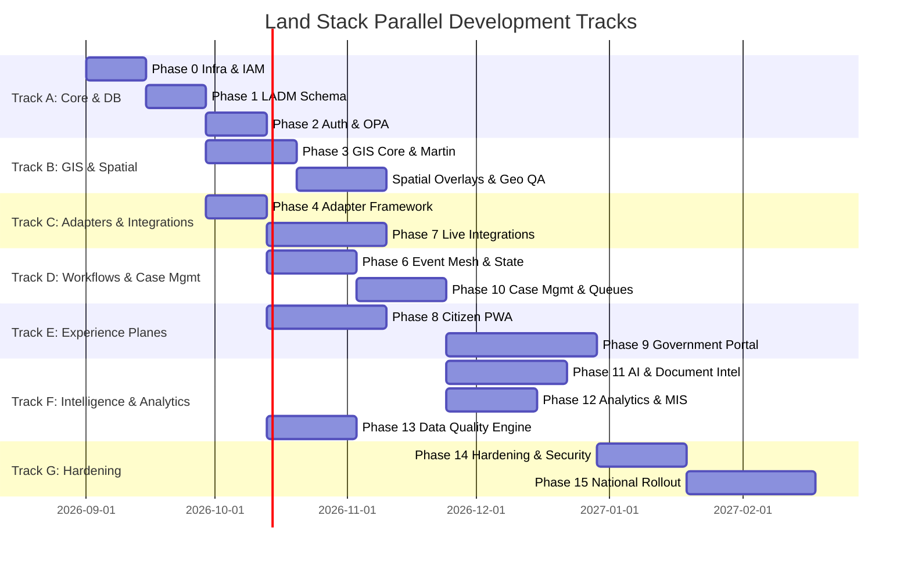

# Land Stack — Implementation Phases & Build Roadmap

**Version**: 2.0 | **Date**: September 2026  
**Scope**: End-to-End Implementation Roadmap for Dual-Plane Land Stack (Citizen Experience + Government Operations)  
**Aligned With**: DILRMP 3.0 (2026–2031), ISO 19152 LADM, SIH Problem Statement 26014, [01-prd.md](./01-prd.md), [GOVERNMENT_PORTAL_ARCHITECTURE.md](./GOVERNMENT_PORTAL_ARCHITECTURE.md)

---

## 1. Architectural Foundation & Dependency Strategy

This roadmap is built on the foundational thesis:
**ONE PARCEL → ONE CANONICAL IDENTITY → MANY AUTHORITATIVE DATA SOURCES → MANY GOVERNMENT WORKFLOWS → ONE GOVERNANCE INTELLIGENCE LAYER → ROLE-SPECIFIC EXPERIENCES.**

Land Stack builds outward from data and identity foundations to integration adapters, event-driven workflows, role-based governance portals, AI intelligence, and citizen accessibility.

### 1.1 Master Phase Dependency Graph

---

## 2. Phase-by-Phase Implementation Plan

### Phase 0 — Infrastructure, Security & Multi-Realm IAM
**Objective**: Establish cloud/on-premise foundation, CI/CD, secrets management, and dual-realm identity infrastructure.
- **Infrastructure**: Kubernetes (EKS/k3s), Terraform definitions, Redis 7 Cluster, Kafka cluster / Redis Streams.
- **Security**: HashiCorp Vault for secrets & mTLS certificates, Cloudflare/Kong WAF with OWASP Top 10 rules, TLS 1.3.
- **IAM Foundation**: Keycloak 24 deployed with two distinct realms:
  1. `landstack-citizen`: Mobile OTP, DigiLocker OAuth, Aadhaar eKYC federation.
  2. `landstack-government`: Jan Parichay / Govt SSO, email/password + TOTP/SMS MFA, Department LDAP/AD federation.
- **CI/CD**: GitHub Actions for automated linting, unit testing, container security scanning (Trivy), and staging deployment.

### Phase 1 — Database & LADM Bi-Temporal Schema
**Objective**: Implement ISO 19152 LADM-compliant, bi-temporal PostgreSQL 16 + PostGIS 3.4 relational schema.
- **Tables**: `parcel`, `parcel_identifier`, `spatial_unit`, `party`, `right_record`, `ror_projection`, `encumbrance`, `restriction`, `court_case`.
- **Temporal Modeling**: Every mutable record contains `valid_from`/`valid_to` (real-world validity) and `system_from`/`system_to` (platform transaction validity).
- **Audit Foundation**: Append-only `audit_event` table with SHA-256 hash-chaining trigger preventing UPDATE and DELETE.
- **Indexing**: GIST spatial indexes on parcel geometry/centroid, B-tree indexes on ULPIN and state identifiers, composite jurisdiction indexes.

### Phase 2 — IAM, Citizen Identity & Government SSO + OPA Engine
**Objective**: Secure, policy-driven authorization engine enforcing RBAC + ABAC + Jurisdiction.
- **Citizen Auth**: Mobile OTP generation, 5-minute expiry, rate limiting, DPDP Act consent ledger recording (`consent_log`).
- **Government Auth**: SSO integration, MFA requirement, jurisdiction assignment binding (State → District → Tehsil → Circle → Village).
- **Policy Engine**: Open Policy Agent (OPA) embedded sidecar with Rego policies enforcing [ROLE_PORTAL_MATRIX.md](./ROLE_PORTAL_MATRIX.md):
  - Deny access outside assigned geographical boundary.
  - Enforce role action constraints (e.g., only Tehsildar can execute `APPROVE`).
  - Block automated AI decision execution (`actor_type == "ai" && action == "APPROVE" -> DENY`).

### Phase 3 — Parcel Identity & GIS Core
**Objective**: Canonical ULPIN identity resolution and high-performance vector tile delivery.
- **Identity Resolution**: `ParcelIdentityModule` mapping diverse State identifiers (Survey No, Khasra, Gat, Patta, CTS) to canonical ULPIN.
- **GIS Server**: Martin tile server serving PostGIS vector tiles (`MVT`) directly from database functions.
- **Spatial Functions**: Point-in-polygon (`ST_Contains`), buffer search (`ST_DWithin`), boundary intersection (`ST_Intersects`).
- **Geometry QA**: Automated ingestion sanitization via `ST_IsValid`, `ST_MakeValid`, and minimum area threshold checks.

### Phase 4 — State Adapter Framework & Mocking Engine
**Objective**: Build the configuration-driven abstraction layer isolating State-specific variations from platform core.
- **Registry**: `StateAdapterRegistry` dynamically instantiating adapters from `state_config` metadata tables.
- **Interface Contract**: Strict `IStateAdapter` contract (`fetchRoR`, `fetchGeometry`, `fetchEncumbrance`, `resolveIdentity`).
- **Adapter Implementations**:
  - `MaharashtraAdapter` (Mahabhulekh 7/12, BhuNaksha, IGR).
  - `KarnatakaAdapter` (Bhoomi RTC, Kaveri).
  - `TamilNaduAdapter` (Patta Chitta, TNReginet).
  - `UttarPradeshAdapter` (Bhulekh UP, IGRS UP).
- **Scenario Mock Adapter**: Mock engine returning deterministic scenario fixtures (`ULPIN-CLEAN`, `ULPIN-DISPUTED`, `ULPIN-ENCUMBERED`, `ULPIN-AREA-MISMATCH`, `ULPIN-TIMEOUT`).

### Phase 5 — Dual-Mode Parcel 360 Aggregation Engine
**Objective**: Assemble complete 10-layer parcel data for both Citizen Mode and Officer Mode.
- **Aggregation Engine**: `Parcel360Module` concurrently pulling from RoR, Spatial, Encumbrance, Restriction, Tax, Planning, and Court projections.
- **Caching Layer**: Redis Cluster caching with 1-hour TTL, stale-while-revalidate pattern, and event-based cache invalidation.
- **Dual-Mode Response Transformation**:
  - **Citizen View**: Public records, ownership names, map boundaries, encumbrance highlights, non-dismissible legal disclaimer.
  - **Officer View**: Full raw provenance, officer audit logs, workflow history, active cross-source discrepancies, AI risk advisory badge.
- **Resilience**: Circuit breaker (Opossum) tripping after 5 consecutive external failures, serving cached projection with freshness warning.

### Phase 6 — Event Mesh & State Workflow Engine
**Objective**: Asynchronous, distributed event routing across departments and durable workflow orchestration.
- **Event Bus**: Kafka / Redis Streams with ULPIN-based partitioning ensuring strict per-parcel event ordering.
- **Event Envelope**: CloudEvents-compliant JSON payload containing `event_id`, `correlation_id`, `causation_id`, `provenance`, and payload.
- **Core Topics**: `registration.completed`, `mutation.initiated`, `mutation.status_changed`, `ror.updated`, `court_order.issued`, `data_conflict.detected`.
- **Workflow State Machine**: 12-state mutation engine (`INITIATED` → `VERIFICATION_ASSIGNED` → `FIELD_VERIFIED` → `REVIEWED` → `NOTICE_PERIOD` → `HEARING` → `APPROVED` → `ROR_UPDATED`).

### Phase 7 — Government Department Integrations
**Objective**: Connect State Adapters to actual state staging/sandbox APIs.
- **RoR Integration**: REST/SOAP consumers for Mahabhulekh, Bhoomi, Bhulekh UP.
- **Registration Webhooks**: `POST /webhooks/ngdrs/registration` endpoint with HMAC-SHA256 signature verification and idempotency keys.
- **BhuNaksha**: WMS/WFS raster & vector tile ingestion pipelines.
- **Revenue Courts**: REST sync with RCCMS and e-Courts case feeds.
- **Planning & ULB**: Spatial layer overlays for master plan zoning and property tax status.

### Phase 8 — Citizen Experience Plane (PWA)
**Objective**: Mobile-first, accessible, multilingual web application for citizens.
- **Tech Stack**: Next.js 14 PWA, TypeScript, TailwindCSS, MapLibre GL JS.
- **Features**:
  - Hierarchical cascading search (State → District → Tehsil → Village → Survey No).
  - Interactive cadastral map with click-to-select and GPS "Locate Me".
  - 10-tab Citizen Parcel 360° view.
  - Real-time mutation tracking timeline with SLA countdown.
  - Parcel Watchlist with SMS/in-app change notifications.
  - Service application submissions (RoR extract, NEC, Grievance).
- **Accessibility & i18n**: WCAG 2.1 AA compliant, 2G network optimization (<200KB initial bundle), multilingual toggle (English, Hindi, Marathi, Tamil).

### Phase 9 — Government Operations Plane (Role Workspaces)
**Objective**: Dedicated, jurisdiction-scoped operational portal for government officers.
- **Portal Shell**: Dynamic header displaying current Officer Role, Department, Jurisdiction path, pending task counter, and notification feed.
- **State-Aware UI**: Dynamic label resolution from `state_config` (e.g., rendering "Talathi" in MH vs "Lekhpal" in UP).
- **Dedicated Workspaces (7 Government Roles)**:
  1. **Talathi / Patwari**: Task-first verification queue, GPS photo upload, field observation entry, recommendation submission directly to Tehsildar.
  2. **Tehsildar**: Decision workspace, objection tracking, hearing recorder, statutory sanction/rejection execution (absorbs RI & SDM).
  3. **Sub-Registrar (SRO)**: Pre-registration parcel encumbrance check, restriction alerts, NGDRS integration transaction monitor.
  4. **District Collector**: District command cockpit, tehsil SLA choropleth rankings, inter-tehsil dispute escalations.
  5. **State PMU Head**: Statewide DILRMP indicator monitor, State Adapter API health, automated AI executive brief.
  6. **DoLR / National Monitor**: Cross-state benchmark cockpit, national ULPIN rollout metrics, central reporting.
  7. **System Administrator**: Platform configuration, state adapter schemas, Keycloak/OPA administration, cryptographic audit hash-chain verification.

### Phase 10 — Case Management & Work Queues
**Objective**: High-throughput task processing, SLA calculation, and automated escalation chains.
- **Task Allocator**: Automatic assignment of incoming mutation events to the village officer based on jurisdiction mapping.
- **SLA Engine**: Dynamic SLA timer calculation based on State citizen charter rules (e.g., 15 days for field report, 30 days for sanction).
- **Escalation Triggers**: Auto-escalation of overdue cases from Talathi to Tehsildar, and from Tehsildar to District Collector with audit log entry.
- **Case Dossier**: Unified case view containing attached citizen applications, registered deed extracts, field photos, and officer notes.

### Phase 11 — AI Land Intelligence & Document Intelligence
**Objective**: Deploy advisory ML models and document processing pipelines.
- **Document Intelligence**:
  - Secure upload to S3/MinIO with virus scanning (ClamAV) and SHA-256 integrity hashing.
  - OCR pipeline (Tesseract/PaddleOCR) extracting deed numbers, party names, and survey numbers.
  - Automated classification of deeds, mutation notices, court orders, and tax receipts.
- **AI Land Intelligence (Strictly Advisory)**:
  - **Parcel Summarizer**: Plain-language synthesis of 360° records with highlighted risk flags.
  - **SLA Risk Predictor**: XGBoost model predicting SLA breach probabilities based on officer queue depth.
  - **Spatial Anomaly Detector**: Geometry overlap detection, RoR area vs PostGIS calculated area discrepancy flagging (>10%).
  - **Natural Language Governance Analytics**: RAG-powered query interface for authorized administrators with cited data sources.
- **Governance Enforcement**: Mandatory `ADVISORY` tag, explanation metadata, and manual officer dismissal logging.

### Phase 12 — Analytics, MIS & Executive Command Center
**Objective**: Multi-tier governance analytics from National overview to village-level drill-down.
- **Hierarchy Drill-Down**: National (DoLR) → State PMU → District Collector → SDM → Tehsildar → Village Talathi.
- **Visualizations**:
  - Choropleth maps of mutation pendency and SLA adherence.
  - Data Quality Index (DQI) grade heatmaps (A to E).
  - Backlog funnels, ageing histograms, and registration-to-mutation conversion trends.
- **Integration Observability**: Live status of state adapters, API response percentiles (P95/P99), webhook receipt latency, DLQ counts.
- **Executive Summaries**: Automated AI-generated governance performance briefs for PMU leadership.

### Phase 13 — Trust, Provenance & Data Quality Engine
**Objective**: Continuous background data validation, conflict alerting, and provenance transparency.
- **Data Quality Engine**: Scheduled batch comparison engine scanning for:
  - Area mismatch (RoR recorded vs cadastral polygon).
  - Duplicate owner names across disparate identifiers.
  - Stale projections (>48 hours without sync).
  - Unmapped parcels (ULPIN missing).
- **Provenance Visualization**: Clickable lineage badge on every field showing authoritative system, retrieval timestamp, and confidence score.
- **Cryptographic Audit Log**: Scheduled batch validator recalculating the SHA-256 hash-chain of `audit_event` to verify tamper-proof history.

### Phase 14 — Production Hardening, Observability & CERT-In Compliance
**Objective**: Resilience verification, penetration testing, and enterprise monitoring.
- **Observability**: OpenTelemetry distributed tracing across all modules, Prometheus metrics collection, Grafana dashboards, Loki log aggregation.
- **Performance Tuning**: PostGIS spatial indexing benchmarks, PgBouncer connection pooling, Redis cluster caching optimization.
- **Load Testing**: 10,000 concurrent citizen users + 2,000 concurrent government officers using k6.
- **Security Audit**: Penetration testing against OWASP Top 10, CERT-In compliance signoff, DPDP Act consent audit review.

### Phase 15 — Multi-State Scale & National Rollout
**Objective**: Expansion to 5+ major States and full national scaling readiness.
- **Multi-State Onboarding**: Rapid configuration onboarding of Uttar Pradesh, Rajasthan, Gujarat, and Madhya Pradesh via metadata injection.
- **Database Partitioning**: PostgreSQL table partitioning by `state_code` and date ranges.
- **National Monitoring**: Central DoLR dashboard aggregating state-level performance indicators.

---

## 3. Parallel Development Tracks

---

## 4. MVP (SIH Demo) vs Production vs Future DPI

| Dimension | SIH Demo MVP | Production Pilot (2 States) | National DPI Scale (All States) |
|---|---|---|---|
| **Experience Planes** | Citizen PWA (Citizen Land Owner) + 3 Govt Workspaces (Talathi, Tehsildar, State PMU) | Citizen PWA + All 7 Government Workspaces | Full National DPI Deployment across all 8 Roles + Mobile Native Apps |
| **Authentication** | Mobile OTP (Citizen) + SSO Mock MFA (Govt) | Keycloak + Govt SMS Gateway + Jan Parichay SSO | Full UIDAI eKYC + National Single Sign-On |
| **Integrations** | Mock Adapters (MH, KA, TN) + Scenario Fixtures | Live APIs for MH & KA + NGDRS Webhook Listener | All 36 States/UTs integrated via State Adapters |
| **GIS Capability** | PostGIS + Martin Tiles + MapLibre | Live BhuNaksha WMS/WFS + Satellite Overlays | Drone-based SVAMITVA integration + 3D Cadastre |
| **Workflows** | End-to-end Mutation lifecycle (Initiation → Sanction) | Multi-department workflows (Mutation, Survey, Planning) | Cross-border dispute & inter-state consolidation |
| **AI Intelligence** | Rule-based Anomaly Engine + Mock Advisory Summaries | Live XGBoost SLA Predictor + LLM Summarizer | Multi-modal Satellite Change Detection + Automated Legal Extraction |
| **Analytics & MIS** | State & District Dashboards with drill-down | Full State PMU Command Center + Choropleths | Real-time DoLR National Land Governance Cockpit |
| **Audit & Trust** | Append-only hash-chained table | Automated nightly integrity verification | Distributed verifiable credential audit proof |

---

*This roadmap aligns completely with [00-product-vision.md](./00-product-vision.md), [01-prd.md](./01-prd.md), [GOVERNMENT_PORTAL_ARCHITECTURE.md](./GOVERNMENT_PORTAL_ARCHITECTURE.md), and [AI_INTELLIGENCE_ARCHITECTURE.md](./AI_INTELLIGENCE_ARCHITECTURE.md).*
