# Land Stack — Workflow Documentation

**Version**: 3.0 | **Last Updated**: September 2026  
**Scope**: All workflows — Citizen-facing (§1–§9) and Government Operations (§10–§15)  
**See Also**: [PRD](./01-prd.md) | [Personas](./02-personas.md) | [Government Portal](./GOVERNMENT_PORTAL_ARCHITECTURE.md)

> **Implementation Note**: The current implementation uses **Supabase Auth** instead of Keycloak, **Express Middleware** instead of OPA, and **Supabase Realtime/DB Triggers** instead of Kafka. Workflows described below have been updated to reflect the current Express + Supabase architecture.

---

## 1. Workflow Overview

Every citizen interaction follows this master flow:

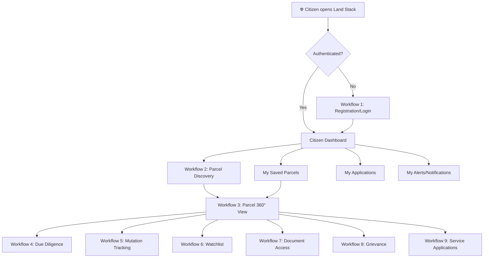
```mermaid
flowchart TD
    LAND["🌐 Citizen opens Land Stack"] --> AUTH{"Authenticated?"}
    AUTH -->|No| LOGIN["Workflow 1: Registration/Login"]
    AUTH -->|Yes| DASH["Citizen Dashboard"]
    LOGIN --> DASH

    DASH --> SEARCH["Workflow 2: Parcel Discovery"]
    DASH --> MY_PARCELS["My Saved Parcels"]
    DASH --> MY_APPS["My Applications"]
    DASH --> ALERTS["My Alerts/Notifications"]

    SEARCH --> P360["Workflow 3: Parcel 360° View"]
    MY_PARCELS --> P360

    P360 --> DD["Workflow 4: Due Diligence"]
    P360 --> MUT["Workflow 5: Mutation Tracking"]
    P360 --> WL["Workflow 6: Watchlist"]
    P360 --> DOCS["Workflow 7: Document Access"]
    P360 --> GRIEV["Workflow 8: Grievance"]
    P360 --> APP["Workflow 9: Service Applications"]
```

---

## 2. Workflow 1 — Registration & Login

### 2.1 Citizen Registration

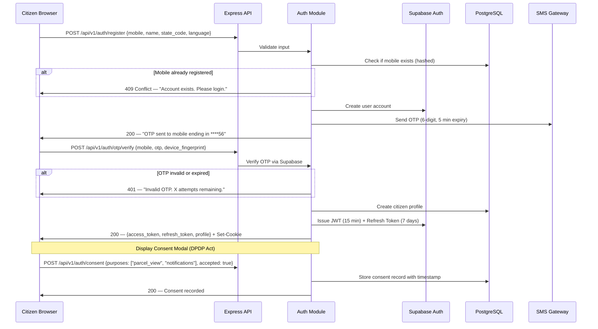
```mermaid
sequenceDiagram
    participant C as Citizen Browser
    participant GW as Express API
    participant AUTH as Auth Module
    participant SUPA as Supabase Auth
    participant DB as PostgreSQL
    participant SMS as SMS Gateway

    C->>GW: POST /api/v1/auth/register {mobile, name, state_code, language}
    GW->>AUTH: Validate input
    AUTH->>DB: Check if mobile exists (hashed)
    
    alt Mobile already registered
        AUTH->>C: 409 Conflict — "Account exists. Please login."
    end

    AUTH->>SUPA: Create user account
    AUTH->>SMS: Send OTP (6-digit, 5 min expiry)
    AUTH->>C: 200 — "OTP sent to mobile ending in ****56"

    C->>GW: POST /api/v1/auth/otp/verify {mobile, otp, device_fingerprint}
    GW->>AUTH: Verify OTP via Supabase
    
    alt OTP invalid or expired
        AUTH->>C: 401 — "Invalid OTP. X attempts remaining."
    end

    AUTH->>DB: Create citizen profile
    AUTH->>SUPA: Issue JWT (15 min) + Refresh Token (7 days)
    AUTH->>C: 200 — {access_token, refresh_token, profile} + Set-Cookie
    
    Note over C,AUTH: Display Consent Modal (DPDP Act)
    C->>GW: POST /api/v1/auth/consent {purposes: ["parcel_view", "notifications"], accepted: true}
    AUTH->>DB: Store consent record with timestamp
    AUTH->>C: 200 — Consent recorded
```

**API Endpoints**:
| Method | Path | Request Body | Response |
|--------|------|-------------|----------|
| POST | `/api/v1/auth/register` | `{mobile, name, state_code, preferred_language}` | `{message, otp_ref}` |
| POST | `/api/v1/auth/otp/send` | `{mobile}` | `{message, otp_ref, expires_in}` |
| POST | `/api/v1/auth/otp/verify` | `{mobile, otp, device_fingerprint}` | `{access_token, refresh_token, profile}` |
| POST | `/api/v1/auth/refresh` | `{refresh_token}` | `{access_token, refresh_token}` |
| POST | `/api/v1/auth/consent` | `{purposes[], accepted, version}` | `{consent_id, recorded_at}` |
| POST | `/api/v1/auth/logout` | `{refresh_token}` | `204 No Content` |
| GET | `/api/v1/auth/profile` | — | `{citizen profile}` |
| PATCH | `/api/v1/auth/profile` | `{name?, language?, notification_prefs?}` | `{updated profile}` |

**Security Rules**:
- OTP: 6-digit, 5-minute expiry, max 5 attempts per 15 minutes, max 10 OTPs per day per mobile
- JWT: 15-minute access token; 7-day refresh token; 30-minute idle timeout
- Mobile stored as SHA-256 hash only. Never stored in plaintext.
- CERT-In compliant session management: 24-hour maximum session length

### 2.2 Login Flow

```
1. Citizen enters mobile number
2. Backend sends OTP via SMS gateway
3. Citizen enters OTP
4. Backend verifies OTP against Supabase Auth
5. Backend issues JWT access token (15 min) + refresh token (7 days)
6. Frontend stores tokens in httpOnly secure cookie (access) + localStorage (refresh)
7. All subsequent API calls include Bearer token
8. Token refresh happens automatically before expiry
9. 30-minute idle timeout triggers re-authentication
```

### 2.3 Profile & Consent

**Profile Data**:
- Name (display name; no legal verification required for basic access)
- Mobile (hashed)
- State preference (determines terminology, language, hierarchy)
- Preferred language (State language / Hindi / English)
- Notification preferences (SMS, email, push — configurable per event type)

**Consent** (DPDP Act 2023 compliance):
- Purpose-limited: parcel_view, notifications, watchlist, service_applications
- Granular: citizen can consent to some purposes and not others
- Revocable: citizen can withdraw consent at any time via profile settings
- Recorded: consent record with timestamp, version, IP, device stored permanently

---

## 3. Workflow 2 — Parcel Discovery

### 3.1 Search Methods

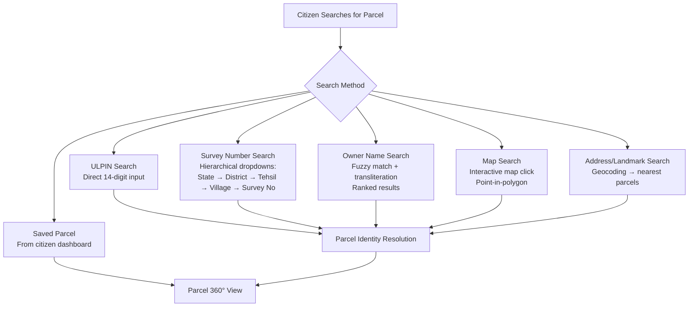
```mermaid
flowchart TD
    SEARCH["Citizen Searches for Parcel"] --> METHOD{"Search Method"}

    METHOD --> ULPIN["ULPIN Search<br/>Direct 14-digit input"]
    METHOD --> SURVEY["Survey Number Search<br/>Hierarchical dropdowns:<br/>State → District → Tehsil → Village → Survey No"]
    METHOD --> OWNER["Owner Name Search<br/>Fuzzy match + transliteration<br/>Ranked results"]
    METHOD --> MAP["Map Search<br/>Interactive map click<br/>Point-in-polygon"]
    METHOD --> ADDR["Address/Landmark Search<br/>Geocoding → nearest parcels"]
    METHOD --> SAVED["Saved Parcel<br/>From citizen dashboard"]

    ULPIN --> RESOLVE
    SURVEY --> RESOLVE
    OWNER --> RESOLVE
    MAP --> RESOLVE
    ADDR --> RESOLVE
    SAVED --> P360

    RESOLVE["Parcel Identity Resolution"] --> P360["Parcel 360° View"]
```

### 3.2 ULPIN Search

```
Backend Flow:
1. Citizen enters: "IN-MH-PU-0001-12345"
2. Validate ULPIN format (regex: /^[A-Z]{2}-[A-Z]{2}-[A-Z]{2}-\d{4}-\d{5}$/)
3. Query: SELECT * FROM parcel WHERE ulpin = $1
4. If found → Return Parcel 360 data
5. If not found → Query ULPIN Registry API (external)
6. If external found → Create parcel projection, store, return
7. If not found anywhere → "No parcel found. Check the ULPIN and try again."
```

**API**: `GET /api/v1/parcels/search?ulpin={ulpin}`  
**Response time target**: < 500ms

### 3.3 Survey Number Search (Hierarchical)

```
Backend Flow:
1. Citizen selects State → GET /api/v1/locations/{state_code}/districts
   Backend: Query state_config → return districts for that State
   
2. Citizen selects District → GET /api/v1/locations/{state_code}/{district_code}/sub-districts
   Backend: Query state_config.hierarchy → return Taluka/Taluk/Tehsil list
   Label: resolved from state_config.terminology.sub_district (e.g., "Taluka" for MH, "Taluk" for KA)
   
3. Citizen selects Sub-district → GET /api/v1/locations/{state_code}/{district_code}/{sub_district_code}/villages
   
4. Citizen selects Village → GET /api/v1/parcels/search?state={code}&village={code}&survey_no={value}
   Backend:
   a. Query parcel_identifier table: WHERE state_code=$1 AND village_code=$2 AND identifier_value=$3
   b. If found → Resolve to parcel_id → Return Parcel 360
   c. If not found locally → Query State RoR API via adapter
   d. If found in State system → Create parcel projection, store, return
   e. If not found → "No parcel found with Survey No {value} in {village_name}"
```

**Why hierarchical**: Each State has different identifiers. Dropdowns prevent invalid combinations. Labels adapt per State (Taluka vs Taluk vs Tehsil) via `state_config.terminology`.

### 3.4 Owner Name Search (Fuzzy)

```
Backend Flow:
1. Citizen types: "Ramesh Kum"
2. Frontend debounces (300ms) → GET /api/v1/parcels/search?name=Ramesh+Kum&state=MH
3. Backend → OpenSearch fuzzy query:
   {
     "query": {
       "bool": {
         "must": [
           { "multi_match": {
               "query": "Ramesh Kum",
               "fields": ["owner_name", "owner_name_local", "owner_name_transliterated"],
               "fuzziness": "AUTO",
               "type": "best_fields"
             }
           }
         ],
         "filter": [
           { "term": { "state_code": "MH" } }
         ]
       }
     }
   }
4. Return ranked results with confidence score:
   [
     { "parcel_ulpin": "...", "owner_name": "Ramesh Kumar", "village": "...", "score": 0.95 },
     { "parcel_ulpin": "...", "owner_name": "Ramesh Kumar Patil", "village": "...", "score": 0.82 }
   ]
5. Privacy: Owner names are semi-public (appear on RoR which is a public record)
   But: no contact details, no Aadhaar, no address shown in search results
```

### 3.5 Map Click Search (Spatial)

```
Backend Flow:
1. Citizen clicks on interactive map at [lng, lat]
2. Frontend: POST /api/v1/parcels/search/spatial {lng, lat}
3. Backend PostGIS query:
   SELECT p.ulpin, p.land_classification, su.area_calculated_sqm,
          ST_AsGeoJSON(su.boundary) as geometry
   FROM spatial_unit su
   JOIN parcel p ON su.parcel_id = p.id
   WHERE ST_Contains(su.boundary, ST_SetSRID(ST_MakePoint($1, $2), 4326))
   ORDER BY ST_Distance(su.centroid, ST_SetSRID(ST_MakePoint($1, $2), 4326))
   LIMIT 5;
4. Return matching parcel(s) + GeoJSON boundary for highlight
5. If no parcel at exact point → Find nearest parcels within 100m
6. Frontend highlights matched parcel boundary on map
```

### 3.6 Address/Landmark Search

```
Backend Flow:
1. Citizen types: "near HDFC Bank, Wadgaon Sheri, Pune"
2. Backend → Geocoding API (Nominatim / Mapbox) → [lng, lat]
3. Use spatial search (same as map click) to find parcels near that point
4. Return 5 nearest parcels with distance
```

---

## 4. Workflow 3 — Parcel 360° View

The core product screen. One page showing everything about a land parcel.

### 4.1 Data Assembly Flow

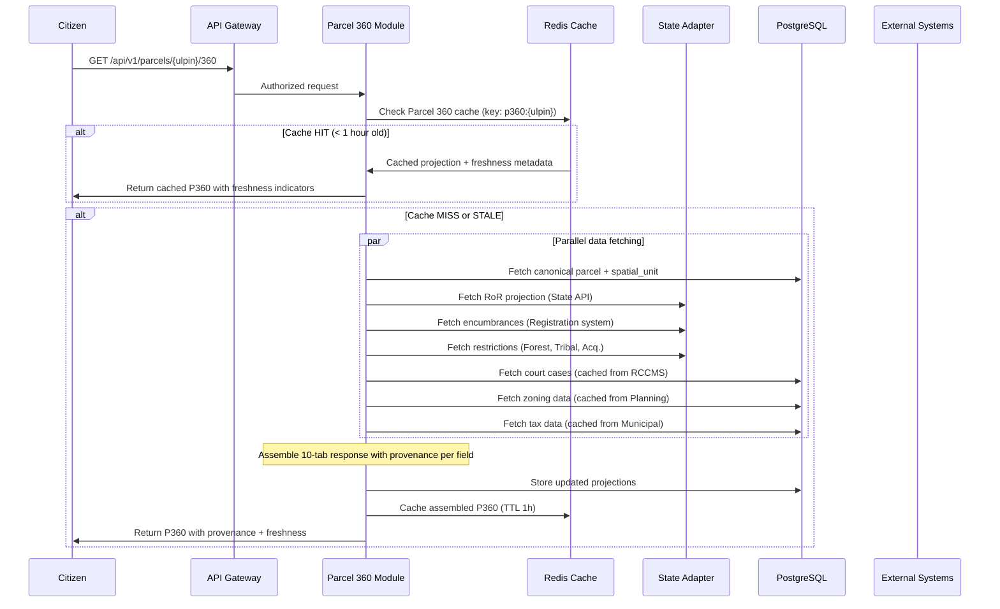
```mermaid
sequenceDiagram
    participant C as Citizen
    participant GW as API Gateway
    participant P360 as Parcel 360 Module
    participant CACHE as Redis Cache
    participant ADAPT as State Adapter
    participant PG as PostgreSQL
    participant EXT as External Systems

    C->>GW: GET /api/v1/parcels/{ulpin}/360
    GW->>P360: Authorized request
    
    P360->>CACHE: Check Parcel 360 cache (key: p360:{ulpin})
    
    alt Cache HIT (< 1 hour old)
        CACHE->>P360: Cached projection + freshness metadata
        P360->>C: Return cached P360 with freshness indicators
    end

    alt Cache MISS or STALE
        par Parallel data fetching
            P360->>PG: Fetch canonical parcel + spatial_unit
            P360->>ADAPT: Fetch RoR projection (State API)
            P360->>ADAPT: Fetch encumbrances (Registration system)
            P360->>ADAPT: Fetch restrictions (Forest, Tribal, Acq.)
            P360->>PG: Fetch court cases (cached from RCCMS)
            P360->>PG: Fetch zoning data (cached from Planning)
            P360->>PG: Fetch tax data (cached from Municipal)
        end

        Note over P360: Assemble 10-tab response with provenance per field

        P360->>PG: Store updated projections
        P360->>CACHE: Cache assembled P360 (TTL 1h)
        P360->>C: Return P360 with provenance + freshness
    end
```

### 4.2 Tab-by-Tab Specification

#### Tab 1: Overview
| Field | Source | Provenance |
|-------|--------|-----------|
| ULPIN | ULPIN Registry | `{authority: "DoLR", freshness: "real-time"}` |
| Survey Number (State-specific label) | Parcel Identifier table | `{authority: "State Revenue", source: "state_ror_system"}` |
| Village, Tehsil/Taluka, District, State | State Adapter → hierarchy | `{authority: "State Revenue"}` |
| Land Classification | RoR projection | `{authority: "State Revenue", freshness: "24h"}` |
| Area (in State units + sq.m) | RoR projection + calculated | Display in local units first, metric in parentheses |
| Status (clear / encumbered / disputed / restricted) | DQ Module aggregate | Composite of encumbrance, restriction, court case checks |
| Last Updated | Provenance.retrieval_time | When data was last fetched from source |
| Data Health Score | DQ Module | A/B/C/D/E with color indicator |

#### Tab 2: Map
| Feature | Implementation |
|---------|---------------|
| Parcel boundary polygon | PostGIS → Martin → MapLibre GL JS (vector tile) |
| Cadastral overlay | BhuNaksha WMS layer |
| Satellite imagery | Mapbox/OSM satellite tiles (configurable) |
| Adjoining parcels | `ST_Touches(parcel_boundary, other_boundary)` |
| Zoning overlay (toggle) | `planning_zone` geometry with color-coded types |
| Restriction overlay (toggle) | Forest/tribal/acquisition boundaries |
| Area measurement tool | MapLibre draw plugin |
| Coordinate display | Centroid lat/lng on click |

**API**: `GET /api/v1/parcels/{ulpin}/geometry` → GeoJSON FeatureCollection  
**Tiles**: `GET /tiles/parcels/{z}/{x}/{y}.pbf` → Martin MVT

#### Tab 3: Ownership / RoR

```
Data from: State Adapter → RoR projection
Display:
  Current Owner(s):
    - Name: Ramesh Kumar Patil
    - Owner Type: Individual
    - Share: 100%
    - Acquisition: Sale (Deed No. PUN-2024-xxxx)
    - Since: 15 March 2024

  Land Classification: Agricultural (Jirayat - Non-irrigated)
  Crop: Kharif - Soybean (last recorded)
  Revenue: Rs. 120/year
  
  [Source: Mahabhulekh | Authority: Revenue Dept, Pune | Last verified: 2 hours ago]
  [Download RoR Copy] [Request Certified Copy]
```

**API**: `GET /api/v1/parcels/{ulpin}/ror`

#### Tab 4: Transaction History

```
Timeline (newest first):
  ├─ 15 Mar 2024: SALE — Ramesh Kumar Patil ← Suresh Jadhav
  │   Deed: PUN-2024-xxxx | SRO: Haveli-1
  │   Consideration: Rs. 50,00,000 | Stamp Duty: Rs. 3,50,000
  │   Mutation: Completed (01 May 2024)
  │
  ├─ 10 Jan 2018: INHERITANCE — Suresh Jadhav ← Late Govind Jadhav
  │   Reference: DC Order 2018-xxx
  │   Mutation: Completed
  │
  ├─ 01 Jun 1995: ORIGINAL GRANT — Govind Jadhav
  │   Settlement Record
```

**API**: `GET /api/v1/parcels/{ulpin}/transactions?page=1&limit=20`

#### Tab 5: Encumbrances

```
Active Encumbrances:
  ├─ MORTGAGE — State Bank of India
  │   Amount: Rs. 25,00,000
  │   Start: 20 Mar 2024 | Expires: 20 Mar 2034
  │   Loan Reference: SBI-PUN-2024-xxxx
  │   Status: ACTIVE
  │   [Source: IGR Maharashtra | Last verified: 12 hours ago]
  │
  └─ No other active encumbrances

Released Encumbrances:
  └─ LIEN — Maharashtra Bank (Released: 15 Jan 2024)

[Request Non-Encumbrance Certificate (NEC)]
```

**API**: `GET /api/v1/parcels/{ulpin}/encumbrances`

#### Tab 6: Restrictions

```
Active Restrictions:
  ├─ ⚠️ NONE DETECTED — No forest, tribal, acquisition, or court restrictions found
  │   
  OR (for a restricted parcel):
  │
  ├─ 🔴 FOREST LAND — 40% of parcel overlaps Reserved Forest boundary
  │   Classification: Reserved Forest (Indian Forest Act, 1927)
  │   Authority: Maharashtra Forest Department
  │   Impact: No non-forest activity permitted without clearance
  │   [Source: Forest Dept GIS | Verified: 5 days ago]
  │
  ├─ 🟡 LAND ACQUISITION — Section 11(1) notification issued
  │   Project: Pune Metro Phase 3
  │   Authority: District Collector, Pune
  │   Date: 01 Aug 2026
  │   Impact: Sale restricted pending acquisition proceedings
  │
  └─ 🔵 COURT STAY — Revenue Court Case No. RC-2026-456
      Status: Stay on mutation | Next hearing: 15 Oct 2026
```

**API**: `GET /api/v1/parcels/{ulpin}/restrictions`

#### Tab 7: Planning / Zoning

```
Zoning Information:
  Zone: Residential (R1)
  Master Plan: Pune Development Plan 2037
  Permitted FSI: 1.5 | Actual FSI: 0.0 (vacant)
  Building Permission: No application on record
  Road Width: 9m (as per DP)
  Authority: Pune Municipal Corporation

  [Source: PMC Town Planning | Verified: 14 days ago]
```

**API**: `GET /api/v1/parcels/{ulpin}/planning`

#### Tab 8: Tax

```
Property Tax Status:
  Assessing Authority: Pune Municipal Corporation
  Assessment Year: 2025-26
  Tax Amount: Rs. 12,500
  Status: PAID (Receipt: PMC-2025-xxxx)
  Arrears: Rs. 0

  [Source: PMC Tax System | Verified: 3 days ago]
  [Pay Property Tax → redirect to PMC portal]
```

**API**: `GET /api/v1/parcels/{ulpin}/tax`

#### Tab 9: Court/Disputes

```
Revenue Court Cases:
  └─ No active cases

Civil Court Cases:
  └─ No active cases linked to this parcel

[Source: RCCMS + e-Courts | Verified: 2 days ago]

--- OR (for a disputed parcel) ---

Revenue Court Cases:
  ├─ RC-2026-456 — Boundary dispute
  │   Filed: 01 Jun 2026 | Status: Hearing in progress
  │   Next hearing: 15 Oct 2026 | Court: Revenue Court, Pune
  │   Impact: Mutation stayed pending disposal
  │   [Source: RCCMS]
```

**API**: `GET /api/v1/parcels/{ulpin}/disputes`

#### Tab 10: Data Health

```
Parcel Health Score: B (Good)

  ✅ Completeness: 92% — All critical fields populated
  ✅ Consistency: 88% — RoR ownership matches registration records
  ⚠️ Currency: 75% — Tax data is 14 days old (target: 7 days)
  ✅ Accuracy: 95% — Geometry matches BhuNaksha; area within 2%
  ⚠️ Conflicts: 1 — [View conflict detail]
  
  Conflict Detail:
    RoR says area: 2.5 Acres
    BhuNaksha calculated area: 2.38 Acres (4.8% deviation)
    → Status: FLAGGED — Area deviation exceeds 3% threshold
    → Land Stack does NOT pick a value. Both are displayed with sources.
```

**API**: `GET /api/v1/parcels/{ulpin}/health`

#### Legal Disclaimer (always visible)

> ⚖️ **Important**: This information is compiled from multiple government sources for reference purposes only. It does not constitute a legal opinion, title guarantee, or certified government document. Obtain certified copies from the competent authority for legal purposes.

---

## 5. Workflow 4 — Land Purchase / Due Diligence

### 5.1 Due Diligence Checklist Flow

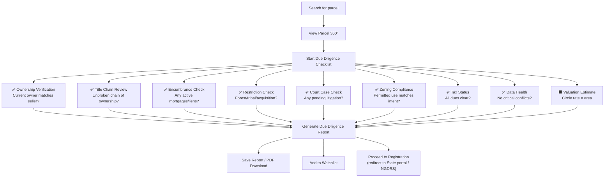
```mermaid
flowchart TD
    SEARCH["Search for parcel"] --> P360["View Parcel 360°"]
    P360 --> DD["Start Due Diligence Checklist"]
    
    DD --> CHECK1["✅ Ownership Verification<br/>Current owner matches seller?"]
    DD --> CHECK2["✅ Title Chain Review<br/>Unbroken chain of ownership?"]
    DD --> CHECK3["✅ Encumbrance Check<br/>Any active mortgages/liens?"]
    DD --> CHECK4["✅ Restriction Check<br/>Forest/tribal/acquisition?"]
    DD --> CHECK5["✅ Court Case Check<br/>Any pending litigation?"]
    DD --> CHECK6["✅ Zoning Compliance<br/>Permitted use matches intent?"]
    DD --> CHECK7["✅ Tax Status<br/>All dues clear?"]
    DD --> CHECK8["✅ Data Health<br/>No critical conflicts?"]
    DD --> CHECK9["⬛ Valuation Estimate<br/>Circle rate × area"]

    CHECK1 --> REPORT["Generate Due Diligence Report"]
    CHECK2 --> REPORT
    CHECK3 --> REPORT
    CHECK4 --> REPORT
    CHECK5 --> REPORT
    CHECK6 --> REPORT
    CHECK7 --> REPORT
    CHECK8 --> REPORT
    CHECK9 --> REPORT

    REPORT --> SAVE["Save Report / PDF Download"]
    REPORT --> WATCH["Add to Watchlist"]
    REPORT --> REG["Proceed to Registration<br/>(redirect to State portal / NGDRS)"]
```

**API**: `GET /api/v1/parcels/{ulpin}/due-diligence`

### 5.2 Due Diligence Report

The report aggregates Parcel 360 data into a single printable/downloadable document:

```
LAND STACK — DUE DILIGENCE REPORT
Generated: 15 Aug 2026 | Report ID: DD-2026-xxxx

PARCEL: IN-MH-PU-0001-12345
Survey No. 45/2A, Village Wadgaon Sheri, Taluka Haveli, District Pune, Maharashtra

OWNERSHIP: Ramesh Kumar Patil (100% — Individual)
  ✅ PASS — Single owner, clear title chain

ENCUMBRANCES:
  ⚠️ WARNING — Active mortgage: SBI, Rs. 25,00,000 (expires 2034)
  → Buyer must ensure mortgage is released before registration

RESTRICTIONS:
  ✅ PASS — No forest, tribal, acquisition, or environmental restrictions

COURT CASES:
  ✅ PASS — No active litigation found

ZONING:
  ✅ PASS — Residential (R1) zone; permitted FSI 1.5

TAX:
  ✅ PASS — No outstanding dues

DATA HEALTH: B (Good)
  ⚠️ NOTE — Area deviation of 4.8% between RoR and BhuNaksha

OVERALL: ⚠️ PROCEED WITH CAUTION
  → Clear mortgage before purchase
  → Verify area through independent survey

DISCLAIMER: This report is for reference only. Not a legal opinion.
Consult a qualified advocate for legal due diligence.
```

---

## 6. Workflow 5 — Mutation Tracking

### 6.1 End-to-End Flow

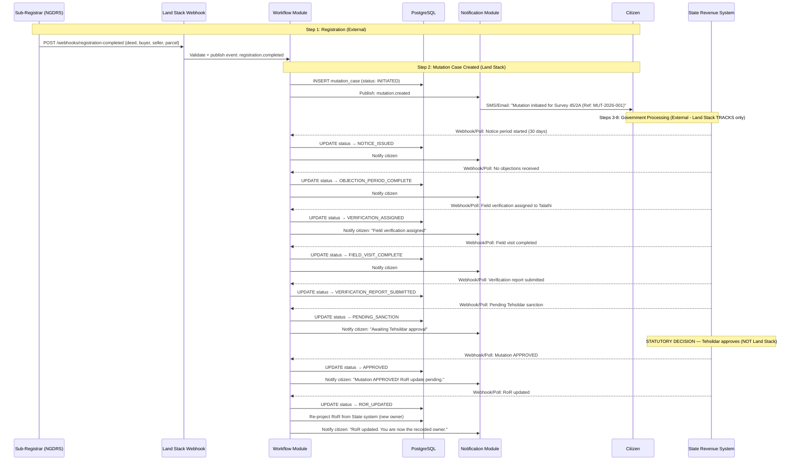
```mermaid
sequenceDiagram
    participant SR as Sub-Registrar (NGDRS)
    participant WH as Land Stack Webhook
    participant WF as Workflow Module
    participant DB as PostgreSQL
    participant NT as Notification Module
    participant CIT as Citizen
    participant EXT as State Revenue System

    Note over SR,CIT: Step 1: Registration (External)
    SR->>WH: POST /webhooks/registration-completed {deed, buyer, seller, parcel}
    WH->>WF: Validate + publish event: registration.completed

    Note over WF,CIT: Step 2: Mutation Case Created (Land Stack)
    WF->>DB: INSERT mutation_case (status: INITIATED)
    WF->>NT: Publish: mutation.created
    NT->>CIT: SMS/Email: "Mutation initiated for Survey 45/2A (Ref: MUT-2026-001)"

    Note over EXT,CIT: Steps 3-8: Government Processing (External - Land Stack TRACKS only)
    
    EXT-->>WF: Webhook/Poll: Notice period started (30 days)
    WF->>DB: UPDATE status → NOTICE_ISSUED
    WF->>NT: Notify citizen

    EXT-->>WF: Webhook/Poll: No objections received
    WF->>DB: UPDATE status → OBJECTION_PERIOD_COMPLETE
    WF->>NT: Notify citizen

    EXT-->>WF: Webhook/Poll: Field verification assigned to Talathi
    WF->>DB: UPDATE status → VERIFICATION_ASSIGNED
    WF->>NT: Notify citizen: "Field verification assigned"

    EXT-->>WF: Webhook/Poll: Field visit completed
    WF->>DB: UPDATE status → FIELD_VISIT_COMPLETE
    WF->>NT: Notify citizen

    EXT-->>WF: Webhook/Poll: Verification report submitted
    WF->>DB: UPDATE status → VERIFICATION_REPORT_SUBMITTED

    EXT-->>WF: Webhook/Poll: Pending Tehsildar sanction
    WF->>DB: UPDATE status → PENDING_SANCTION
    WF->>NT: Notify citizen: "Awaiting Tehsildar approval"

    Note over EXT: STATUTORY DECISION — Tehsildar approves (NOT Land Stack)

    EXT-->>WF: Webhook/Poll: Mutation APPROVED
    WF->>DB: UPDATE status → APPROVED
    WF->>NT: Notify citizen: "Mutation APPROVED! RoR update pending."

    EXT-->>WF: Webhook/Poll: RoR updated
    WF->>DB: UPDATE status → ROR_UPDATED
    WF->>DB: Re-project RoR from State system (new owner)
    WF->>NT: Notify citizen: "RoR updated. You are now the recorded owner."
```

### 6.2 Mutation Status State Machine

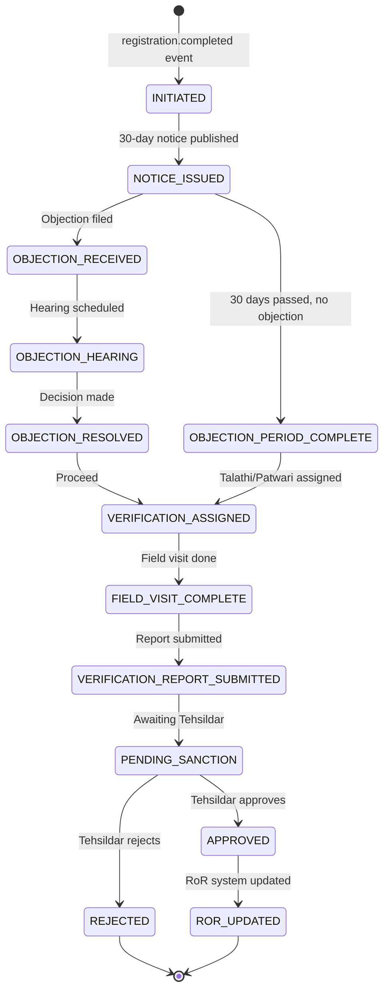
```mermaid
stateDiagram-v2
    [*] --> INITIATED: registration.completed event
    INITIATED --> NOTICE_ISSUED: 30-day notice published
    NOTICE_ISSUED --> OBJECTION_RECEIVED: Objection filed
    NOTICE_ISSUED --> OBJECTION_PERIOD_COMPLETE: 30 days passed, no objection
    OBJECTION_RECEIVED --> OBJECTION_HEARING: Hearing scheduled
    OBJECTION_HEARING --> OBJECTION_RESOLVED: Decision made
    OBJECTION_RESOLVED --> VERIFICATION_ASSIGNED: Proceed
    OBJECTION_PERIOD_COMPLETE --> VERIFICATION_ASSIGNED: Talathi/Patwari assigned
    VERIFICATION_ASSIGNED --> FIELD_VISIT_COMPLETE: Field visit done
    FIELD_VISIT_COMPLETE --> VERIFICATION_REPORT_SUBMITTED: Report submitted
    VERIFICATION_REPORT_SUBMITTED --> PENDING_SANCTION: Awaiting Tehsildar
    PENDING_SANCTION --> APPROVED: Tehsildar approves
    PENDING_SANCTION --> REJECTED: Tehsildar rejects
    APPROVED --> ROR_UPDATED: RoR system updated
    REJECTED --> [*]
    ROR_UPDATED --> [*]
```

### 6.3 Citizen Mutation Dashboard

```
Mutation Case: MUT-2026-001
Parcel: IN-MH-PU-0001-12345 (Survey 45/2A, Wadgaon Sheri)
Type: Sale Transfer

Timeline:
  ✅ 15 Aug 2026 — Case initiated (Deed: PUN-2026-xxxx)
  ✅ 16 Aug 2026 — 30-day notice published (Aapli Chawadi)
  ✅ 16 Sep 2026 — No objections received. Proceeding.
  ✅ 18 Sep 2026 — Field verification assigned to Talathi Shri. Desai
  ✅ 22 Sep 2026 — Field visit completed
  ✅ 25 Sep 2026 — Verification report submitted
  🔄 28 Sep 2026 — Pending Tehsildar sanction ← CURRENT
  ⬜ RoR Update

SLA:
  Target: 30 days from initiation (13 Oct 2026)
  Elapsed: 44 days
  Status: 🟢 Within SLA
  Estimated completion: 5-10 days
```

**API**: `GET /api/v1/mutations/{mutation_id}`  
**API**: `GET /api/v1/mutations?citizen_id={id}&status=active`

### 6.4 Critical Boundary: What Land Stack Does vs. Does NOT Do

| Action | Who Does It | Land Stack Role |
|--------|------------|----------------|
| Register deed | Sub-Registrar (NGDRS) | Receives webhook event |
| Publish notice | Tehsildar's office | Tracks status change |
| Conduct field verification | Talathi/Patwari | Tracks assignment + completion |
| Approve/reject mutation | Tehsildar | Tracks statutory decision |
| Update RoR | Revenue Department system | Re-projects updated data |
| Notify citizen at each step | Land Stack | ✅ **This is what we build** |

---

## 7. Workflow 6 — Watchlist & Alerts

### 7.1 Flow

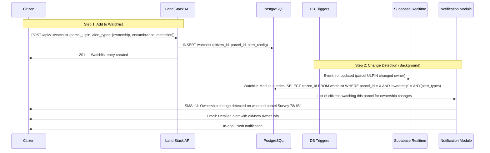
```mermaid
sequenceDiagram
    participant C as Citizen
    participant API as Land Stack API
    participant DB as PostgreSQL
    participant CDC as DB Triggers
    participant RT as Supabase Realtime
    participant NT as Notification Module

    Note over C,API: Step 1: Add to Watchlist
    C->>API: POST /api/v1/watchlist {parcel_ulpin, alert_types: [ownership, encumbrance, restriction]}
    API->>DB: INSERT watchlist (citizen_id, parcel_id, alert_config)
    API->>C: 201 — Watchlist entry created

    Note over CDC,NT: Step 2: Change Detection (Background)
    CDC->>RT: Event: ror.updated (parcel ULPIN changed owner)
    RT->>DB: Watchlist Module queries: SELECT citizen_id FROM watchlist WHERE parcel_id = X AND 'ownership' = ANY(alert_types)
    DB->>NT: List of citizens watching this parcel for ownership changes
    NT->>C: SMS: "⚠️ Ownership change detected on watched parcel Survey 78/1B"
    NT->>C: Email: Detailed alert with old/new owner info
    NT->>C: In-app: Push notification
```

### 7.2 Alert Types

| Alert Type | Trigger | Notification Content |
|-----------|---------|---------------------|
| `ownership_change` | RoR projection shows new owner | "Ownership change detected: [old] → [new]" |
| `new_encumbrance` | New mortgage/lien detected | "New encumbrance: [type] by [institution]" |
| `encumbrance_released` | Existing encumbrance released | "Encumbrance released: [type] by [institution]" |
| `new_restriction` | Forest/tribal/acquisition restriction added | "New restriction: [type] on parcel" |
| `court_case_linked` | New court case linked to parcel | "Court case [ref] linked to parcel" |
| `zoning_change` | Zoning reclassification | "Zoning changed: [old zone] → [new zone]" |
| `mutation_status` | Mutation progresses to new state | "Mutation [ref]: moved to [status]" |
| `data_conflict` | DQ engine detects cross-source conflict | "Data conflict detected: [description]" |

**API**: `POST /api/v1/watchlist` — Add parcel  
**API**: `GET /api/v1/watchlist` — List watched parcels  
**API**: `PATCH /api/v1/watchlist/{id}` — Update alert config  
**API**: `DELETE /api/v1/watchlist/{id}` — Remove from watchlist

---

## 8. Workflow 7 — Document Access

### 8.1 Flow

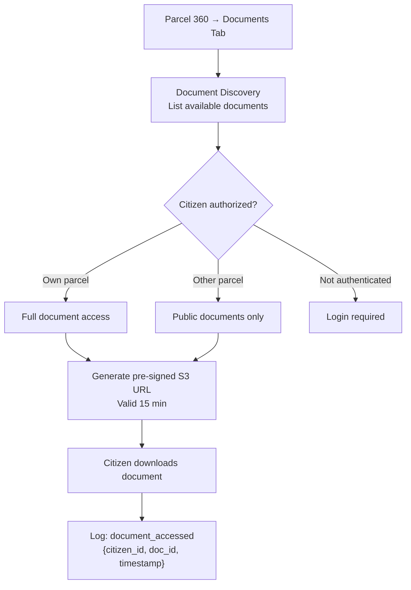
```mermaid
flowchart TD
    P360["Parcel 360 → Documents Tab"] --> LIST["Document Discovery<br/>List available documents"]
    LIST --> AUTH_CHECK{"Citizen authorized?"}
    AUTH_CHECK -->|Own parcel| FULL["Full document access"]
    AUTH_CHECK -->|Other parcel| LIMITED["Public documents only"]
    AUTH_CHECK -->|Not authenticated| DENY["Login required"]

    FULL --> SIGNED["Generate pre-signed S3 URL<br/>Valid 15 min"]
    LIMITED --> SIGNED

    SIGNED --> DL["Citizen downloads document"]
    DL --> AUDIT["Log: document_accessed<br/>{citizen_id, doc_id, timestamp}"]
```

### 8.2 Document Types

| Document | Source | Access Level | Format |
|----------|--------|-------------|--------|
| RoR Extract (7/12, RTC, Patta) | State RoR system | Authenticated (any) | PDF |
| Registered Deed Copy | NGDRS / State Registration | Owner or authorized party | PDF |
| Cadastral Map Extract | BhuNaksha | Authenticated (any) | PNG/PDF |
| Encumbrance Certificate | State Registration | Owner or authorized party | PDF |
| Mutation Order | State Revenue | Owner | PDF |
| Field Measurement Book (FMB) | State Survey | Authenticated (any) | PDF |
| Property Card (urban) | SVAMITVA / Municipal | Owner | PDF |

### 8.3 Security

- Pre-signed URLs with 15-minute expiry
- All downloads logged in audit trail
- Virus scanning on upload (ClamAV)
- Max file size: 10MB per document
- Watermark on downloaded documents: "Downloaded from Land Stack — Reference Copy Only"

**API**: `GET /api/v1/parcels/{ulpin}/documents` — List  
**API**: `GET /api/v1/documents/{document_id}/download` — Pre-signed URL

---

## 9. Workflow 8 — Grievance

### 9.1 Flow

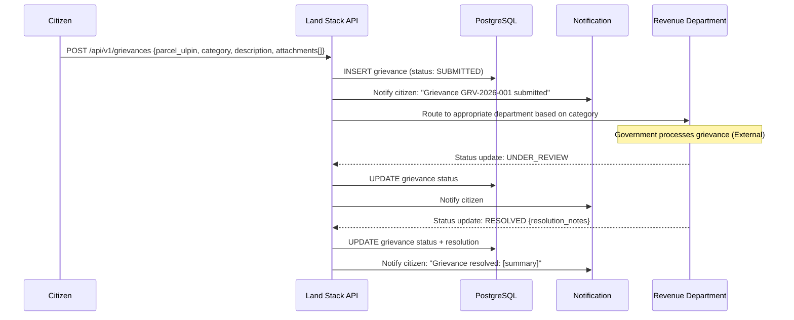
```mermaid
sequenceDiagram
    participant C as Citizen
    participant API as Land Stack API
    participant DB as PostgreSQL
    participant NT as Notification
    participant EXT as Revenue Department

    C->>API: POST /api/v1/grievances {parcel_ulpin, category, description, attachments[]}
    API->>DB: INSERT grievance (status: SUBMITTED)
    API->>NT: Notify citizen: "Grievance GRV-2026-001 submitted"
    API->>EXT: Route to appropriate department based on category

    Note over EXT: Government processes grievance (External)
    EXT-->>API: Status update: UNDER_REVIEW
    API->>DB: UPDATE grievance status
    API->>NT: Notify citizen

    EXT-->>API: Status update: RESOLVED {resolution_notes}
    API->>DB: UPDATE grievance status + resolution
    API->>NT: Notify citizen: "Grievance resolved: [summary]"
```

### 9.2 Grievance Categories

| Category | Routed To | Example |
|----------|-----------|---------|
| `data_error` | Revenue Department (State) | "My name is misspelled on the RoR" |
| `boundary_dispute` | Revenue Court (RCCMS) | "Neighbor has encroached on my land" |
| `mutation_delay` | Tehsildar's office | "Mutation pending for 120+ days" |
| `service_complaint` | Land Stack support | "Unable to download document" |
| `unauthorized_change` | Revenue Department + Police | "Ownership changed without my knowledge" |
| `data_conflict` | DQ Module + Revenue | "RoR shows wrong area" |

**API**: `POST /api/v1/grievances`  
**API**: `GET /api/v1/grievances?citizen_id={id}`  
**API**: `GET /api/v1/grievances/{id}`

---

## 10. Workflow 9 — Citizen Service Applications

### 10.1 Generic Application Framework

All service applications follow the same lifecycle:

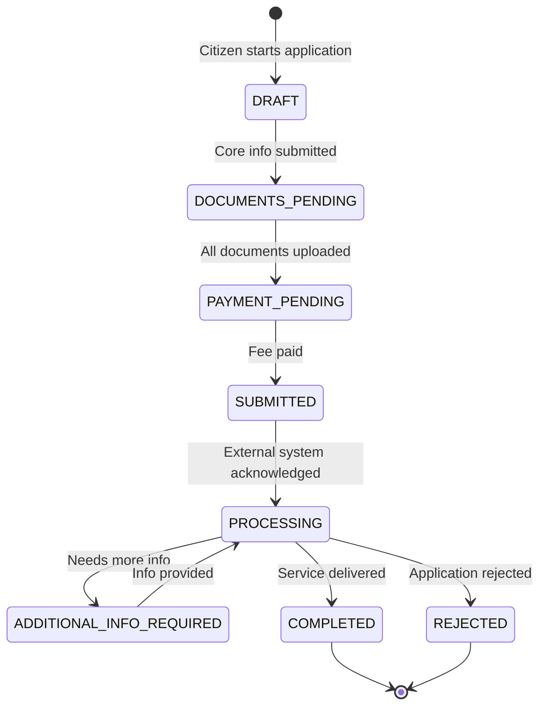
```mermaid
stateDiagram-v2
    [*] --> DRAFT: Citizen starts application
    DRAFT --> DOCUMENTS_PENDING: Core info submitted
    DOCUMENTS_PENDING --> PAYMENT_PENDING: All documents uploaded
    PAYMENT_PENDING --> SUBMITTED: Fee paid
    SUBMITTED --> PROCESSING: External system acknowledged
    PROCESSING --> ADDITIONAL_INFO_REQUIRED: Needs more info
    ADDITIONAL_INFO_REQUIRED --> PROCESSING: Info provided
    PROCESSING --> COMPLETED: Service delivered
    PROCESSING --> REJECTED: Application rejected
    COMPLETED --> [*]
    REJECTED --> [*]
```

### 10.2 Supported Services

| Service | External System | Requirements | Fee |
|---------|----------------|-------------|-----|
| **RoR Extract** | State RoR Portal | Parcel selection | Rs. 15-50 (varies by State) |
| **Non-Encumbrance Certificate** | State Registration | Parcel + date range | Rs. 200-500 |
| **Certified Copy of Deed** | NGDRS | Deed reference number | Rs. 100-300 |
| **Data Correction Request** | Revenue Department | Error description + evidence | Free |
| **Mutation Application** | Revenue Department | Deed reference + documents | Rs. 50-200 |
| **SRO Appointment** | NGDRS | Date + time + SRO selection | Free |

**API**: `POST /api/v1/applications` — Create  
**API**: `GET /api/v1/applications?citizen_id={id}` — List  
**API**: `GET /api/v1/applications/{id}` — Detail  
**API**: `POST /api/v1/applications/{id}/documents` — Upload document  
**API**: `POST /api/v1/applications/{id}/payment` — Initiate payment

---

## 11. Workflow 10 — Data Conflict Handling

### 11.1 Conflict Detection

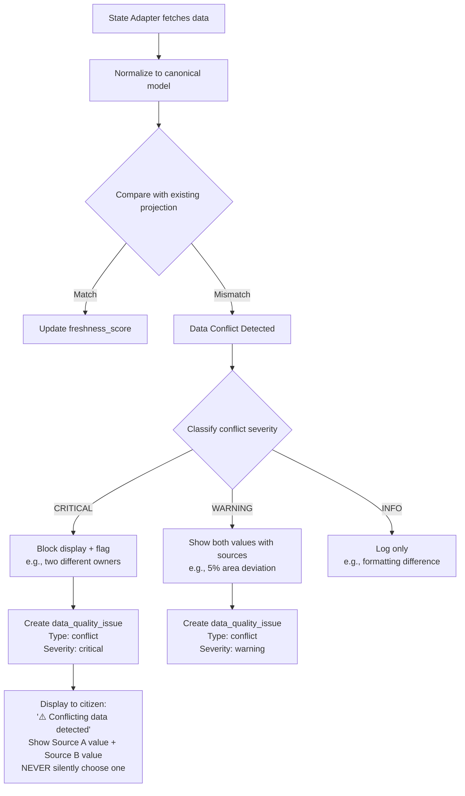
```mermaid
flowchart TD
    ADAPTER["State Adapter fetches data"] --> NORMALIZE["Normalize to canonical model"]
    NORMALIZE --> COMPARE{"Compare with existing projection"}
    
    COMPARE -->|Match| UPDATE["Update freshness_score"]
    COMPARE -->|Mismatch| CONFLICT["Data Conflict Detected"]
    
    CONFLICT --> CLASSIFY{"Classify conflict severity"}
    CLASSIFY -->|CRITICAL| CRIT["Block display + flag<br/>e.g., two different owners"]
    CLASSIFY -->|WARNING| WARN["Show both values with sources<br/>e.g., 5% area deviation"]
    CLASSIFY -->|INFO| INFO["Log only<br/>e.g., formatting difference"]
    
    CRIT --> DQ_ISSUE["Create data_quality_issue<br/>Type: conflict<br/>Severity: critical"]
    WARN --> DQ_ISSUE_W["Create data_quality_issue<br/>Type: conflict<br/>Severity: warning"]
    
    DQ_ISSUE --> DISPLAY["Display to citizen:<br/>'⚠️ Conflicting data detected'<br/>Show Source A value + Source B value<br/>NEVER silently choose one"]
```

### 11.2 Critical Rule: Never Silently Resolve Conflicts

When RoR says "Owner A" and Registration says "Owner B":
- Land Stack displays BOTH values with their respective sources
- Land Stack NEVER silently picks one value
- A `data_quality_issue` is created for investigation
- The citizen sees: "⚠️ Ownership conflict detected between Revenue and Registration records. Contact your Tehsildar's office."

---

## 12. Workflow 11 — External API Failure Handling

### 12.1 Resilience Architecture

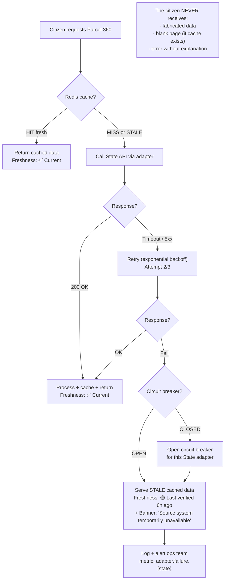
```mermaid
flowchart TD
    REQ["Citizen requests Parcel 360"] --> CACHE{"Redis cache?"}
    
    CACHE -->|HIT fresh| RETURN_FRESH["Return cached data<br/>Freshness: ✅ Current"]
    
    CACHE -->|MISS or STALE| API_CALL["Call State API via adapter"]
    
    API_CALL --> SUCCESS{"Response?"}
    
    SUCCESS -->|200 OK| PROCESS["Process + cache + return<br/>Freshness: ✅ Current"]
    
    SUCCESS -->|Timeout / 5xx| RETRY["Retry (exponential backoff)<br/>Attempt 2/3"]
    
    RETRY --> SUCCESS2{"Response?"}
    SUCCESS2 -->|OK| PROCESS
    SUCCESS2 -->|Fail| CB_CHECK{"Circuit breaker?"}
    
    CB_CHECK -->|OPEN| STALE["Serve STALE cached data<br/>Freshness: 🟡 Last verified 6h ago<br/>+ Banner: 'Source system temporarily unavailable'"]
    CB_CHECK -->|CLOSED| OPEN_CB["Open circuit breaker<br/>for this State adapter"]
    OPEN_CB --> STALE
    
    STALE --> MONITOR["Log + alert ops team<br/>metric: adapter.failure.{state}"]

    Note["The citizen NEVER receives:<br/>- fabricated data<br/>- blank page (if cache exists)<br/>- error without explanation"]
```

### 12.2 Circuit Breaker Configuration

| Parameter | Value |
|-----------|-------|
| Failure threshold | 5 consecutive failures |
| Open duration | 60 seconds |
| Half-open: test requests | 1 request per 30 seconds |
| Recovery: consecutive successes to close | 3 |
| Scope | Per State adapter, per data source |

---

## 13. Notification Architecture

### 13.1 Channel Configuration

| Channel | Provider | Use Case |
|---------|---------|----------|
| **SMS** | MSG91 / State SMS GW | OTP, mutation alerts, critical changes |
| **Email** | SES / Sendgrid | Due diligence reports, application updates |
| **In-app Push** | Firebase FCM (via PWA) | Real-time alerts, watchlist triggers |

### 13.2 Citizen Preferences

Citizens configure per-event-type, per-channel preferences:

```json
{
  "mutation_status": { "sms": true, "email": true, "push": true },
  "watchlist_alert": { "sms": false, "email": true, "push": true },
  "application_update": { "sms": true, "email": true, "push": true },
  "digest_frequency": "daily"
}
```

### 13.3 Template Engine

Templates are multi-language (resolved via citizen's `preferred_language`):

```
Template: mutation.status_changed
  
  EN: "Land Stack: Your mutation case {mutation_ref} for parcel {survey_no}, {village} has moved to '{status}'. Track: {tracking_url}"
  
  MR: "लँड स्टॅक: तुमचा फेरफार केस {mutation_ref}, गट क्र. {survey_no}, {village} ची स्थिती '{status}' झाली आहे. ट्रॅक करा: {tracking_url}"
  
  HI: "लैंड स्टैक: आपका म्यूटेशन केस {mutation_ref}, सर्वे नं. {survey_no}, {village} की स्थिति '{status}' हो गई है। ट्रैक करें: {tracking_url}"
```

**API**: `GET /api/v1/notifications?citizen_id={id}&page=1`  
**API**: `PATCH /api/v1/notifications/{id}/read`  
**API**: `PATCH /api/v1/auth/profile/notification-preferences`

---

# PART II — Government Operations Workflows

---

## 10. Workflow 10 — Government Authentication & Workspace Loading

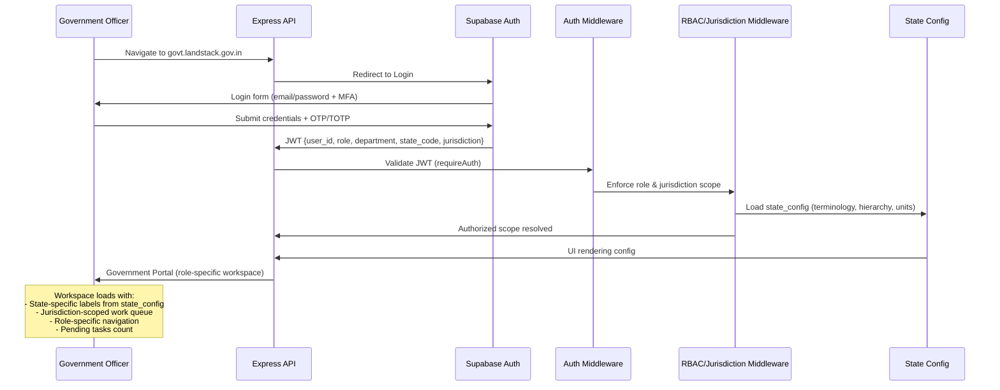
```mermaid
sequenceDiagram
    participant O as Government Officer
    participant GW as Express API
    participant SUPA as Supabase Auth
    participant AUTH as Auth Middleware
    participant MW as RBAC/Jurisdiction Middleware
    participant CONF as State Config

    O->>GW: Navigate to govt.landstack.gov.in
    GW->>SUPA: Redirect to Login
    SUPA->>O: Login form (email/password + MFA)
    O->>SUPA: Submit credentials + OTP/TOTP
    SUPA->>GW: JWT {user_id, role, department, state_code, jurisdiction}
    GW->>AUTH: Validate JWT (requireAuth)
    AUTH->>MW: Enforce role & jurisdiction scope
    MW->>CONF: Load state_config (terminology, hierarchy, units)
    MW->>GW: Authorized scope resolved
    CONF->>GW: UI rendering config
    GW->>O: Government Portal (role-specific workspace)

    Note over O: Workspace loads with:<br/>- State-specific labels from state_config<br/>- Jurisdiction-scoped work queue<br/>- Role-specific navigation<br/>- Pending tasks count
```

---

## 11. Workflow 11 — Mutation (Officer Side)

This is the government-side workflow for the mutation lifecycle. The citizen side (status tracking) is covered in Workflow 5.

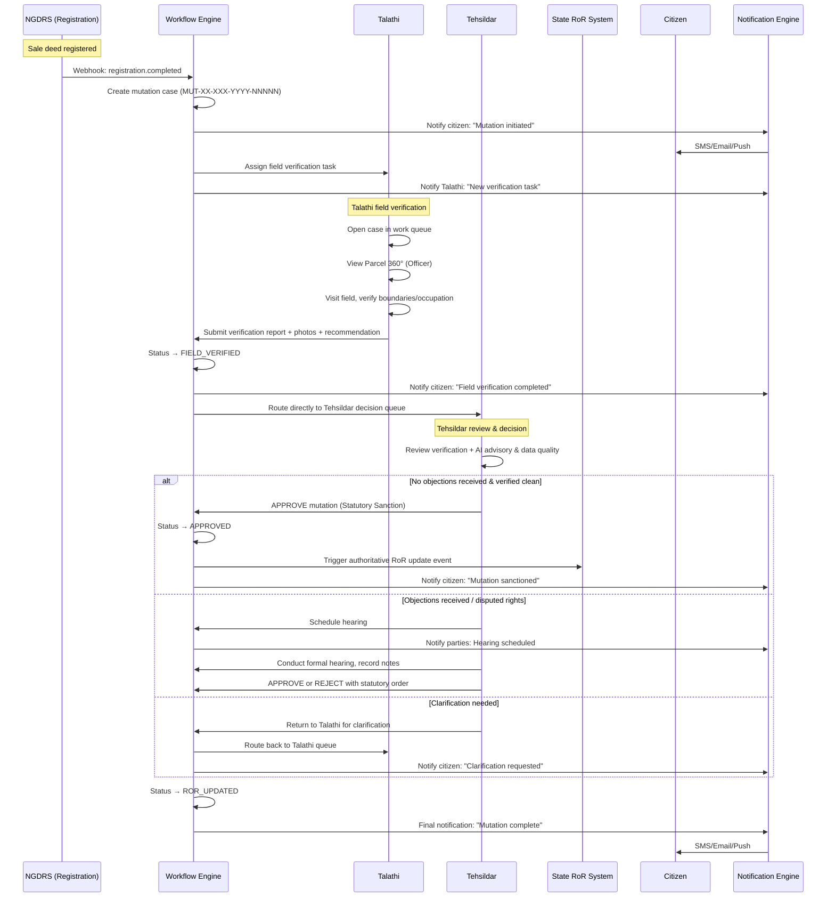
```mermaid
sequenceDiagram
    participant NGDRS as NGDRS (Registration)
    participant WF as Workflow Engine
    participant TAL as Talathi
    participant TEH as Tehsildar
    participant ROR as State RoR System
    participant CIT as Citizen
    participant NOTIF as Notification Engine

    Note over NGDRS: Sale deed registered
    NGDRS->>WF: Webhook: registration.completed
    WF->>WF: Create mutation case (MUT-XX-XXX-YYYY-NNNNN)
    WF->>NOTIF: Notify citizen: "Mutation initiated"
    NOTIF->>CIT: SMS/Email/Push
    WF->>TAL: Assign field verification task
    WF->>NOTIF: Notify Talathi: "New verification task"

    Note over TAL: Talathi field verification
    TAL->>TAL: Open case in work queue
    TAL->>TAL: View Parcel 360° (Officer)
    TAL->>TAL: Visit field, verify boundaries/occupation
    TAL->>WF: Submit verification report + photos + recommendation
    WF->>WF: Status → FIELD_VERIFIED
    WF->>NOTIF: Notify citizen: "Field verification completed"
    WF->>TEH: Route directly to Tehsildar decision queue

    Note over TEH: Tehsildar review & decision
    TEH->>TEH: Review verification + AI advisory & data quality
    
    alt No objections received & verified clean
        TEH->>WF: APPROVE mutation (Statutory Sanction)
        WF->>WF: Status → APPROVED
        WF->>ROR: Trigger authoritative RoR update event
        WF->>NOTIF: Notify citizen: "Mutation sanctioned"
    else Objections received / disputed rights
        TEH->>WF: Schedule hearing
        WF->>NOTIF: Notify parties: Hearing scheduled
        TEH->>WF: Conduct formal hearing, record notes
        TEH->>WF: APPROVE or REJECT with statutory order
    else Clarification needed
        TEH->>WF: Return to Talathi for clarification
        WF->>TAL: Route back to Talathi queue
        WF->>NOTIF: Notify citizen: "Clarification requested"
    end

    WF->>WF: Status → ROR_UPDATED
    WF->>NOTIF: Final notification: "Mutation complete"
    NOTIF->>CIT: SMS/Email/Push
```

**State Machine:**
```
INITIATED → VERIFICATION_ASSIGNED → FIELD_VERIFIED
  → NOTICE_PERIOD → OBJECTION_RECEIVED? → HEARING_SCHEDULED → HEARING_COMPLETED
  → APPROVED / REJECTED
  → ROR_UPDATE_TRIGGERED → ROR_UPDATED

At any point: RETURNED_FOR_CLARIFICATION → back to VERIFICATION_ASSIGNED
At any point: ESCALATED → District Collector escalation queue
```

---

## 12. Workflow 12 — Registration Integration (Sub-Registrar)

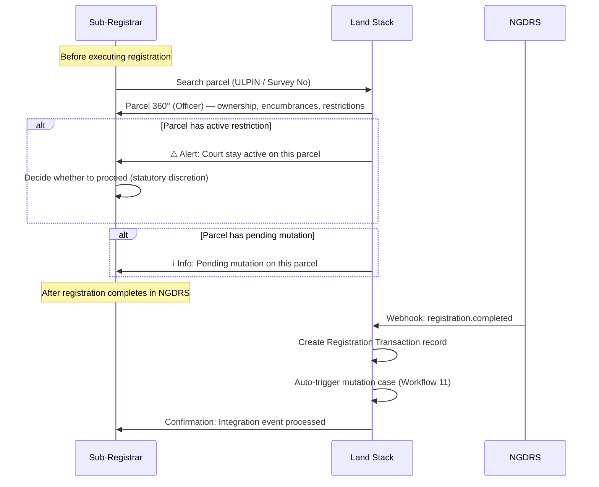
```mermaid
sequenceDiagram
    participant SRO as Sub-Registrar
    participant LS as Land Stack
    participant NGDRS as NGDRS

    Note over SRO: Before executing registration
    SRO->>LS: Search parcel (ULPIN / Survey No)
    LS->>SRO: Parcel 360° (Officer) — ownership, encumbrances, restrictions
    
    alt Parcel has active restriction
        LS->>SRO: ⚠️ Alert: Court stay active on this parcel
        SRO->>SRO: Decide whether to proceed (statutory discretion)
    end
    
    alt Parcel has pending mutation
        LS->>SRO: ℹ️ Info: Pending mutation on this parcel
    end

    Note over SRO: After registration completes in NGDRS
    NGDRS->>LS: Webhook: registration.completed
    LS->>LS: Create Registration Transaction record
    LS->>LS: Auto-trigger mutation case (Workflow 11)
    LS->>SRO: Confirmation: Integration event processed
```

---

## 13. Workflow 13 — Survey & GIS

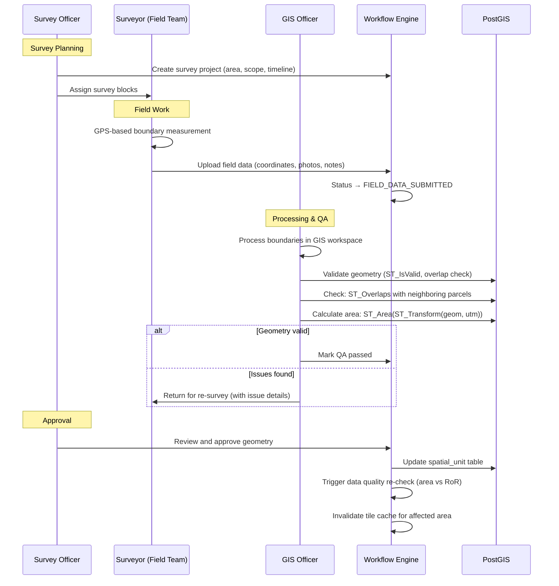
```mermaid
sequenceDiagram
    participant SO as Survey Officer
    participant SUR as Surveyor (Field Team)
    participant GIS as GIS Officer
    participant WF as Workflow Engine
    participant PG as PostGIS

    Note over SO: Survey Planning
    SO->>WF: Create survey project (area, scope, timeline)
    SO->>SUR: Assign survey blocks

    Note over SUR: Field Work
    SUR->>SUR: GPS-based boundary measurement
    SUR->>WF: Upload field data (coordinates, photos, notes)
    WF->>WF: Status → FIELD_DATA_SUBMITTED

    Note over GIS: Processing & QA
    GIS->>GIS: Process boundaries in GIS workspace
    GIS->>PG: Validate geometry (ST_IsValid, overlap check)
    GIS->>PG: Check: ST_Overlaps with neighboring parcels
    GIS->>PG: Calculate area: ST_Area(ST_Transform(geom, utm))
    
    alt Geometry valid
        GIS->>WF: Mark QA passed
    else Issues found
        GIS->>SUR: Return for re-survey (with issue details)
    end

    Note over SO: Approval
    SO->>WF: Review and approve geometry
    WF->>PG: Update spatial_unit table
    WF->>WF: Trigger data quality re-check (area vs RoR)
    WF->>WF: Invalidate tile cache for affected area
```

---

## 14. Workflow 14 — Revenue Court

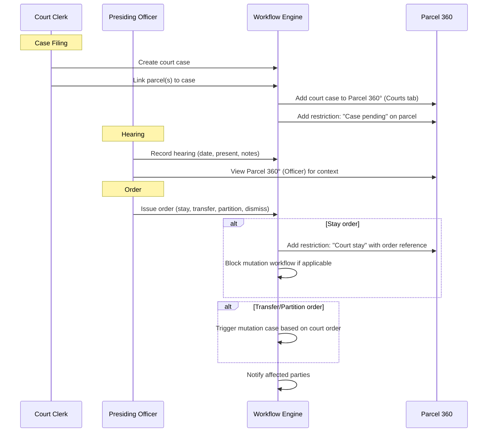
```mermaid
sequenceDiagram
    participant CLERK as Court Clerk
    participant JUDGE as Presiding Officer
    participant WF as Workflow Engine
    participant P360 as Parcel 360

    Note over CLERK: Case Filing
    CLERK->>WF: Create court case
    CLERK->>WF: Link parcel(s) to case
    WF->>P360: Add court case to Parcel 360° (Courts tab)
    WF->>P360: Add restriction: "Case pending" on parcel

    Note over JUDGE: Hearing
    JUDGE->>WF: Record hearing (date, present, notes)
    JUDGE->>P360: View Parcel 360° (Officer) for context
    
    Note over JUDGE: Order
    JUDGE->>WF: Issue order (stay, transfer, partition, dismiss)
    
    alt Stay order
        WF->>P360: Add restriction: "Court stay" with order reference
        WF->>WF: Block mutation workflow if applicable
    end
    
    alt Transfer/Partition order
        WF->>WF: Trigger mutation case based on court order
    end
    
    WF->>WF: Notify affected parties
```

---

## 15. Workflow 15 — Planning & Building Permission

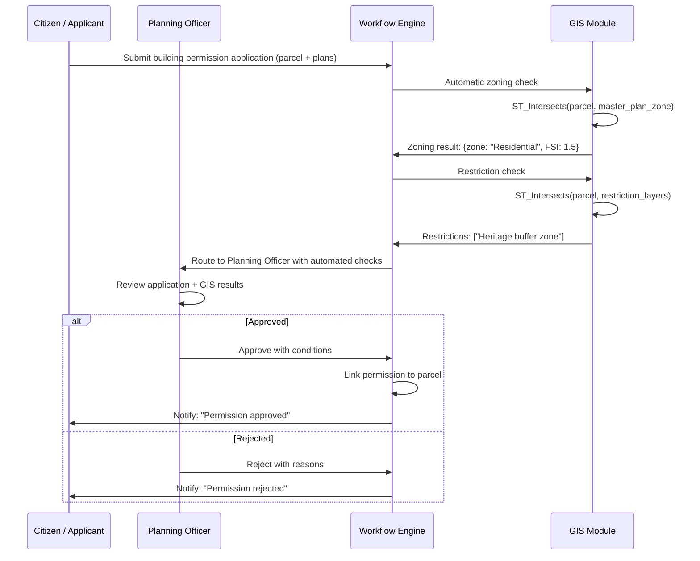
```mermaid
sequenceDiagram
    participant CIT as Citizen / Applicant
    participant TCP as Planning Officer
    participant WF as Workflow Engine
    participant GIS as GIS Module

    CIT->>WF: Submit building permission application (parcel + plans)
    WF->>GIS: Automatic zoning check
    GIS->>GIS: ST_Intersects(parcel, master_plan_zone)
    GIS->>WF: Zoning result: {zone: "Residential", FSI: 1.5}
    
    WF->>GIS: Restriction check
    GIS->>GIS: ST_Intersects(parcel, restriction_layers)
    GIS->>WF: Restrictions: ["Heritage buffer zone"]
    
    WF->>TCP: Route to Planning Officer with automated checks
    TCP->>TCP: Review application + GIS results
    
    alt Approved
        TCP->>WF: Approve with conditions
        WF->>WF: Link permission to parcel
        WF->>CIT: Notify: "Permission approved"
    else Rejected
        TCP->>WF: Reject with reasons
        WF->>CIT: Notify: "Permission rejected"
    end
```

---

## 16. Cross-Workflow Event Map

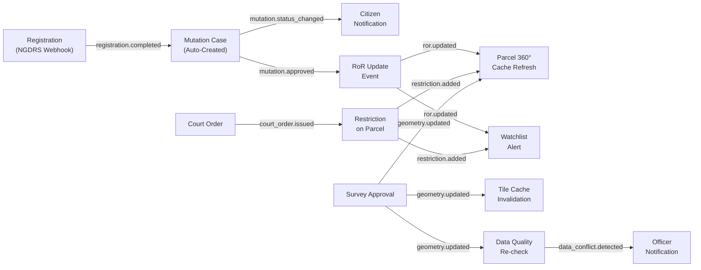
```mermaid
flowchart LR
    REG["Registration<br/>(NGDRS Webhook)"] -->|registration.completed| MUT["Mutation Case<br/>(Auto-Created)"]
    MUT -->|mutation.status_changed| CIT_NOTIF["Citizen<br/>Notification"]
    MUT -->|mutation.approved| ROR["RoR Update<br/>Event"]
    ROR -->|ror.updated| P360["Parcel 360°<br/>Cache Refresh"]
    ROR -->|ror.updated| WATCH["Watchlist<br/>Alert"]
    
    COURT["Court Order"] -->|court_order.issued| REST["Restriction<br/>on Parcel"]
    REST -->|restriction.added| P360
    REST -->|restriction.added| WATCH
    
    SURVEY["Survey Approval"] -->|geometry.updated| P360
    SURVEY -->|geometry.updated| TILE["Tile Cache<br/>Invalidation"]
    SURVEY -->|geometry.updated| DQ["Data Quality<br/>Re-check"]
    
    DQ -->|data_conflict.detected| OFF_NOTIF["Officer<br/>Notification"]
```

---

## 17. Government Operations API Contracts & Failure Modes

### 17.1 Government API Endpoints Specification

| Method | Endpoint | Authorized Roles | Request Payload | Response | Description |
|---|---|---|---|---|---|
| `GET` | `/api/v1/govt/work-queue` | Talathi / Patwari, Tehsildar, Sub-Registrar | Query params: `stage`, `sla_status`, `page`, `limit` | `{ items: CaseSummary[], total, overdue_count }` | Fetches jurisdiction-filtered work queue matching caller's credentials. |
| `GET` | `/api/v1/govt/parcels/{ulpin}/360` | All 7 Government Roles | Query params: `include_audit=true` | `{ parcel, ror, spatial, provenance, conflicts[], ai_advisory }` | Extended Officer Parcel 360 with conflict flags and raw provenance. |
| `POST` | `/api/v1/govt/cases/{caseId}/verify` | Talathi / Patwari | `{ findings: string, boundary_confirmed: boolean, photos: string[], recommendation: "RECOMMEND" \| "OBJECT" }` | `{ status: "FIELD_VERIFIED", transition_time: ISO8601 }` | Records field verification findings, attaches photos, advances case directly to Tehsildar queue. |
| `POST` | `/api/v1/govt/cases/{caseId}/sanction` | Tehsildar | `{ decision: "APPROVE" \| "REJECT", statutory_order_ref: string, justification: string, order_doc_id: UUID }` | `{ status: "APPROVED" \| "REJECTED", order_url: string }` | **Statutory decision execution**. Emits `mutation.approved` event. |
| `POST` | `/api/v1/govt/cases/{caseId}/hearing` | Tehsildar | `{ hearing_date: ISO8601, parties_present: string[], minutes: string, next_action: string }` | `{ hearing_id: UUID, recorded_at: ISO8601 }` | Enters formal record of revenue hearing and schedules notice or order. |
| `POST` | `/api/v1/govt/ai/advisory/{id}/dismiss` | Tehsildar, Talathi, District Collector, State PMU | `{ dismissal_reason: string, override_justification: string }` | `{ status: "DISMISSED", audit_event_id: UUID }` | Dismisses an AI advisory alert; writes mandatory audit log. |
| `POST` | `/webhooks/ngdrs/registration` | External (NGDRS) | `NGDRSRegistrationPayload` + HMAC Header | `{ status: "RECEIVED", case_id: UUID }` | Ingests registered sale deed event; triggers mutation case initiation. |

### 17.2 Failure Handling & Resilience Patterns

```mermaid
flowchart TD
    SUB["External Webhook Received<br/>(e.g., NGDRS Sale Deed)"] --> HMAC{"HMAC-SHA256<br/>Signature Valid?"}
    HMAC -->|No| REJ["Return 401 Unauthorized<br/>Log Security Alert"]
    HMAC -->|Yes| IDEM{"Idempotency Key<br/>Processed in DB?"}
    IDEM -->|Duplicate| DUP["Return 200 OK<br/>Skip Duplicate Processing"]
    IDEM -->|New| TRANS["Begin DB Transaction<br/>Create Case + Notify DB Trigger"]
    
    TRANS --> SUCCESS{"Event Published<br/>Successfully?"}
    SUCCESS -->|Yes| OK["Return 200 OK<br/>Notify Citizen via SMS"]
    SUCCESS -->|Failure/Timeout| RETRY["Retry with Exponential Backoff<br/>(1s, 2s, 4s, max 3)"]
    
    RETRY --> RETRY_OK{"Retry<br/>Success?"}
    RETRY_OK -->|Yes| OK
    RETRY_OK -->|No| DLQ["Route to Dead-Letter Queue (DLQ)<br/>Raise P1 Alert for Platform Admin"]
```

### 17.3 SLA Breach Escalation Flow
1. **Warning Threshold**: When a case reaches 80% of allotted SLA time without progress, an automated `sla.approaching` notification is pushed to the assigned officer and supervisory dashboard.
2. **Breach Execution**: When SLA exceeds 100%, a background cron job flags `is_breached = true`, increases priority weight, and surfaces the case in the Tehsildar's escalation queue.
3. **Appellate Visibility**: Persistent overdue cases (>150% SLA) are auto-aggregated in the District Collector's monthly governance review deck.

---

*Citizen workflows (§1–§9) remain the canonical reference for the Citizen Experience Plane. Government workflows (§10–§17) define the Government Operations Plane. Both planes share the same event bus (Supabase Realtime), Express middleware engine, and PostGIS data layer.*


